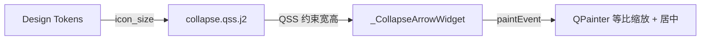

# 设计文档：TCollapse 箭头图标变形修复

## 概述

本修复解决 TCollapse 组件中箭头图标因非等比缩放导致的视觉变形问题。根本原因是 QSS 模板仅约束了箭头控件的宽度（18px），而高度被 QHBoxLayout 拉伸至 header 高度（≥32px）。`paintEvent` 中使用独立的 `scale_x` 和 `scale_y` 导致 chevron 路径被非等比拉伸。

修复方案包含两层防御：
1. **QSS 层**：为箭头控件添加高度约束，使其保持正方形
2. **绘制层**：在 `paintEvent` 中使用等比缩放 + 居中绘制，即使控件尺寸非正方形也能正确渲染

## 架构

修复涉及两个文件，不改变现有架构：



修改范围：
- `src/tyto_ui_lib/styles/templates/collapse.qss.j2` — 添加高度约束
- `src/tyto_ui_lib/components/molecules/collapse.py` — 修改 `paintEvent` 缩放逻辑

## 组件与接口

### 修改 1：QSS 模板 (`collapse.qss.j2`)

在 `TCollapseItem QWidget#collapse_arrow` 规则中添加高度约束：

```css
TCollapseItem QWidget#collapse_arrow {
    color: {{ colors.text_primary }};
    min-width: {{ component_sizes.medium.icon_size }}px;
    max-width: {{ component_sizes.medium.icon_size }}px;
    min-height: {{ component_sizes.medium.icon_size }}px;
    max-height: {{ component_sizes.medium.icon_size }}px;
}
```

### 修改 2：`_CollapseArrowWidget.paintEvent`

将非等比缩放替换为等比缩放 + 居中偏移：

```python
def paintEvent(self, event: object) -> None:
    painter = QPainter(self)
    painter.setRenderHint(QPainter.RenderHint.Antialiasing)

    color = self.palette().color(QPalette.ColorRole.WindowText)
    painter.setPen(Qt.PenStyle.NoPen)
    painter.setBrush(color)

    w = self.width()
    h = self.height()
    scale = min(w, h) / _CHEVRON_VIEWBOX  # 等比缩放

    # 居中偏移
    offset_x = (w - _CHEVRON_VIEWBOX * scale) / 2.0
    offset_y = (h - _CHEVRON_VIEWBOX * scale) / 2.0

    transform = QTransform()
    if self._expanded:
        cx = w / 2.0
        cy = h / 2.0
        transform.translate(cx, cy)
        transform.rotate(90)
        transform.translate(-cx, -cy)
    transform.translate(offset_x, offset_y)
    transform.scale(scale, scale)

    painter.setTransform(transform)
    painter.drawPath(self._chevron_path)
    painter.end()
```

关键变化：
- `scale_x` / `scale_y` → 单一 `scale = min(w, h) / _CHEVRON_VIEWBOX`
- 新增 `offset_x` / `offset_y` 实现居中绘制
- 旋转仍以控件中心为轴心，在缩放之前应用

## 数据模型

本修复不涉及数据模型变更。所有修改限于渲染逻辑和样式约束。

Design Token 引用（已有，无需修改）：
- `component_sizes.medium.icon_size`：18（light/dark 主题一致）


## 正确性属性

*属性是系统在所有有效执行中都应保持为真的特征或行为——本质上是关于系统应该做什么的形式化陈述。属性是人类可读规范与机器可验证正确性保证之间的桥梁。*

### Property 1：等比缩放与居中不变量

*For any* Arrow_Widget 的宽度 w > 0 和高度 h > 0，`paintEvent` 中的缩放变换 SHALL 使用 `scale = min(w, h) / 16.0` 作为 x 和 y 方向的统一缩放因子，且偏移量 `offset_x = (w - 16 * scale) / 2` 和 `offset_y = (h - 16 * scale) / 2` 使路径居中。这保证了无论控件尺寸如何，chevron 的宽高比始终与原始 viewBox 一致。

**Validates: Requirements 2.1, 2.2, 2.3**

### Property 2：箭头控件正方形约束

*For any* TCollapseItem 在 QHBoxLayout 中布局后，Arrow_Widget 的实际宽度和高度 SHALL 相等（均为 icon_size Token 值）。

**Validates: Requirements 1.1, 1.2**

### Property 3：箭头旋转状态一致性（已有）

*For any* TCollapseItem 经过任意序列的 toggle/set_expanded 操作后，Arrow_Widget 的 `_expanded` 属性 SHALL 始终与 TCollapseItem 的 `_expanded` 属性一致。

**Validates: Requirements 3.1, 3.2, 3.3**

> 注：Property 3 已在现有测试 `TestArrowRotationStateProperty` 中实现，本次修复无需新增。

## 错误处理

本修复的错误处理场景有限：

- **控件尺寸为 0**：当 `w` 或 `h` 为 0 时，`min(w, h) / _CHEVRON_VIEWBOX` 结果为 0，缩放后路径不可见，这是正确行为（控件不可见时不应绘制内容）
- **主题 Token 缺失**：`_CollapseArrowWidget.__init__` 已有 fallback 逻辑（默认 icon_size=18），无需修改
- **QSS 渲染失败**：`apply_theme` 已有 try/except 保护，无需修改

## 测试策略

### 单元测试（pytest + pytest-qt）

- 验证 QSS 模板渲染后包含 `min-height` 和 `max-height` 约束（需求 1.1）
- 验证折叠状态下箭头无旋转、展开状态下箭头 90 度旋转（需求 3.1, 3.2）
- 验证 disabled 状态下 QSS 颜色约束不变（需求 4.2）

### 属性基测试（Hypothesis）

- **Property 1**：生成随机 (w, h) 对，验证缩放因子和居中偏移的正确性
  - 库：Hypothesis
  - 最少 100 次迭代
  - 标注：`# Feature: collapse-arrow-distortion-fix, Property 1: 等比缩放与居中不变量`
- **Property 2**：生成不同 header 高度的 TCollapseItem，验证箭头控件宽高相等
  - 库：Hypothesis
  - 最少 100 次迭代
  - 标注：`# Feature: collapse-arrow-distortion-fix, Property 2: 箭头控件正方形约束`
- **Property 3**：已有测试覆盖，无需新增

### 测试运行

```bash
uv run pytest tests/test_molecules/test_collapse.py -v
```
