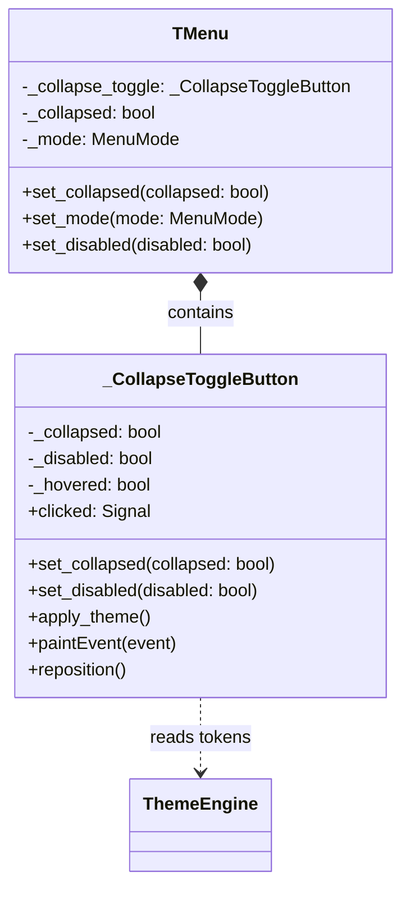

# 设计文档：Menu Collapse Toggle Button

## 概述

本设计为 TMenu 组件增加一个内置的折叠/展开切换按钮（`_CollapseToggleButton`），作为 TMenu 的内部子组件。该按钮是一个圆形的 QPainter 自绘控件，定位于菜单右边缘并半露出边界，使用已有的 `_CHEVRON_PATH_DATA` SVG 路径绘制箭头图标。按钮通过 TMenu 现有的 `set_collapsed` 方法驱动状态切换，确保与程序化 API 完全同步。

## 架构

该功能作为 TMenu 组件的内部增强实现，不引入新的公开组件类。



### 设计决策

1. **内部类而非公开组件**：`_CollapseToggleButton` 以下划线前缀命名，作为 `menu.py` 的模块级私有类。它不继承 `BaseWidget`（因为它不需要独立的 QSS 样式表），而是直接继承 `QWidget` 并通过 `QPainter` 自绘。主题响应由父级 TMenu 的 `apply_theme` 方法触发。

2. **定位策略**：按钮不参与 TMenu 的布局管理（QVBoxLayout），而是作为 TMenu 的直接子 widget，通过 `reposition()` 方法手动定位。使用 TMenu 的 `resizeEvent` 监听尺寸变化来更新位置。这样按钮可以自由地半露出菜单右边界。

3. **复用现有 SVG 路径**：使用已有的 `_CHEVRON_PATH_DATA` 和 `_parse_svg_path` 函数，通过旋转变换实现左/右箭头方向切换，与 `_MenuArrowWidget` 保持一致的绘制风格。

4. **通过 set_collapsed 驱动**：按钮点击时调用 TMenu 的 `set_collapsed`，而非直接修改状态。`set_collapsed` 内部更新按钮状态，确保单一数据流。

## 组件与接口

### _CollapseToggleButton（模块级私有类）

```python
class _CollapseToggleButton(QWidget):
    """Circular toggle button for menu collapse/expand.

    Positioned at the right edge of TMenu, half-protruding beyond
    the menu boundary. Draws a chevron icon pointing left (collapse)
    or right (expand) based on the current state.
    """

    clicked = Signal()

    def __init__(self, parent: QWidget | None = None) -> None: ...
    def set_collapsed(self, collapsed: bool) -> None: ...
    def set_disabled(self, disabled: bool) -> None: ...
    def apply_theme(self) -> None: ...
    def reposition(self) -> None: ...
    def paintEvent(self, event: object) -> None: ...
    def enterEvent(self, event: object) -> None: ...
    def leaveEvent(self, event: object) -> None: ...
    def mousePressEvent(self, event: object) -> None: ...
    def sizeHint(self) -> QSize: ...
```

### TMenu 修改点

以下是对 TMenu 类的修改：

1. **`__init__`**：创建 `_CollapseToggleButton` 实例，连接 `clicked` 信号
2. **`_build_ui`**：在布局构建后调用 `_update_toggle_visibility` 设置初始可见性
3. **`set_collapsed`**：在现有逻辑后调用 `self._collapse_toggle.set_collapsed(collapsed)` 同步按钮状态
4. **`set_mode`**：在模式切换后调用 `_update_toggle_visibility` 更新按钮可见性
5. **`set_disabled`**：在现有逻辑后调用 `self._collapse_toggle.set_disabled(disabled)` 同步禁用状态
6. **`apply_theme`**：在现有逻辑后调用 `self._collapse_toggle.apply_theme()` 同步主题
7. **`resizeEvent`**（新增覆写）：调用 `self._collapse_toggle.reposition()` 更新按钮位置
8. **`_update_toggle_visibility`**（新增私有方法）：根据当前 mode 控制按钮显示/隐藏

```python
def _update_toggle_visibility(self) -> None:
    """Show toggle button only in vertical mode."""
    visible = self._mode == self.MenuMode.VERTICAL
    self._collapse_toggle.setVisible(visible)
    if visible:
        self._collapse_toggle.reposition()
```

## 数据模型

### _CollapseToggleButton 内部状态

| 属性 | 类型 | 说明 |
|------|------|------|
| `_collapsed` | `bool` | 当前折叠状态，决定箭头方向 |
| `_disabled` | `bool` | 禁用状态，阻止点击并改变视觉 |
| `_hovered` | `bool` | 鼠标悬停状态，用于 hover 效果 |
| `_bg_color` | `str` | 背景色，从 Design Token 获取 |
| `_border_color` | `str` | 边框色，从 Design Token 获取 |
| `_icon_color` | `str` | 图标色，从 Design Token 获取 |
| `_hover_bg_color` | `str` | 悬停背景色，从 Design Token 获取 |
| `_btn_size` | `int` | 按钮直径，从 Design Token 获取 |

### Design Token 映射

按钮的视觉属性从现有 Design Token 中获取：

| 视觉属性 | Token 路径 | 说明 |
|----------|-----------|------|
| 背景色 | `colors.bg_default` | 按钮圆形背景 |
| 边框色 | `colors.border` | 按钮圆形边框 |
| 图标色 | `colors.text_secondary` | 箭头图标颜色 |
| 悬停背景色 | `colors.hover_color` | 鼠标悬停时的背景色 |
| 禁用图标色 | `colors.text_disabled` | 禁用状态下的图标色 |
| 按钮尺寸 | `component_sizes.small.height` (28px) | 按钮直径 |

### 绘制逻辑

`paintEvent` 的绘制流程：

1. 绘制圆形背景（填充 `_bg_color`，如果 `_hovered` 则使用 `_hover_bg_color`）
2. 绘制圆形边框（`_border_color`，1px 宽度）
3. 在圆心绘制 chevron 路径：
   - Expanded 状态：旋转 180° 使箭头朝左（`<`）
   - Collapsed 状态：不旋转，箭头朝右（`>`）
4. 如果 `_disabled`，使用 `_disabled_icon_color` 绘制图标

### 定位计算

`reposition()` 方法的定位逻辑：

```python
def reposition(self) -> None:
    """Position the button at the right edge, vertically centered."""
    parent = self.parentWidget()
    if parent is None:
        return
    x = parent.width() - self._btn_size // 2  # half-protruding
    y = (parent.height() - self._btn_size) // 2
    self.move(x, y)
```


## 正确性属性

*属性（Property）是一种在系统所有有效执行中都应成立的特征或行为——本质上是关于系统应该做什么的形式化陈述。属性是人类可读规范与机器可验证正确性保证之间的桥梁。*

### Property 1: Toggle button positioning

*For any* TMenu in vertical mode with any width W and height H, the Collapse_Toggle_Button shall be positioned at x = W - btn_size/2 and y = (H - btn_size) / 2, such that the button protrudes beyond the menu's right boundary (x + btn_size > W).

**Validates: Requirements 1.1, 1.2**

### Property 2: Click inverts collapsed state

*For any* TMenu in vertical mode with any initial collapsed state (True or False), clicking the Collapse_Toggle_Button shall result in the TMenu's collapsed state being the logical inverse of the initial state, and the button's chevron direction shall reflect the new state.

**Validates: Requirements 2.1, 2.2, 2.4**

### Property 3: Programmatic set_collapsed syncs button state

*For any* boolean value passed to TMenu.set_collapsed(), the Collapse_Toggle_Button's internal _collapsed state shall equal that boolean value.

**Validates: Requirements 4.1, 4.3**

### Property 4: Disabled state blocks toggle interaction

*For any* disabled TMenu in vertical mode, clicking the Collapse_Toggle_Button shall not change the TMenu's collapsed state. After re-enabling the TMenu, clicking the Collapse_Toggle_Button shall correctly invert the collapsed state.

**Validates: Requirements 6.1, 6.2**

## 错误处理

| 场景 | 处理方式 |
|------|---------|
| 按钮在水平模式下被意外显示 | `_update_toggle_visibility` 在每次 `set_mode` 调用时强制检查，确保水平模式下隐藏 |
| ThemeEngine 未初始化时调用 `apply_theme` | 使用 fallback 默认值（与 `_MenuArrowWidget` 和 `TMenuItem` 的现有模式一致） |
| `reposition` 在父 widget 为 None 时调用 | 提前返回，不执行定位 |
| 按钮在禁用状态下收到点击事件 | `mousePressEvent` 检查 `_disabled` 标志，为 True 时忽略事件 |

## 测试策略

### 测试框架

- **单元测试**：pytest + pytest-qt
- **属性基测试**：Hypothesis（每个属性至少 100 次迭代）

### 属性基测试

每个正确性属性对应一个独立的 Hypothesis 测试：

1. **Property 1 测试**：生成随机的 menu 宽度和高度，验证按钮定位公式
   - 标注：`# Feature: menu-collapse-toggle, Property 1: Toggle button positioning`
2. **Property 2 测试**：生成随机的初始 collapsed 状态，模拟点击，验证状态翻转
   - 标注：`# Feature: menu-collapse-toggle, Property 2: Click inverts collapsed state`
3. **Property 3 测试**：生成随机布尔值，调用 set_collapsed，验证按钮状态同步
   - 标注：`# Feature: menu-collapse-toggle, Property 3: Programmatic set_collapsed syncs button state`
4. **Property 4 测试**：生成随机初始状态，禁用菜单后点击验证无变化，启用后点击验证状态翻转
   - 标注：`# Feature: menu-collapse-toggle, Property 4: Disabled state blocks toggle interaction`

### 单元测试

单元测试覆盖具体示例和边界情况：

- 水平模式下按钮不可见（Requirements 1.3）
- 模式切换时按钮可见性自动更新（Requirements 1.4, 1.5）
- 按钮 clicked 信号连接到 set_collapsed（Requirements 2.3, 4.2）
- Expanded 状态下箭头朝左，Collapsed 状态下箭头朝右（Requirements 3.1, 3.2）
- hover 状态切换（Requirements 3.4）
- 主题变更后 apply_theme 被调用（Requirements 3.5）
- 初始化 collapsed=True 时按钮状态正确（Requirements 4.3）

### 测试文件

- `tests/test_organisms/test_menu_collapse_toggle.py`
