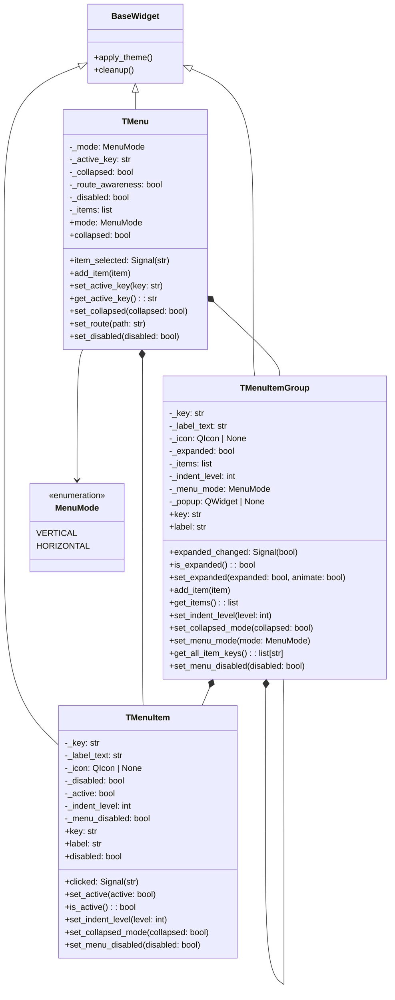
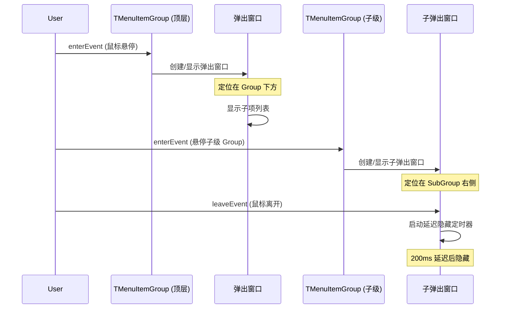

# 设计文档：TMenu 组件重新实现

## 概述

重新实现 Tyto 组件库的 TMenu 菜单组件，对标 NaiveUI Menu 的视觉效果和交互行为。核心改进点：

1. **水平模式弹出子菜单**：水平模式下 TMenuItemGroup 使用 QWidget 弹出窗口（popup）展示子项，支持多级级联弹出
2. **垂直模式展开/收缩动画**：垂直模式下通过 QPropertyAnimation 对 maximumHeight 做平滑动画
3. **折叠模式**：垂直菜单可折叠为仅显示图标的窄条，通过宽度动画过渡
4. **统一的 Design Token 驱动样式**：所有视觉属性通过 menu.qss.j2 + Design Token 渲染

组件继续保持在 organisms 层级（`components/organisms/menu.py`），因为它需要管理复杂的状态逻辑（路由感知、递归活跃状态、disabled 传播）。

## 架构



### 水平模式弹出子菜单架构



## 组件与接口

### TMenuItem

叶子菜单项，负责显示单个可点击的导航条目。

```python
class TMenuItem(BaseWidget):
    """Single menu item with key, label, and optional icon."""

    clicked = Signal(str)

    def __init__(
        self,
        key: str,
        label: str = "",
        icon: QIcon | None = None,
        disabled: bool = False,
        parent: QWidget | None = None,
    ) -> None: ...

    @property
    def key(self) -> str: ...
    @property
    def label(self) -> str: ...
    @property
    def disabled(self) -> bool: ...

    def set_active(self, active: bool) -> None: ...
    def is_active(self) -> bool: ...
    def set_indent_level(self, level: int) -> None: ...
    def set_collapsed_mode(self, collapsed: bool) -> None: ...
    def set_menu_disabled(self, disabled: bool) -> None: ...
    def apply_theme(self) -> None: ...
```

**设计决策**：
- 图标使用 QLabel + QIcon.pixmap 渲染，icon 为 None 时 `setVisible(False)` 隐藏
- 活跃状态通过 QSS dynamic property `active="true"/"false"` 控制样式切换
- 缩进通过修改 row layout 的 left contentsMargins 实现，缩进量从 Design Token `menu.indent` 获取

### TMenuItemGroup

可展开/收缩的子菜单分组，支持垂直模式的内联展开和水平模式的弹出展示。

```python
class TMenuItemGroup(BaseWidget):
    """Submenu group with expand/collapse and popup support."""

    expanded_changed = Signal(bool)

    def __init__(
        self,
        key: str,
        label: str = "",
        icon: QIcon | None = None,
        expanded: bool = True,
        parent: QWidget | None = None,
    ) -> None: ...

    def set_menu_mode(self, mode: MenuMode) -> None:
        """Set the display mode. In HORIZONTAL mode, children are shown
        in a popup widget instead of inline."""
        ...

    def add_item(self, item: TMenuItem | TMenuItemGroup) -> None: ...
    def get_items(self) -> list[TMenuItem | TMenuItemGroup]: ...
    def set_indent_level(self, level: int) -> None: ...
    def set_collapsed_mode(self, collapsed: bool) -> None: ...
    def get_all_item_keys(self) -> list[str]: ...
    def set_menu_disabled(self, disabled: bool) -> None: ...
```

**设计决策**：
- **垂直模式**：子项内联在 `_children_wrapper` QWidget 中，展开/收缩通过 `QPropertyAnimation(maximumHeight)` 实现 200ms ease-in-out 动画
- **水平模式**：子项放在 `_popup` QWidget 中（`Qt.WindowType.Popup | Qt.WindowType.FramelessWindowHint`），通过 `enterEvent`/`leaveEvent` 控制显示/隐藏，使用 QTimer 实现 200ms 延迟隐藏以避免鼠标移动时闪烁
- **级联弹出**：顶层 Group 的 popup 在 Group 下方显示，嵌套 Group 的 popup 在父 popup 右侧显示
- 箭头指示符：垂直模式展开时显示 `▲`（U+25B2），收缩时显示 `▼`（U+25BC）

### TMenu

顶层菜单容器，管理布局模式、活跃状态、折叠模式和路由感知。

```python
class TMenu(BaseWidget):
    """Navigation menu with vertical/horizontal mode support."""

    class MenuMode(str, Enum):
        VERTICAL = "vertical"
        HORIZONTAL = "horizontal"

    item_selected = Signal(str)

    def __init__(
        self,
        mode: MenuMode = MenuMode.VERTICAL,
        active_key: str = "",
        collapsed: bool = False,
        route_awareness: bool = False,
        disabled: bool = False,
        parent: QWidget | None = None,
    ) -> None: ...

    def add_item(self, item: TMenuItem | TMenuItemGroup) -> None: ...
    def set_active_key(self, key: str) -> None: ...
    def get_active_key(self) -> str: ...
    def set_collapsed(self, collapsed: bool) -> None: ...
    def set_route(self, path: str) -> None: ...
    def set_disabled(self, disabled: bool) -> None: ...
```

**设计决策**：
- `add_item` 时自动调用 `item.set_menu_mode(self._mode)` 将模式传播到 TMenuItemGroup 子项
- 折叠动画通过 `QPropertyAnimation(minimumWidth)` + `QPropertyAnimation(maximumWidth)` 同步动画实现
- 路由匹配使用最长前缀匹配：遍历所有 TMenuItem key，找到与路径最长匹配的 key
- 垂直模式布局末尾添加 stretch 以将菜单项推到顶部

## 数据模型

### 菜单树结构

菜单数据以树形结构组织，TMenu 为根节点：

```
TMenu
├── TMenuItem(key="home", label="首页", icon=home_icon)
├── TMenuItemGroup(key="content", label="内容管理", icon=book_icon)
│   ├── TMenuItem(key="articles", label="文章")
│   └── TMenuItem(key="categories", label="分类")
├── TMenuItemGroup(key="users", label="用户", icon=people_icon)
│   ├── TMenuItem(key="list", label="用户列表")
│   └── TMenuItemGroup(key="roles", label="角色管理")
│       ├── TMenuItem(key="admin", label="管理员")
│       └── TMenuItem(key="editor", label="编辑者")
└── TMenuItem(key="settings", label="设置", icon=gear_icon)
```

### Design Token 结构（menu 部分）

```json
{
  "menu": {
    "indent": 24,
    "item_height": 40,
    "collapsed_width": 48
  }
}
```

现有 token 结构已满足需求，无需新增 token 字段。所有颜色（primary、text_primary、text_secondary、text_disabled、bg_default、bg_elevated）、间距（spacing.medium、spacing.large）和字号（font_sizes.medium、font_sizes.small、font_sizes.large）均复用已有的全局 token。

### QSS Dynamic Properties

| 组件 | Property 名 | 值 | 用途 |
|------|------------|-----|------|
| TMenu | `mode` | `"vertical"` / `"horizontal"` | 区分布局模式样式 |
| TMenu | `disabled` | `"true"` / `"false"` | 菜单级禁用状态 |
| TMenuItem | `active` | `"true"` / `"false"` | 活跃状态高亮 |
| TMenuItem | `itemDisabled` | `"true"` / `"false"` | 项级禁用状态 |
| TMenuItemGroup | `groupDisabled` | `"true"` / `"false"` | 组级禁用状态 |

## 正确性属性

*属性（Property）是一种在系统所有有效执行中都应成立的特征或行为——本质上是关于系统应该做什么的形式化陈述。属性是人类可读规范与机器可验证正确性保证之间的桥梁。*

### Property 1: 添加子项保持结构完整性并连接信号

*For any* TMenu 和任意组合的 TMenuItem/TMenuItemGroup 子项列表，通过 add_item 添加后，TMenu 的内部 items 列表应包含所有添加的子项，且点击任意 TMenuItem 应触发 TMenu 的 item_selected 信号。

**Validates: Requirements 1.1, 1.2, 1.3**

### Property 2: key/label 数据完整性

*For any* 非空字符串 key 和 label，创建 TMenuItem(key, label) 后，item.key 应等于 key，item.label 应等于 label。

**Validates: Requirements 1.4**

### Property 3: 布局类型与 MenuMode 一致性

*For any* MenuMode 值，创建 TMenu(mode=mode) 后，根布局类型应为：HORIZONTAL 对应 QHBoxLayout，VERTICAL 对应 QVBoxLayout。

**Validates: Requirements 3.1, 4.1**

### Property 4: 折叠模式隐藏文字标签的往返一致性

*For any* 包含 TMenuItem 和 TMenuItemGroup 的菜单树，调用 set_collapsed(True) 后所有 TMenuItem 的文字标签应不可见、所有 TMenuItemGroup 的文字标签和箭头应不可见；再调用 set_collapsed(False) 后所有文字标签应恢复可见。

**Validates: Requirements 2.4, 5.2, 5.3, 5.4**

### Property 5: 箭头指示符与展开状态一致性

*For any* TMenuItemGroup，当 is_expanded() 为 True 时箭头文本应为 "▲"，当 is_expanded() 为 False 时箭头文本应为 "▼"。

**Validates: Requirements 4.5, 4.6**

### Property 6: 展开/收缩切换往返一致性

*For any* TMenuItemGroup 和初始展开状态 s，调用 set_expanded(not s, animate=False) 再调用 set_expanded(s, animate=False) 后，is_expanded() 应恢复为 s。

**Validates: Requirements 4.3, 4.4**

### Property 7: 缩进量与嵌套层级成正比

*For any* 嵌套层级 n（0 ≤ n ≤ 5），调用 set_indent_level(n) 后，TMenuItem 的 row layout 左边距应等于 n × menu.indent token 值。

**Validates: Requirements 4.2, 4.7**

### Property 8: set_active_key 精确激活唯一项

*For any* 包含多个 TMenuItem 的菜单树和任意有效 key k，调用 set_active_key(k) 后，key 为 k 的 TMenuItem 的 is_active() 应为 True 且 property("active") 应为 "true"，所有其他 TMenuItem 的 is_active() 应为 False。

**Validates: Requirements 6.1, 6.2, 6.3**

### Property 9: 禁用状态阻断交互

*For any* disabled 的 TMenuItem（自身 disabled 或 menu-level disabled），模拟点击不应触发 clicked 信号。*For any* menu-level disabled 的 TMenuItemGroup，调用 set_expanded 不应改变展开状态。

**Validates: Requirements 6.4, 7.2, 7.3**

### Property 10: disabled 状态递归传播

*For any* 菜单树，调用 TMenu.set_disabled(True) 后，树中所有 TMenuItem 和 TMenuItemGroup 的 _menu_disabled 应为 True，且对应的 QSS property（itemDisabled/groupDisabled）应为 "true"。

**Validates: Requirements 7.1**

### Property 11: disabled 往返保留项自身 disabled 状态

*For any* 菜单树（其中部分 TMenuItem 自身 disabled=True），调用 set_disabled(True) 再 set_disabled(False) 后，自身 disabled=True 的项的 itemDisabled QSS property 应仍为 "true"，自身 disabled=False 的项应恢复为 "false"。

**Validates: Requirements 7.4**

### Property 12: 路由匹配使用最长前缀

*For any* 包含多个 key 的菜单（route_awareness=True）和任意路径字符串 path，set_route(path) 后 active_key 应为所有 key 中与 path 最长前缀匹配的那个；若无匹配则 active_key 不变。

**Validates: Requirements 8.1, 8.3**

### Property 13: route_awareness 关闭时忽略 set_route

*For any* route_awareness=False 的 TMenu 和任意路径字符串，调用 set_route 后 active_key 应保持不变。

**Validates: Requirements 8.2**

## 错误处理

| 场景 | 处理方式 |
|------|---------|
| add_item 传入非 TMenuItem/TMenuItemGroup 类型 | 类型检查由 Python 类型标注保证，运行时不做额外检查 |
| set_active_key 传入不存在的 key | 所有项的 active 状态设为 False，active_key 更新为传入值 |
| set_indent_level 传入负数 | 视为 0 处理 |
| ThemeEngine 未初始化时调用 apply_theme | 静默返回（已有 `if not engine.current_theme(): return` 保护） |
| QSS 模板渲染失败 | 捕获异常并静默忽略（已有 try/except 保护） |
| 水平模式弹出窗口超出屏幕边界 | 使用 QScreen.availableGeometry 检测并调整弹出位置 |

## 测试策略

### 双轨测试方法

1. **单元测试**（pytest + pytest-qt）：验证具体示例、边界情况和错误条件
2. **属性基测试**（Hypothesis）：验证跨所有输入的通用属性，每个属性至少 100 次迭代

### 属性基测试库

使用 **Hypothesis** 库（项目已配置），配合 pytest-qt 进行 PySide6 组件测试。

### 属性基测试配置

- 每个属性测试至少运行 100 次迭代（`@settings(max_examples=100)`）
- 每个测试用注释标注对应的设计属性：`# Feature: menu-component, Property N: 属性名称`
- 使用 Hypothesis 的 `@given` 装饰器生成随机输入
- 自定义 strategy 生成随机菜单树结构

### 测试文件组织

- 测试文件：`tests/test_organisms/test_menu.py`
- 属性基测试和单元测试放在同一文件中，按类组织

### 单元测试覆盖

- 具体示例：创建特定菜单结构并验证行为
- 边界情况：空菜单、单项菜单、深度嵌套（5+ 层）
- 图标显示/隐藏
- 水平模式弹出窗口创建
- 主题切换后样式更新

### 属性基测试覆盖

每个正确性属性（Property 1-13）对应一个独立的属性基测试，使用 Hypothesis 生成随机菜单树和输入参数。
