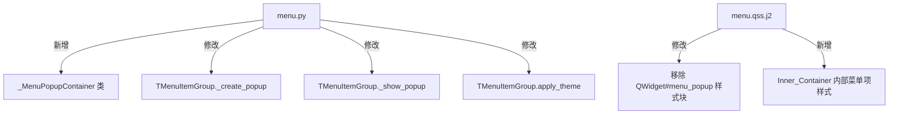

# 设计文档：Menu 子菜单弹出面板样式优化

## 概述

本设计优化 TMenu 组件中弹出子菜单面板（popup）的视觉样式，使其对齐 NaiveUI 的 popover/dropdown 风格。核心改动是将当前基于纯 QSS 的 popup 样式方案，迁移为 `WA_TranslucentBackground` + 内部容器自绘（QPainter）+ `QGraphicsDropShadowEffect` 的组合方案。

这一方案已在项目中的 `TPopconfirm` 组件中成功验证，本次设计复用相同的架构模式。

### 设计决策与理由

1. **为什么不用纯 QSS？** QSS 不支持 `box-shadow`，且在 `FramelessWindowHint` 窗口上 `border-radius` 无法裁剪窗口边角，导致圆角区域出现背景色泄漏。
2. **为什么用 `WA_TranslucentBackground`？** 设置此属性后窗口背景完全透明，配合内部容器自绘圆角矩形，可以实现真正的圆角效果，同时阴影可以在窗口边界外正确渲染。
3. **为什么用 `QGraphicsDropShadowEffect`？** 这是 Qt 原生的阴影方案，性能好且易于与 Design Token 集成。项目中 `TCard` 已使用此方案。
4. **为什么用 `colors.divider` 而非 `colors.border` 作为边框色？** NaiveUI 的弹出面板边框非常淡，`divider`（Light: `#efeff5`，Dark: `rgba(255,255,255,0.09)`）比 `border`（Light: `#e0e0e6`）更接近参考效果。

## 架构

### 改动范围



### Popup 窗口层级结构

```
QWidget#menu_popup (FramelessWindowHint + WA_TranslucentBackground)
 ├── QVBoxLayout (root_layout, margins: shadow_margin)
 │   └── _MenuPopupContainer#menu_popup_container (QPainter 自绘)
 │       └── QVBoxLayout (container_layout, margins: 0, spacing.small, 0, spacing.small)
 │           ├── TMenuItem / TMenuItemGroup (子菜单项)
 │           ├── TMenuItem / TMenuItemGroup
 │           └── ...
```

## 组件与接口

### 新增：`_MenuPopupContainer` 类

模块内部私有类，负责自绘圆角矩形背景和淡边框。参考 `_PopconfirmContainer` 的实现模式。

```python
class _MenuPopupContainer(QWidget):
    """Inner container that paints rounded-rect background and border.

    Required because the parent popup uses WA_TranslucentBackground,
    which prevents QSS background-color from rendering.
    """

    def paintEvent(self, _event: object) -> None:
        painter = QPainter(self)
        painter.setRenderHint(QPainter.RenderHint.Antialiasing)

        try:
            engine = ThemeEngine.instance()
            bg = parse_color(str(engine.get_token("colors", "popover_color")))
            border_c = parse_color(str(engine.get_token("colors", "divider")))
            radius = int(engine.get_token("radius", "large"))
        except Exception:
            bg = QColor("#ffffff")
            border_c = QColor("#efeff5")
            radius = 8

        pen = QPen(border_c)
        pen.setWidthF(1.0)
        painter.setPen(pen)
        painter.setBrush(bg)
        rect = QRectF(0.5, 0.5, self.width() - 1.0, self.height() - 1.0)
        painter.drawRoundedRect(rect, radius, radius)
        painter.end()
```

### 修改：`TMenuItemGroup._create_popup`

关键改动：
1. 添加 `WA_TranslucentBackground` 属性
2. 外层 layout 设置 shadow margin（为阴影留出渲染空间）
3. 插入 `_MenuPopupContainer` 作为内部容器
4. 在容器上应用 `QGraphicsDropShadowEffect`
5. 容器内部 layout 设置垂直内边距 `spacing.small`

```python
def _create_popup(self) -> QWidget:
    popup = QWidget(
        None,
        Qt.WindowType.Tool
        | Qt.WindowType.FramelessWindowHint
        | Qt.WindowType.WindowStaysOnTopHint,
    )
    popup.setAttribute(Qt.WidgetAttribute.WA_ShowWithoutActivating, True)
    popup.setAttribute(Qt.WidgetAttribute.WA_TranslucentBackground, True)
    popup.setObjectName("menu_popup")

    # Root layout with margins for shadow rendering space
    shadow_margin = 8  # from ThemeEngine token
    root_layout = QVBoxLayout(popup)
    root_layout.setContentsMargins(
        shadow_margin, shadow_margin, shadow_margin, shadow_margin
    )
    root_layout.setSpacing(0)

    # Inner container with self-painted background
    container = _MenuPopupContainer(popup)
    container.setObjectName("menu_popup_container")

    # Apply shadow effect on container
    shadow = QGraphicsDropShadowEffect(container)
    shadow.setOffset(0, 4)
    shadow.setBlurRadius(16)
    shadow.setColor(QColor(0, 0, 0, 31))  # ~0.12 alpha, from shadows.medium
    container.setGraphicsEffect(shadow)

    # Container layout with vertical padding
    v_pad = 4  # from spacing.small token
    container_layout = QVBoxLayout(container)
    container_layout.setContentsMargins(0, v_pad, 0, v_pad)
    container_layout.setSpacing(0)

    for item in self._items:
        item.setParent(container)
        container_layout.addWidget(item)
        item.set_indent_level(0)

    root_layout.addWidget(container)

    # Apply theme QSS and install event filter
    engine = ThemeEngine.instance()
    if engine.current_theme():
        try:
            qss = engine.render_qss("menu.qss.j2")
            popup.setStyleSheet(qss)
        except Exception:
            pass

    popup.installEventFilter(self)
    return popup
```

### 修改：`TMenuItemGroup._show_popup` 定位逻辑

在计算 popup 位置时，增加 `spacing.small`（4px）的间距偏移：

```python
# 水平模式下方弹出：增加垂直间距
if not (self._is_nested_group() or self._collapsed_mode):
    global_pos = self._header.mapToGlobal(
        QPoint(0, self._header.height() + gap)  # gap = spacing.small
    )

# 侧边弹出：增加水平间距
else:
    global_pos = self.mapToGlobal(QPoint(self.width() + gap, 0))
```

### 修改：`TMenuItemGroup.apply_theme`

在 apply_theme 中更新 shadow effect 的参数以响应主题切换：

```python
def apply_theme(self) -> None:
    # ... existing logic ...
    if self._popup is not None:
        # Update shadow parameters from current theme
        container = self._popup.findChild(QWidget, "menu_popup_container")
        if container is not None:
            effect = container.graphicsEffect()
            if isinstance(effect, QGraphicsDropShadowEffect):
                self._apply_shadow_from_token(effect)
            container.update()  # Trigger repaint for bg/border colors
```

### 修改：`menu.qss.j2`

移除旧的 `QWidget#menu_popup` 样式块（因为 popup 背景和边框现在由 `_MenuPopupContainer` 自绘），替换为容器内部菜单项的样式规则：

```css
/* 移除旧规则 */
/* QWidget#menu_popup { ... } */

/* 新增：popup 容器内的菜单项样式 */
QWidget#menu_popup_container TMenuItem QWidget#menu_item_row {
    background-color: transparent;
    border: none;
    border-radius: {{ radius.medium }}px;
}

QWidget#menu_popup_container TMenuItem QWidget#menu_item_row:hover {
    background-color: {{ colors.hover_color }};
}
```

## 数据模型

本次改动不涉及新的数据模型。所有视觉参数均来自现有的 Design Token 体系：

| Token 路径 | Light 值 | Dark 值 | 用途 |
|---|---|---|---|
| `colors.popover_color` | `#ffffff` | `rgb(72, 72, 78)` | 容器背景色 |
| `colors.divider` | `#efeff5` | `rgba(255,255,255,0.09)` | 容器边框色 |
| `radius.large` | `8` | `8` | 圆角半径 |
| `shadows.medium` | `0 4px 16px rgba(0,0,0,0.12)` | `0 4px 16px rgba(0,0,0,0.36)` | 阴影参数 |
| `spacing.small` | `4` | `4` | 间距和内边距 |
| `colors.hover_color` | `rgba(0,0,0,0.04)` | `rgba(255,255,255,0.09)` | 菜单项悬停色 |


## 正确性属性

*正确性属性是系统在所有有效执行中都应保持为真的特征或行为——本质上是关于系统应该做什么的形式化陈述。属性作为人类可读规范与机器可验证正确性保证之间的桥梁。*

基于需求验收标准的分析，以下属性经过去重合并后，覆盖了所有可测试的需求：

### Property 1：Popup 结构完整性

*For any* 通过 `_create_popup` 创建的 popup 窗口，该窗口应同时满足：(a) 设置了 `WA_TranslucentBackground` 属性，(b) 包含一个 objectName 为 `menu_popup_container` 的 `_MenuPopupContainer` 子控件，(c) 该子控件上应用了 `QGraphicsDropShadowEffect`。

**Validates: Requirements 2.3, 3.1**

### Property 2：容器自绘 Token 一致性

*For any* 主题（Light 或 Dark），当 `_MenuPopupContainer` 执行 `paintEvent` 时，其读取的背景色应等于当前主题的 `colors.popover_color`，边框色应等于当前主题的 `colors.divider`，圆角半径应等于当前主题的 `radius.large`。

**Validates: Requirements 1.1, 1.2, 3.2, 3.3, 3.4**

### Property 3：阴影参数与 Token 一致性

*For any* 主题，popup 容器上的 `QGraphicsDropShadowEffect` 的 blur radius 和 color 参数应与当前主题的 `shadows.medium` Token 解析结果一致。

**Validates: Requirements 2.1, 2.2**

### Property 4：Popup 间距正确性

*For any* popup 弹出模式（水平下方弹出或侧边弹出），popup 与父菜单之间的间距应等于当前主题的 `spacing.small` 值。

**Validates: Requirements 4.1, 4.2**

### Property 5：容器布局边距正确性

*For any* 通过 `_create_popup` 创建的 popup，其内部 `_MenuPopupContainer` 的 layout contentsMargins 应为 `(0, spacing.small, 0, spacing.small)`，即水平方向无额外内边距，垂直方向内边距等于 `spacing.small`。

**Validates: Requirements 5.1, 5.2**

### Property 6：主题切换传播

*For any* 已创建的 popup，当主题切换事件发生时，`apply_theme` 应触发 popup 容器的重绘（update）和阴影参数更新，使所有视觉属性反映新主题。

**Validates: Requirements 6.3**

## 错误处理

| 场景 | 处理策略 |
|---|---|
| ThemeEngine 未初始化或 Token 缺失 | `_MenuPopupContainer.paintEvent` 使用硬编码 fallback 值（bg=#ffffff, border=#efeff5, radius=8），确保 popup 仍可正常显示 |
| `QGraphicsDropShadowEffect` 创建失败 | 捕获异常，popup 仍然显示但无阴影效果 |
| 屏幕边界溢出 | 复用现有的 `_show_popup` 屏幕边界检测逻辑，确保 popup 不超出可用屏幕区域 |
| `shadows.medium` Token 格式解析失败 | 使用 fallback 阴影参数（offset=0,4, blur=16, color=rgba(0,0,0,0.12)） |

## 测试策略

### 属性基测试（Hypothesis）

使用 `hypothesis` 库生成随机主题配置，验证上述 6 个正确性属性。每个属性至少运行 100 次迭代。

测试标注格式：
```python
# Feature: menu-submenu-popup-style, Property 1: Popup 结构完整性
```

属性基测试库：**hypothesis**

每个正确性属性对应一个独立的属性基测试：

- Property 1 → 生成随机主题名，创建 popup，验证结构
- Property 2 → 生成随机主题 Token 值，mock ThemeEngine，验证 paintEvent 读取的值
- Property 3 → 生成随机阴影 Token 字符串，验证解析后的 shadow effect 参数
- Property 4 → 生成随机 popup 模式（水平/侧边），验证间距偏移
- Property 5 → 创建 popup，验证 layout margins
- Property 6 → 创建 popup，切换主题，验证 container.update 被调用

### 单元测试（pytest + pytest-qt）

单元测试聚焦于具体示例和边界情况：

- Light 主题下 popup 背景色为 `#ffffff`（需求 6.1 示例）
- Dark 主题下 popup 背景色为 `rgb(72, 72, 78)`（需求 6.2 示例）
- Token 缺失时 fallback 值正确
- `_MenuPopupContainer` 的 `paintEvent` 不抛出异常
- popup 的 `eventFilter` 在新结构下仍正常工作

### 测试配置

```python
from hypothesis import given, settings, strategies as st

@settings(max_examples=100)
@given(...)
def test_property_N(...):
    # Feature: menu-submenu-popup-style, Property N: ...
    # Validates: Requirements X.Y
    ...
```
