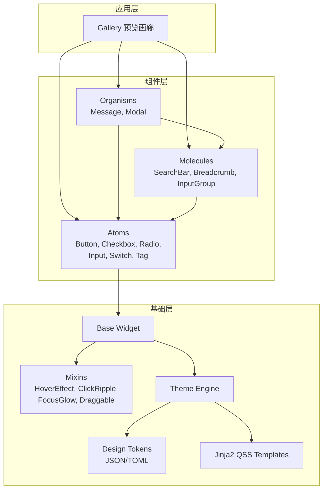
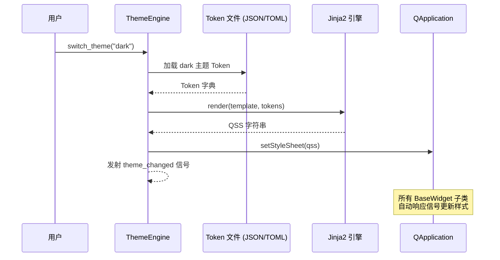
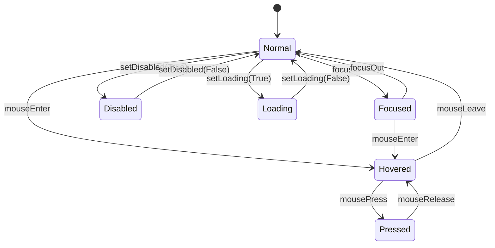
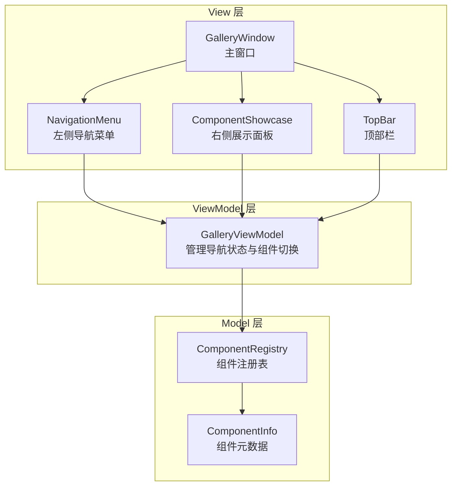
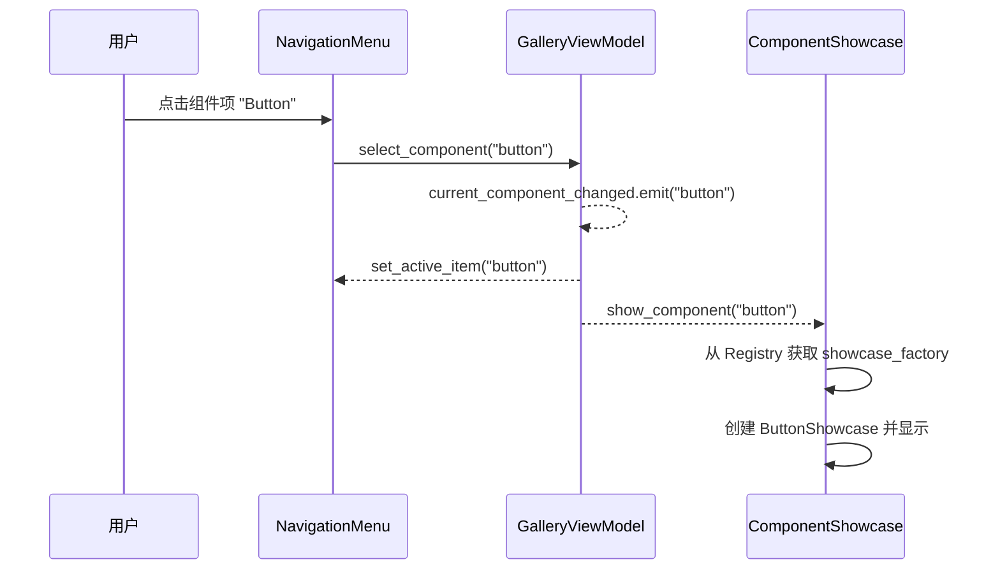
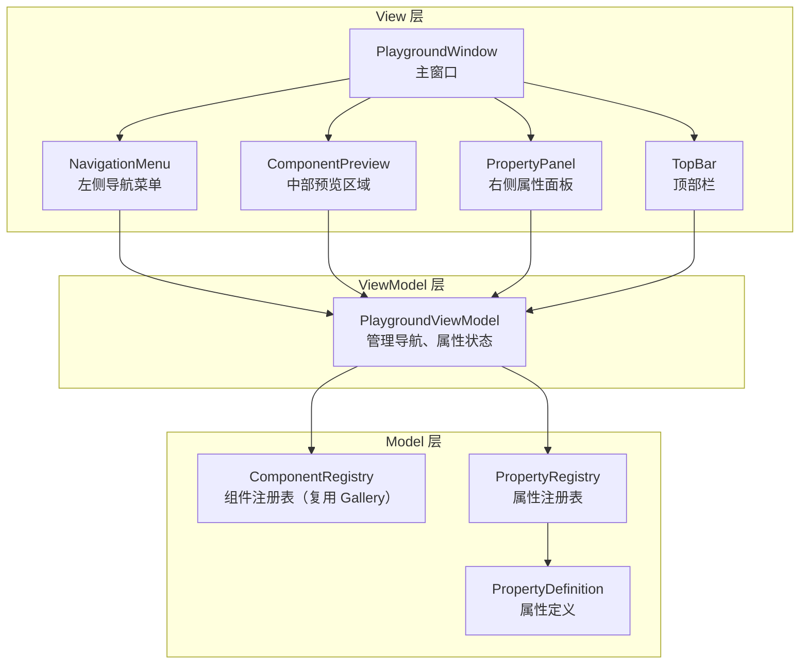
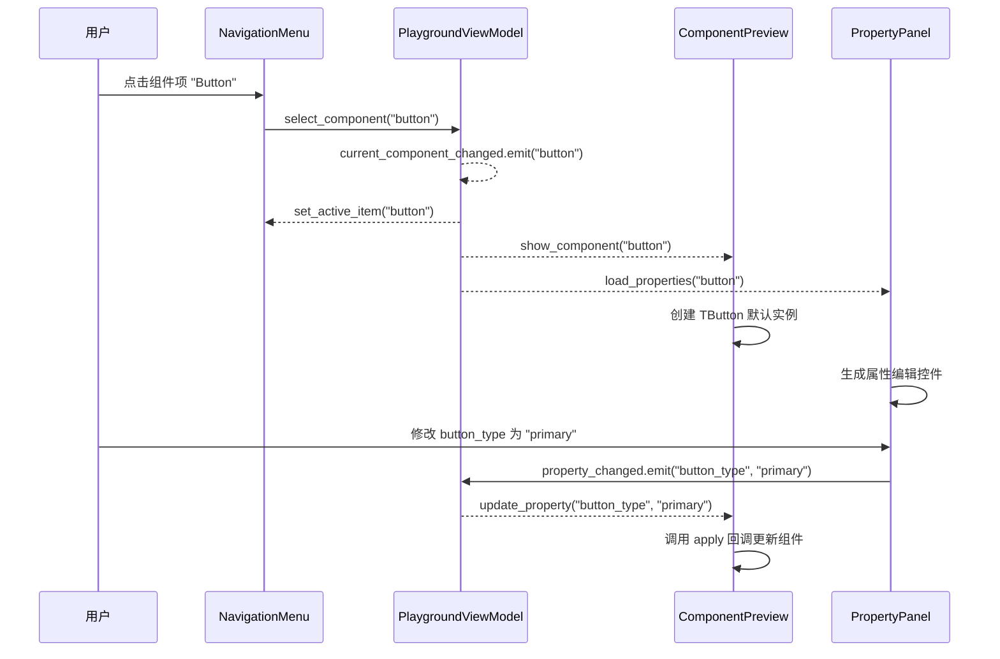
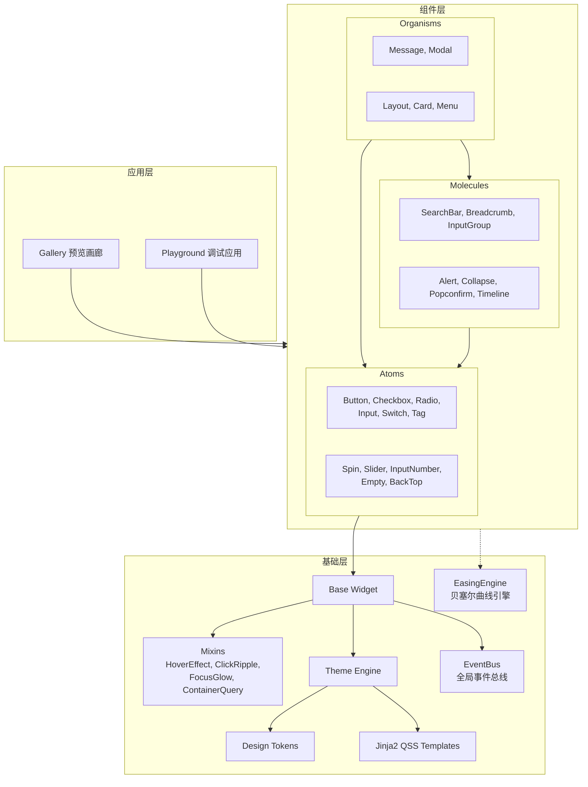

# 设计文档：Tyto UI 组件库 V1.0.0

## 概述

Tyto 是一个基于 PySide6 的现代化桌面 UI 组件库，采用原子设计方法论（Atomic Design），提供从基础控件（Atom）到复杂业务模块（Organism）的分层组件体系。样式系统基于 Design Token + Jinja2 + QSS 的动态渲染架构，支持 Light/Dark 主题实时无闪烁切换。视觉风格仿 NaiveUI。

本设计文档覆盖 V1.0.0 的全部交付内容：主题引擎、组件基类与行为混入、11 个 UI 组件、工程化配置和组件预览画廊。

## 架构

### 整体分层架构



### 主题引擎渲染流程



### 组件状态机



## 组件与接口

### 1. 核心模块 (`core/`)

#### ThemeEngine（单例）

```python
class ThemeEngine(QObject):
    """主题引擎，管理 Design Token 并动态渲染 QSS。"""

    # 信号
    theme_changed = Signal(str)  # 参数: 主题名称 ("light" | "dark")

    # 公开方法
    def load_tokens(self, path: str | Path) -> None:
        """从 JSON/TOML 文件加载 Design Token 定义。
        Raises: TokenFileError 当文件格式错误时。
        """

    def switch_theme(self, theme_name: str) -> None:
        """切换主题并重新渲染所有样式。"""

    def get_token(self, key: str) -> str:
        """获取当前主题下指定 Token 的值。"""

    def current_theme(self) -> str:
        """返回当前主题名称。"""

    def render_qss(self, template_name: str, **extra_context) -> str:
        """使用 Jinja2 渲染指定模板为 QSS 字符串。"""
```

#### DesignToken 数据结构

```python
@dataclass
class DesignTokenSet:
    """一套完整的 Design Token 定义。"""
    colors: dict[str, str]       # 如 {"primary": "#18a058", ...}
    spacing: dict[str, int]      # 如 {"small": 4, "medium": 8, ...}
    radius: dict[str, int]       # 如 {"small": 2, "medium": 4, ...}
    font_sizes: dict[str, int]   # 如 {"small": 12, "medium": 14, ...}
    shadows: dict[str, str]      # 如 {"small": "0 2px 8px ...", ...}
```

### 2. 通用模块 (`common/`)

#### BaseWidget

```python
class BaseWidget(QWidget):
    """所有 Tyto 组件的基类。"""

    def __init__(self, parent: QWidget | None = None) -> None: ...

    def apply_theme(self) -> None:
        """从 ThemeEngine 获取当前 Token 并更新自身样式。"""

    def _on_theme_changed(self, theme_name: str) -> None:
        """主题变更信号的槽函数。"""

    def cleanup(self) -> None:
        """销毁前的清理逻辑，断开信号连接。"""
```

#### Mixin 体系 (`common/traits/`)

```python
class HoverEffectMixin:
    """鼠标悬停效果混入：200ms 背景色渐变 + PointingHand 光标。"""
    def enterEvent(self, event: QEnterEvent) -> None: ...
    def leaveEvent(self, event: QEvent) -> None: ...

class ClickRippleMixin:
    """点击效果混入：背景色加深 + Scale 0.98 下陷。"""
    def mousePressEvent(self, event: QMouseEvent) -> None: ...
    def mouseReleaseEvent(self, event: QMouseEvent) -> None: ...

class FocusGlowMixin:
    """焦点光晕混入：2px 半透明主色扩散光晕。"""
    def focusInEvent(self, event: QFocusEvent) -> None: ...
    def focusOutEvent(self, event: QFocusEvent) -> None: ...

class DisabledMixin:
    """禁用状态混入：0.5 透明度 + Forbidden 光标。"""
    def set_disabled_style(self, disabled: bool) -> None: ...
```

### 3. 原子组件 (`components/atoms/`)

#### Button

```python
class TButton(BaseWidget, HoverEffectMixin, ClickRippleMixin, FocusGlowMixin):
    """按钮组件，支持 Primary/Default/Dashed/Text 四种类型。"""

    class ButtonType(str, Enum):
        PRIMARY = "primary"
        DEFAULT = "default"
        DASHED = "dashed"
        TEXT = "text"

    # 信号
    clicked = Signal()

    def __init__(
        self,
        text: str = "",
        button_type: ButtonType = ButtonType.DEFAULT,
        loading: bool = False,
        disabled: bool = False,
        parent: QWidget | None = None,
    ) -> None: ...

    def set_loading(self, loading: bool) -> None: ...
    def set_disabled(self, disabled: bool) -> None: ...
```

#### Checkbox

```python
class TCheckbox(BaseWidget, HoverEffectMixin, FocusGlowMixin):
    """复选框组件，支持三态。"""

    class CheckState(IntEnum):
        UNCHECKED = 0
        CHECKED = 1
        INDETERMINATE = 2

    # 信号
    state_changed = Signal(int)  # CheckState 值

    def __init__(
        self,
        label: str = "",
        state: CheckState = CheckState.UNCHECKED,
        parent: QWidget | None = None,
    ) -> None: ...

    def set_state(self, state: CheckState) -> None: ...
    def get_state(self) -> CheckState: ...
    def toggle(self) -> None: ...
```

#### Radio / RadioGroup

```python
class TRadio(BaseWidget, HoverEffectMixin, FocusGlowMixin):
    """单选框组件。"""
    toggled = Signal(bool)

    def __init__(
        self,
        label: str = "",
        value: Any = None,
        checked: bool = False,
        parent: QWidget | None = None,
    ) -> None: ...

    def set_checked(self, checked: bool) -> None: ...
    def is_checked(self) -> bool: ...

class TRadioGroup(BaseWidget):
    """单选框分组管理器。"""
    selection_changed = Signal(object)  # 选中项的 value

    def add_radio(self, radio: TRadio) -> None: ...
    def get_selected_value(self) -> Any: ...
```

#### Input

```python
class TInput(BaseWidget, FocusGlowMixin):
    """输入框组件，支持前后缀图标、清空、密码模式。"""

    # 信号
    text_changed = Signal(str)
    cleared = Signal()

    def __init__(
        self,
        placeholder: str = "",
        clearable: bool = False,
        password: bool = False,
        prefix_icon: QIcon | None = None,
        suffix_icon: QIcon | None = None,
        parent: QWidget | None = None,
    ) -> None: ...

    def get_text(self) -> str: ...
    def set_text(self, text: str) -> None: ...
    def clear(self) -> None: ...
    def toggle_password_visibility(self) -> None: ...
```

#### Switch

```python
class TSwitch(BaseWidget, HoverEffectMixin):
    """开关组件，仿 iOS/NaiveUI 风格。"""

    toggled = Signal(bool)

    def __init__(
        self,
        checked: bool = False,
        disabled: bool = False,
        parent: QWidget | None = None,
    ) -> None: ...

    def is_checked(self) -> bool: ...
    def set_checked(self, checked: bool) -> None: ...
    def toggle(self) -> None: ...
```

#### Tag

```python
class TTag(BaseWidget):
    """标签组件，支持多尺寸和可关闭。"""

    class TagSize(str, Enum):
        SMALL = "small"
        MEDIUM = "medium"
        LARGE = "large"

    class TagType(str, Enum):
        DEFAULT = "default"
        PRIMARY = "primary"
        SUCCESS = "success"
        WARNING = "warning"
        ERROR = "error"

    closed = Signal()

    def __init__(
        self,
        text: str = "",
        tag_type: TagType = TagType.DEFAULT,
        size: TagSize = TagSize.MEDIUM,
        closable: bool = False,
        parent: QWidget | None = None,
    ) -> None: ...
```

### 4. 分子组件 (`components/molecules/`)

#### SearchBar

```python
class TSearchBar(BaseWidget):
    """搜索栏组件，由 TInput + TButton 组合。"""

    search_changed = Signal(str)
    search_submitted = Signal(str)

    def __init__(
        self,
        placeholder: str = "搜索...",
        clearable: bool = True,
        parent: QWidget | None = None,
    ) -> None: ...

    def get_text(self) -> str: ...
    def clear(self) -> None: ...
```

#### Breadcrumb

```python
@dataclass
class BreadcrumbItem:
    label: str
    data: Any = None

class TBreadcrumb(BaseWidget):
    """面包屑导航组件。"""

    item_clicked = Signal(int, object)  # (index, data)

    def __init__(
        self,
        items: list[BreadcrumbItem] | None = None,
        separator: str = "/",
        parent: QWidget | None = None,
    ) -> None: ...

    def set_items(self, items: list[BreadcrumbItem]) -> None: ...
    def get_items(self) -> list[BreadcrumbItem]: ...
```

#### InputGroup

```python
class TInputGroup(BaseWidget):
    """输入组合组件，紧凑横向排列子组件并自动合并圆角。"""

    def __init__(self, parent: QWidget | None = None) -> None: ...

    def add_widget(self, widget: QWidget) -> None: ...
    def insert_widget(self, index: int, widget: QWidget) -> None: ...
    def remove_widget(self, widget: QWidget) -> None: ...
    def _recalculate_radius(self) -> None:
        """重新计算所有子组件的圆角合并规则。"""
```

### 5. 有机体组件 (`components/organisms/`)

#### Message

```python
class MessageType(str, Enum):
    INFO = "info"
    SUCCESS = "success"
    WARNING = "warning"
    ERROR = "error"

class TMessage(BaseWidget):
    """单条消息气泡。"""
    closed = Signal()

    def __init__(
        self,
        text: str,
        msg_type: MessageType = MessageType.INFO,
        duration: int = 3000,
        parent: QWidget | None = None,
    ) -> None: ...

    def show_message(self) -> None: ...
    def close_message(self) -> None: ...

class MessageManager(QObject):
    """全局消息管理器（单例），管理消息堆叠。"""

    @classmethod
    def info(cls, text: str, duration: int = 3000) -> None: ...
    @classmethod
    def success(cls, text: str, duration: int = 3000) -> None: ...
    @classmethod
    def warning(cls, text: str, duration: int = 3000) -> None: ...
    @classmethod
    def error(cls, text: str, duration: int = 3000) -> None: ...

    def _update_positions(self) -> None:
        """重新计算所有可见消息的堆叠位置。"""
```

#### Modal

```python
class TModal(BaseWidget):
    """模态对话框组件。"""

    closed = Signal()

    def __init__(
        self,
        title: str = "",
        closable: bool = True,
        mask_closable: bool = True,
        parent: QWidget | None = None,
    ) -> None: ...

    def set_content(self, widget: QWidget) -> None: ...
    def set_footer(self, widget: QWidget) -> None: ...
    def open(self) -> None: ...
    def close(self) -> None: ...
```

### 6. 样式模块 (`styles/`)

```
styles/
├── templates/
│   ├── base.qss.j2          # 基础样式模板
│   ├── button.qss.j2        # Button 专用模板
│   ├── checkbox.qss.j2
│   ├── radio.qss.j2
│   ├── input.qss.j2
│   ├── switch.qss.j2
│   ├── tag.qss.j2
│   ├── searchbar.qss.j2
│   ├── breadcrumb.qss.j2
│   ├── inputgroup.qss.j2
│   ├── message.qss.j2
│   └── modal.qss.j2
└── tokens/
    ├── light.json            # Light 主题 Token
    └── dark.json             # Dark 主题 Token
```

Jinja2 QSS 模板示例：

```jinja2
{# button.qss.j2 #}
TButton {
    background-color: {{ colors.bg_default }};
    color: {{ colors.text_primary }};
    border: 1px solid {{ colors.border }};
    border-radius: {{ radius.medium }}px;
    padding: {{ spacing.small }}px {{ spacing.medium }}px;
    font-size: {{ font_sizes.medium }}px;
}

TButton[buttonType="primary"] {
    background-color: {{ colors.primary }};
    color: {{ colors.white }};
    border: none;
}

TButton:hover {
    background-color: {{ colors.primary_hover }};
}

TButton:disabled {
    opacity: 0.5;
}
```

## 数据模型

### Design Token JSON 结构

```json
{
  "name": "light",
  "colors": {
    "primary": "#18a058",
    "primary_hover": "#36ad6a",
    "primary_pressed": "#0c7a43",
    "success": "#18a058",
    "warning": "#f0a020",
    "error": "#d03050",
    "info": "#2080f0",
    "bg_default": "#ffffff",
    "bg_elevated": "#f8f8fa",
    "text_primary": "#333639",
    "text_secondary": "#667085",
    "text_disabled": "#c2c2c2",
    "border": "#e0e0e6",
    "border_focus": "#18a058",
    "white": "#ffffff",
    "mask": "rgba(0, 0, 0, 0.4)"
  },
  "spacing": {
    "small": 4,
    "medium": 8,
    "large": 16,
    "xlarge": 24
  },
  "radius": {
    "small": 2,
    "medium": 4,
    "large": 8
  },
  "font_sizes": {
    "small": 12,
    "medium": 14,
    "large": 16,
    "xlarge": 20
  },
  "shadows": {
    "small": "0 2px 8px rgba(0, 0, 0, 0.08)",
    "medium": "0 4px 16px rgba(0, 0, 0, 0.12)",
    "large": "0 8px 32px rgba(0, 0, 0, 0.16)"
  }
}
```

### 组件状态枚举

```python
class WidgetState(str, Enum):
    """组件交互状态。"""
    NORMAL = "normal"
    HOVERED = "hovered"
    PRESSED = "pressed"
    FOCUSED = "focused"
    DISABLED = "disabled"
    LOADING = "loading"
```

### 消息堆叠模型

```python
@dataclass
class MessageSlot:
    """消息在堆叠中的位置信息。"""
    message: TMessage
    y_offset: int        # 距离屏幕顶部的偏移量
    created_at: float    # 创建时间戳
```

## 正确性属性

*属性（Property）是一种在系统所有有效执行中都应成立的特征或行为——本质上是关于系统应该做什么的形式化陈述。属性是人类可读规范与机器可验证正确性保证之间的桥梁。*

以下属性基于需求文档中的验收标准推导而来，每个属性都包含明确的"对于任意"全称量化声明，可直接转化为 Hypothesis 属性基测试。

### 属性 1：Token 完整性不变量

*对于任意*有效的主题配置（light 或 dark），加载后的 DesignTokenSet 应包含所有必需的 Token 类别（colors、spacing、radius、font_sizes），且每个类别中包含所有必需的键。

**验证需求：1.1**

### 属性 2：Token 序列化 Round-Trip

*对于任意*有效的 DesignTokenSet 对象，将其序列化为 JSON 后再反序列化加载，应得到与原始对象等价的 DesignTokenSet。

**验证需求：1.6**

### 属性 3：QSS 渲染包含 Token 值

*对于任意*有效的 Token 字典和 Jinja2 QSS 模板，渲染后的 QSS 字符串应包含 Token 字典中所有被模板引用的值，且不包含未解析的 Jinja2 模板变量。

**验证需求：1.4**

### 属性 4：Token 文件错误处理

*对于任意*格式错误的 Token 文件内容（缺少必需字段、类型错误、JSON 语法错误），ThemeEngine 的 load_tokens 方法应抛出 TokenFileError 异常，且异常消息包含具体的错误描述。

**验证需求：1.7**

### 属性 5：主题切换自动更新组件样式

*对于任意* BaseWidget 子类实例，当 ThemeEngine 发射 theme_changed 信号时，该组件的 apply_theme 方法应被调用。

**验证需求：2.2**

### 属性 6：HoverEffect 光标变化

*对于任意*应用了 HoverEffectMixin 的组件，模拟 enterEvent 后组件的光标应变为 PointingHandCursor，模拟 leaveEvent 后应恢复为默认光标。

**验证需求：2.4**

### 属性 7：Disabled 状态属性

*对于任意*组件，设置 disabled=True 后，组件的 windowOpacity 应为 0.5，光标应为 ForbiddenCursor，且所有交互事件应被屏蔽。

**验证需求：2.7, 3.3**

### 属性 8：多 Mixin 无冲突

*对于任意*同时应用了 HoverEffectMixin、ClickRippleMixin 和 FocusGlowMixin 的组件，依次触发 enterEvent、mousePressEvent、focusInEvent 后，各 Mixin 的效果应独立生效且不互相覆盖。

**验证需求：2.8**

### 属性 9：Button 类型正确性

*对于任意* ButtonType 枚举值，创建 TButton 时传入该类型后，Button 的 buttonType 属性应等于传入值。

**验证需求：3.1**

### 属性 10：Loading 屏蔽点击

*对于任意* TButton，设置 loading=True 后，模拟鼠标点击不应发射 clicked 信号。

**验证需求：3.2, 3.5**

### 属性 11：Button 正常点击发射信号

*对于任意*非 loading 且非 disabled 的 TButton，模拟鼠标点击后应发射恰好一次 clicked 信号。

**验证需求：3.4**

### 属性 12：Checkbox 状态 Round-Trip

*对于任意* CheckState 枚举值，对 TCheckbox 调用 set_state(state) 后，get_state() 应返回相同的 state 值，且 state_changed 信号应携带该 state 值。

**验证需求：4.1, 4.2**

### 属性 13：RadioGroup 互斥不变量

*对于任意* TRadioGroup 和其中任意数量（≥2）的 TRadio，选中其中一个 Radio 后，该组内有且仅有一个 Radio 处于选中状态。

**验证需求：5.2**

### 属性 14：RadioGroup 选择一致性

*对于任意* TRadioGroup，选中某个 TRadio 后，get_selected_value() 应返回该 Radio 的 value 值，且 selection_changed 信号应携带该 value。

**验证需求：5.3, 5.4**

### 属性 15：Input 清空 Round-Trip

*对于任意*非空文本字符串和 clearable=True 的 TInput，设置文本后调用 clear()，get_text() 应返回空字符串，且 cleared 信号应被发射。

**验证需求：6.2, 6.3**

### 属性 16：Input 密码可见性 Toggle Round-Trip

*对于任意* password=True 的 TInput，调用 toggle_password_visibility() 两次后，输入框的显示模式应回到初始的掩码模式（幂等性：f(f(x)) = x）。

**验证需求：6.5**

### 属性 17：Input text_changed 信号

*对于任意*文本字符串，对 TInput 调用 set_text(text) 后，text_changed 信号应携带该 text 值。

**验证需求：6.6**

### 属性 18：Switch Toggle Round-Trip

*对于任意* TSwitch 和初始布尔状态，调用 toggle() 后 is_checked() 应返回相反值，再次调用 toggle() 后应回到初始值。toggled 信号应携带正确的布尔值。

**验证需求：7.2, 7.3**

### 属性 19：Tag 属性正确性

*对于任意* TagSize 和 TagType 枚举值组合，创建 TTag 后其 size 和 tag_type 属性应等于传入值。

**验证需求：8.1, 8.4**

### 属性 20：Tag closed 信号

*对于任意* closable=True 的 TTag，模拟点击关闭按钮后应发射恰好一次 closed 信号。

**验证需求：8.3**

### 属性 21：SearchBar search_changed 信号

*对于任意*文本字符串，在 TSearchBar 的输入框中输入文本后，search_changed 信号应携带该文本值。

**验证需求：9.2**

### 属性 22：SearchBar search_submitted 信号

*对于任意*文本字符串，在 TSearchBar 中输入文本后触发提交（点击按钮或 Enter），search_submitted 信号应携带该文本值。

**验证需求：9.3**

### 属性 23：Breadcrumb Items Round-Trip

*对于任意* BreadcrumbItem 列表，对 TBreadcrumb 调用 set_items(items) 后，get_items() 应返回与原始列表等价的列表。

**验证需求：10.1**

### 属性 24：Breadcrumb item_clicked 信号

*对于任意*非空 BreadcrumbItem 列表和任意有效索引（非最后一项），点击该路径项后 item_clicked 信号应携带正确的索引和数据。

**验证需求：10.3**

### 属性 25：Breadcrumb 最后一项不可点击

*对于任意*非空 BreadcrumbItem 列表，最后一个路径项应处于不可点击状态（点击不发射 item_clicked 信号）。

**验证需求：10.4**

### 属性 26：InputGroup 圆角合并不变量

*对于任意*数量（≥2）的子组件序列，InputGroup 中第一个组件应仅保留左侧圆角，最后一个组件应仅保留右侧圆角，中间所有组件的圆角应为零。此不变量在添加或删除子组件后仍应成立。

**验证需求：11.2, 11.3**

### 属性 27：Message 类型正确性

*对于任意* MessageType 枚举值，创建 TMessage 后其消息类型属性应等于传入值。

**验证需求：12.1**

### 属性 28：Message 堆叠不变量

*对于任意*数量的同时可见消息，它们的 y_offset 应按创建时间严格递增，且相邻消息之间的间距应为固定值。

**验证需求：12.4, 12.5**

### 属性 29：Modal closed 信号

*对于任意* closable=True 的 TModal，点击关闭按钮或遮罩层后应发射 closed 信号。

**验证需求：13.4**

### 属性 30：Modal closable 属性控制

*对于任意* TModal，当 closable=False 时，点击遮罩层不应关闭 Modal 且不应发射 closed 信号；当 mask_closable=False 时，点击遮罩层同样不应关闭 Modal。

**验证需求：13.5**

## 错误处理

### Token 文件加载错误

| 错误场景 | 异常类型 | 处理方式 |
|---------|---------|---------|
| 文件不存在 | `FileNotFoundError` | 抛出异常，包含文件路径 |
| JSON/TOML 语法错误 | `TokenFileError` | 抛出异常，包含行号和错误描述 |
| 缺少必需 Token 键 | `TokenFileError` | 抛出异常，列出缺失的键名 |
| Token 值类型错误 | `TokenFileError` | 抛出异常，包含键名和期望类型 |

### Jinja2 模板渲染错误

| 错误场景 | 异常类型 | 处理方式 |
|---------|---------|---------|
| 模板文件不存在 | `TemplateNotFoundError` | 抛出异常，包含模板名称 |
| 模板语法错误 | `TemplateSyntaxError` | 抛出异常，包含行号 |
| 未定义的 Token 变量 | `UndefinedError` | 抛出异常，包含变量名 |

### 组件运行时错误

| 错误场景 | 处理方式 |
|---------|---------|
| 组件在 ThemeEngine 初始化前创建 | 使用默认样式，在 ThemeEngine 就绪后自动更新 |
| Mixin 事件处理异常 | 捕获异常并记录日志，不影响组件基本功能 |
| Message 定时器异常 | 强制关闭消息并释放资源 |
| Modal 遮罩层创建失败 | 回退到无遮罩模式并记录警告 |

## 测试策略

### 双轨测试方法

本项目采用单元测试与属性基测试互补的双轨策略：

- **单元测试（pytest + pytest-qt）**：验证具体示例、边界情况和错误条件
- **属性基测试（Hypothesis）**：验证跨所有输入的通用属性

### 属性基测试配置

- **测试库**：Hypothesis（Python 生态最成熟的属性基测试框架）
- **最小迭代次数**：每个属性测试至少 100 次迭代
- **标注格式**：每个测试用注释引用设计文档中的属性编号
  ```python
  # Feature: tyto-ui-lib-v1, Property 1: Token 完整性不变量
  @given(theme_name=st.sampled_from(["light", "dark"]))
  def test_token_completeness(theme_name: str) -> None:
      ...
  ```
- **每个正确性属性对应一个独立的属性基测试函数**

### Hypothesis 自定义策略

为组件测试定义以下自定义生成策略：

```python
# 生成任意 ButtonType
button_types = st.sampled_from(list(TButton.ButtonType))

# 生成任意 CheckState
check_states = st.sampled_from(list(TCheckbox.CheckState))

# 生成任意 TagSize 和 TagType 组合
tag_configs = st.tuples(
    st.sampled_from(list(TTag.TagSize)),
    st.sampled_from(list(TTag.TagType)),
)

# 生成任意非空文本
non_empty_text = st.text(min_size=1, max_size=100)

# 生成任意 BreadcrumbItem 列表
breadcrumb_items = st.lists(
    st.builds(BreadcrumbItem, label=st.text(min_size=1, max_size=50)),
    min_size=1,
    max_size=20,
)

# 生成任意有效 Token 字典
valid_token_colors = st.fixed_dictionaries({
    "primary": st.from_regex(r"#[0-9a-f]{6}", fullmatch=True),
    # ... 其他必需颜色键
})
```

### 测试目录结构

```
tests/
├── conftest.py                    # pytest-qt fixtures, QApplication 初始化
├── test_core/
│   ├── test_theme_engine.py       # 属性 1-4 的属性基测试 + 单元测试
│   └── test_design_tokens.py      # Token 加载和验证测试
├── test_common/
│   ├── test_base_widget.py        # 属性 5 的属性基测试
│   └── test_mixins.py             # 属性 6-8 的属性基测试
├── test_atoms/
│   ├── test_button.py             # 属性 9-11 的属性基测试
│   ├── test_checkbox.py           # 属性 12 的属性基测试
│   ├── test_radio.py              # 属性 13-14 的属性基测试
│   ├── test_input.py              # 属性 15-17 的属性基测试
│   ├── test_switch.py             # 属性 18 的属性基测试
│   └── test_tag.py                # 属性 19-20 的属性基测试
├── test_molecules/
│   ├── test_searchbar.py          # 属性 21-22 的属性基测试
│   ├── test_breadcrumb.py         # 属性 23-25 的属性基测试
│   └── test_inputgroup.py         # 属性 26 的属性基测试
└── test_organisms/
    ├── test_message.py            # 属性 27-28 的属性基测试
    └── test_modal.py              # 属性 29-30 的属性基测试
```

### 单元测试覆盖重点

- 各组件的边界情况（空文本、极端尺寸值）
- 错误条件（无效 Token 文件、无效参数）
- 组件间集成（SearchBar 内部的 Input + Button 协作）
- 主题切换的端到端流程
- 组件生命周期（创建、样式绑定、销毁清理）


---

# 设计文档：Tyto UI 组件库 V1.0.1 - Gallery MVVM 重构

## 概述

V1.0.1 将 Gallery 预览画廊从单文件重构为基于 MVVM 架构的模块化结构。左侧提供按原子/分子/有机体分类的导航菜单，右侧展示选中组件的所有特性示例。架构设计确保新增组件时仅需添加 Showcase 模块并注册，无需修改框架代码。

## 架构

### Gallery MVVM 架构



### 目录结构

```
examples/
├── gallery.py                          # 入口文件，委托给 gallery 包
└── gallery/
    ├── __init__.py                     # 包初始化，导出 main()
    ├── __main__.py                     # 支持 python -m examples.gallery
    ├── models/
    │   ├── __init__.py
    │   ├── component_info.py           # ComponentInfo 数据模型
    │   └── component_registry.py       # ComponentRegistry 组件注册表
    ├── viewmodels/
    │   ├── __init__.py
    │   └── gallery_viewmodel.py        # GalleryViewModel
    ├── views/
    │   ├── __init__.py
    │   ├── gallery_window.py           # GalleryWindow 主窗口
    │   ├── navigation_menu.py          # NavigationMenu 左侧导航
    │   ├── component_showcase.py       # ComponentShowcase 右侧展示面板
    │   └── top_bar.py                  # TopBar 顶部栏
    ├── showcases/
    │   ├── __init__.py                 # register_all() 注册所有组件
    │   ├── base_showcase.py            # BaseShowcase 基类
    │   ├── button_showcase.py          # Button 展示
    │   ├── checkbox_showcase.py        # Checkbox 展示
    │   ├── radio_showcase.py           # Radio 展示
    │   ├── input_showcase.py           # Input 展示
    │   ├── switch_showcase.py          # Switch 展示
    │   ├── tag_showcase.py             # Tag 展示
    │   ├── searchbar_showcase.py       # SearchBar 展示
    │   ├── breadcrumb_showcase.py      # Breadcrumb 展示
    │   ├── inputgroup_showcase.py      # InputGroup 展示
    │   ├── message_showcase.py         # Message 展示
    │   └── modal_showcase.py           # Modal 展示
    └── styles/
        ├── __init__.py
        └── gallery_styles.py           # Gallery 专用样式常量
```

## 组件与接口

### 1. Model 层

#### ComponentInfo

```python
@dataclass
class ComponentInfo:
    """Component metadata for registry."""
    name: str                    # Display name, e.g. "Button"
    key: str                     # Unique key, e.g. "button"
    category: str                # "atoms" | "molecules" | "organisms"
    showcase_factory: Callable[[QWidget], QWidget]  # Factory to create showcase widget
```

#### ComponentRegistry

```python
class ComponentRegistry:
    """Singleton registry of all gallery components."""

    def register(self, info: ComponentInfo) -> None:
        """Register a component for the gallery."""

    def get_by_key(self, key: str) -> ComponentInfo | None:
        """Get component info by key."""

    def get_by_category(self, category: str) -> list[ComponentInfo]:
        """Get all components in a category."""

    def categories(self) -> list[str]:
        """Return ordered list of categories: ['atoms', 'molecules', 'organisms']."""

    def all_components(self) -> list[ComponentInfo]:
        """Return all registered components."""
```

### 2. ViewModel 层

#### GalleryViewModel

```python
class GalleryViewModel(QObject):
    """Manages gallery navigation state and component switching."""

    # Signals
    current_component_changed = Signal(str)  # component key
    theme_changed = Signal(str)              # "light" | "dark"

    def __init__(self, registry: ComponentRegistry) -> None: ...

    def select_component(self, key: str) -> None:
        """Select a component by key, emits current_component_changed."""

    def current_component_key(self) -> str | None:
        """Return the currently selected component key."""

    def toggle_theme(self, dark: bool) -> None:
        """Switch theme and emit theme_changed."""

    def get_registry(self) -> ComponentRegistry:
        """Return the component registry."""
```

### 3. View 层

#### NavigationMenu

```python
class NavigationMenu(QWidget):
    """Left sidebar navigation with categorized component list."""

    component_selected = Signal(str)  # component key

    def __init__(self, viewmodel: GalleryViewModel, parent: QWidget | None = None) -> None:
        """Build tree-style menu from registry categories."""

    def _on_item_clicked(self, key: str) -> None:
        """Handle menu item click, emit component_selected."""

    def set_active_item(self, key: str) -> None:
        """Highlight the active menu item."""
```

#### ComponentShowcase

```python
class ComponentShowcase(QScrollArea):
    """Right panel that displays the selected component's showcase."""

    def __init__(self, viewmodel: GalleryViewModel, parent: QWidget | None = None) -> None: ...

    def show_component(self, key: str) -> None:
        """Load and display the showcase for the given component key."""
```

#### TopBar

```python
class TopBar(QWidget):
    """Top bar with title and theme toggle switch."""

    def __init__(self, viewmodel: GalleryViewModel, parent: QWidget | None = None) -> None: ...
```

#### GalleryWindow

```python
class GalleryWindow(QWidget):
    """Main gallery window composing TopBar, NavigationMenu, and ComponentShowcase."""

    def __init__(self) -> None:
        """Initialize MVVM components and wire signals."""
```

### 4. Showcase 层

#### BaseShowcase

```python
class BaseShowcase(QWidget):
    """Base class for component showcases."""

    def __init__(self, parent: QWidget | None = None) -> None: ...

    def add_section(self, title: str, description: str, content: QWidget) -> None:
        """Add a showcase section with title, description, and content widget."""

    @staticmethod
    def hbox(*widgets: QWidget) -> QWidget:
        """Helper: wrap widgets in horizontal layout."""
```

每个具体 Showcase（如 ButtonShowcase）继承 BaseShowcase，在 `__init__` 中通过 `add_section()` 添加各特性区块。

### 5. 样式模块

#### GalleryStyles

```python
class GalleryStyles:
    """Gallery-specific style constants, theme-aware."""

    @staticmethod
    def nav_menu_style(theme: str) -> str:
        """Return QSS for navigation menu based on theme."""

    @staticmethod
    def top_bar_style(theme: str) -> str:
        """Return QSS for top bar based on theme."""

    @staticmethod
    def showcase_section_title_style() -> str:
        """Return QSS for showcase section titles."""

    @staticmethod
    def showcase_section_desc_style() -> str:
        """Return QSS for showcase section descriptions."""
```

## 信号流



## 组件注册示例

```python
# In examples/gallery/showcases/__init__.py
def register_all(registry: ComponentRegistry) -> None:
    """Register all component showcases."""
    from .button_showcase import ButtonShowcase
    from .checkbox_showcase import CheckboxShowcase
    # ... other imports

    registry.register(ComponentInfo(
        name="Button", key="button", category="atoms",
        showcase_factory=lambda parent: ButtonShowcase(parent),
    ))
    registry.register(ComponentInfo(
        name="Checkbox", key="checkbox", category="atoms",
        showcase_factory=lambda parent: CheckboxShowcase(parent),
    ))
    # ... register all components
```

## 正确性属性

### 属性 31：组件注册表完整性

*对于任意*已注册的 ComponentInfo，通过 `get_by_key(info.key)` 应返回与原始注册信息等价的 ComponentInfo 对象。

**验证需求：16.4, 17.5**

### 属性 32：分类查询一致性

*对于任意*已注册的 ComponentInfo，`get_by_category(info.category)` 返回的列表应包含该 ComponentInfo。

**验证需求：17.1, 17.2**

### 属性 33：ViewModel 组件切换信号

*对于任意*已注册的组件 key，调用 `GalleryViewModel.select_component(key)` 后，`current_component_key()` 应返回该 key，且 `current_component_changed` 信号应携带该 key。

**验证需求：17.4, 18.1**

## 错误处理

| 错误场景 | 处理方式 |
|---------|---------|
| 选择未注册的组件 key | ViewModel 忽略请求，不发射信号 |
| Showcase 工厂创建失败 | ComponentShowcase 显示错误提示文字 |
| 注册重复 key | ComponentRegistry 覆盖旧注册，记录警告日志 |

## 测试策略

V1.0.1 的属性基测试聚焦于 Model 和 ViewModel 层的纯逻辑验证：

- **属性 31-32**：ComponentRegistry 的注册与查询逻辑
- **属性 33**：GalleryViewModel 的状态管理与信号发射

View 层（NavigationMenu、ComponentShowcase 等）通过手动 Gallery 运行验证，不编写自动化 UI 测试。


---

# 设计文档：Tyto UI 组件库 V1.0.1 - Bug 修复

## 概述

V1.0.1 Bug 修复版本解决 V1.0.0 中发现的 5 个组件共 10 个缺陷。问题根因集中在三个方面：(1) QSS 动态属性选择器在 `setStyleSheet()` 后未触发重新匹配；(2) Input 清空按钮布局在 QLineEdit 外部而非内部；(3) Message 组件的窗口标志和背景属性导致样式丢失及定位异常。

## Bug 根因分析

### Bug 1：Button 类型样式未生效

**现象**：不同 `button_type` 的按钮均显示为 DEFAULT 样式，无法区分 Primary/Dashed/Text 类型。

**根因**：`TButton.__init__()` 中先调用 `setProperty("buttonType", ...)` 设置动态属性，再调用 `apply_theme()` 执行 `setStyleSheet(qss)`。但 Qt 的 QSS 属性选择器（如 `[buttonType="primary"]`）依赖 widget 的 style 系统在属性变更后重新匹配规则。当 `setStyleSheet()` 在 `setProperty()` 之后调用时，Qt 不会自动重新 polish widget，导致属性选择器未生效。

**修复方案**：在 `apply_theme()` 中，调用 `setStyleSheet(qss)` 后，显式调用 `self.style().unpolish(self)` 和 `self.style().polish(self)` 强制 Qt 重新评估 QSS 属性选择器。

### Bug 2：Input 清空按钮位置错误

**现象**：当 `clearable=True` 时，清空按钮（✕）显示在 QLineEdit 右侧外部，而非输入框内部靠右边界处。

**根因**：`TInput.__init__()` 将 `_clear_btn`（QToolButton）作为独立 widget 添加到外层 `QHBoxLayout` 中，与 `QLineEdit` 并列排列。这导致清空按钮在 QLineEdit 边框之外渲染。

**修复方案**：使用 `QLineEdit.addAction(QAction, TrailingPosition)` 将清空动作嵌入 QLineEdit 内部。当文本非空时显示该 action，点击时触发清空逻辑。移除外层布局中的独立 QToolButton。同样处理密码可见性切换按钮。

### Bug 3：Tag 类型样式未生效

**现象**：不同 `tag_type` 的标签均显示为 DEFAULT 样式，无法区分 Primary/Success/Warning/Error 类型。标签无可见边框和背景色，无法辨识尺寸。

**根因**：与 Bug 1 相同。`TTag.__init__()` 中 `setProperty("tagType", ...)` 后调用 `apply_theme()` 的 `setStyleSheet()`，但未触发 QSS 属性选择器重新匹配。

**修复方案**：与 Bug 1 相同，在 `TTag.apply_theme()` 中 `setStyleSheet()` 后调用 `unpolish/polish`。

### Bug 4：Tag 关闭按钮无法删除标签

**现象**：当 `closable=True` 时，点击关闭按钮仅发射 `closed` 信号，但标签本身不会从界面中消失。

**根因**：`TTag` 的关闭按钮 `clicked` 信号仅连接到 `self.closed.emit()`，未执行任何隐藏或删除操作。`closed` 信号的设计意图是通知外部，但组件自身也应提供默认的自我隐藏行为。

**修复方案**：在关闭按钮的 `clicked` 处理中，先发射 `closed` 信号，然后调用 `self.setVisible(False)` 隐藏标签。外部代码可通过连接 `closed` 信号来决定是否真正删除 widget。

### Bug 5：SearchBar 清空按钮位置错误

**现象**：SearchBar 内部 TInput 的清空按钮位置与独立 TInput 相同，显示在输入框外部。

**根因**：SearchBar 内部使用 TInput 组件，继承了 Bug 2 的问题。

**修复方案**：修复 TInput（Bug 2）后，SearchBar 自动受益，无需额外修改。

### Bug 6：Message 触发按钮样式异常

**现象**：Message 展示面板中的触发按钮未显示对应的边框效果和背景颜色。

**根因**：与 Bug 1 相同，MessageShowcase 中使用的 TButton 受同一 QSS 属性选择器问题影响。

**修复方案**：修复 TButton（Bug 1）后，所有使用 TButton 的地方自动受益。

### Bug 7：Message 弹出位置不正确

**现象**：弹出的提示消息未显示在软件窗口的顶部水平居中位置。

**根因**：`MessageManager._show()` 中通过 `QApplication.instance().activeWindow()` 获取 parent，但 `TMessage` 使用了 `Qt.WindowType.Tool` 窗口标志，使其成为独立顶层窗口。`msg.move(cx, y)` 中的坐标是相对于屏幕的绝对坐标，而非相对于 parent 窗口。当 parent 窗口不在屏幕左上角时，消息位置偏移。

**修复方案**：在 `_update_positions()` 中，将 parent 窗口的全局坐标（`parent.mapToGlobal()`）纳入位置计算。水平居中应基于 parent 窗口的全局 x 坐标 + (parent 宽度 - message 宽度) / 2，垂直位置应基于 parent 窗口的全局 y 坐标 + 顶部边距。

### Bug 8：Message 无背景色和边框

**现象**：弹出的提示消息没有背景色和边框，内容悬浮在空中。

**根因**：`TMessage.__init__()` 设置了 `WA_TranslucentBackground` 属性，该属性使 widget 的背景完全透明。虽然 QSS 中定义了 `background-color` 和 `border`，但 `WA_TranslucentBackground` 会覆盖 QSS 的背景渲染。同时 `FramelessWindowHint` 移除了系统边框。

**修复方案**：移除 `WA_TranslucentBackground` 属性，或改为在 `TMessage` 内部使用一个带样式的容器 QFrame/QWidget 来承载内容，使 QSS 的背景色和边框能正确渲染。保留 `FramelessWindowHint` 以维持无系统标题栏的外观。

## 修改范围

### 需修改的源码文件

| 文件 | 修改内容 | 关联 Bug |
|------|---------|---------|
| `src/tyto_ui_lib/components/atoms/button.py` | `apply_theme()` 中添加 unpolish/polish | Bug 1 |
| `src/tyto_ui_lib/components/atoms/input.py` | 重构清空按钮为 QLineEdit 内部 action | Bug 2 |
| `src/tyto_ui_lib/components/atoms/tag.py` | `apply_theme()` 添加 unpolish/polish；关闭按钮添加 `setVisible(False)` | Bug 3, 4 |
| `src/tyto_ui_lib/components/organisms/message.py` | 修复位置计算；移除 `WA_TranslucentBackground` 或添加内容容器 | Bug 7, 8 |

### 无需修改的文件

- `searchbar.py`：修复 TInput 后自动受益（Bug 5）
- `message_showcase.py`：修复 TButton 后自动受益（Bug 6）
- QSS 模板文件：模板本身定义正确，问题在 Python 代码层

## 正确性属性

### 属性 34：Button QSS 属性选择器生效

*对于任意* ButtonType 枚举值，创建 TButton 后，通过 `self.styleSheet()` 获取的 QSS 应包含对应 `[buttonType="xxx"]` 的规则，且 widget 的实际渲染样式应与该规则匹配。

**验证需求：20.1, 20.2, 20.3, 20.4, 20.5**

### 属性 35：Input 清空按钮在 QLineEdit 内部

*对于任意* clearable=True 的 TInput，当输入框内有文本时，清空按钮的视觉位置应在 QLineEdit 的边框范围内。

**验证需求：21.1, 21.2**

### 属性 36：Tag QSS 属性选择器生效

*对于任意* TagType 枚举值，创建 TTag 后，widget 的 QSS 动态属性选择器应立即生效，渲染对应的背景色和边框色。

**验证需求：22.1, 22.2, 22.3, 22.4**

### 属性 37：Tag 关闭按钮隐藏标签

*对于任意* closable=True 的 TTag，模拟点击关闭按钮后，标签应变为不可见（`isVisible() == False`），且 `closed` 信号应被发射。

**验证需求：22.5**

### 属性 38：Message 窗口居中定位

*对于任意* TMessage 及其 parent 窗口，Message 的水平中心点应与 parent 窗口的水平中心点对齐（误差不超过 1px），且 Message 的顶部应位于 parent 窗口顶部附近。

**验证需求：24.1, 24.4**

### 属性 39：Message 背景色和边框可见

*对于任意* MessageType，创建并显示 TMessage 后，widget 应具有非透明的背景色和可见的边框。

**验证需求：24.2**

## 测试策略

V1.0.1 Bug 修复的测试聚焦于验证修复后的行为正确性：

- **属性 34**：通过 Hypothesis 生成任意 ButtonType，验证 QSS 属性选择器生效（检查 `property("buttonType")` 值和 `style().polish()` 调用）
- **属性 35**：验证 TInput clearable 模式下清空 action 存在于 QLineEdit 内部
- **属性 36**：通过 Hypothesis 生成任意 TagType，验证 QSS 属性选择器生效
- **属性 37**：验证 TTag closable 点击后 `isVisible()` 为 False
- **属性 38**：验证 Message 位置计算逻辑（单元测试，mock parent 窗口几何信息）
- **属性 39**：验证 TMessage 不设置 `WA_TranslucentBackground` 或内容容器具有背景色


---

# 设计文档：Tyto UI 组件库 V1.0.1 - Dark 模式颜色修复

## 概述

V1.0.1 Dark 模式修复版本解决在 "dark" 主题下组件和 Gallery 界面元素颜色显示异常的问题。问题根因集中在三个方面：(1) 部分组件使用 per-widget `setStyleSheet()` 覆盖了全局 QSS，导致主题切换后旧样式残留；(2) 自定义绘制组件（如 Switch 的轨道）在主题切换时未触发重绘；(3) Gallery 界面元素的 QSS 未正确使用 dark 主题 Token 值。

## 参考效果图

所有修复以 NaiveUI dark 主题风格为参考标准：

| 组件 | 参考图 |
|------|--------|
| Button | `docs/image/reference/v1.0.1_1.png` |
| Input | `docs/image/reference/v1.0.1_2.png` |
| Switch | `docs/image/reference/v1.0.1_3.png` |
| Tag | `docs/image/reference/v1.0.1_4.png` |
| SearchBar | `docs/image/reference/v1.0.1_5.png` |
| Gallery 列表/列表项 | `docs/image/reference/v1.0.1_6.png` |

## Dark 模式根因分析

### 问题 1：组件 per-widget setStyleSheet 覆盖全局 QSS

**现象**：TInput、TSwitch、TSearchBar 等组件在 `apply_theme()` 中调用 `self.setStyleSheet(qss)` 设置 per-widget 样式。当 `ThemeEngine.switch_theme()` 更新全局 QSS 后，per-widget 样式的优先级高于全局 QSS，导致组件仍显示旧主题的颜色。

**受影响组件**：TInput、TSwitch、TSearchBar

**根因**：Qt 的样式优先级规则为：per-widget `setStyleSheet()` > 全局 `QApplication.setStyleSheet()`。当组件在 `apply_theme()` 中调用 `self.setStyleSheet(qss)` 时，虽然使用了当前主题的 Token 重新渲染 QSS，但如果 `apply_theme()` 未被正确触发（例如信号连接问题），或者渲染的 QSS 中某些选择器未覆盖所有状态，就会出现颜色残留。

**修复方案**：统一组件的样式应用策略。对于已在全局 QSS 中定义了完整规则的组件（如 TButton、TTag），使用 `unpolish/polish` 方式让全局 QSS 生效。对于需要 per-widget 样式的组件（如 TInput、TSwitch、TSearchBar），确保 `apply_theme()` 在主题切换时被正确调用，并且重新渲染的 QSS 包含当前主题的所有 Token 值。

### 问题 2：Switch 自定义绘制未响应主题切换

**现象**：TSwitch 的轨道通过 `_SwitchTrack.paintEvent()` 自定义绘制，在绘制时通过 `ThemeEngine.get_token()` 获取颜色。主题切换后，虽然 Token 值已更新，但 `_SwitchTrack` 未调用 `update()` 触发重绘，导致轨道仍显示旧主题颜色。

**根因**：`TSwitch.apply_theme()` 仅调用 `self.setStyleSheet(qss)` 更新 QSS，但 `_SwitchTrack` 的颜色是通过 `paintEvent()` 中的 `get_token()` 实时获取的。需要在主题切换时显式调用 `self._track.update()` 触发重绘。

**修复方案**：在 `TSwitch.apply_theme()` 中，除了更新 QSS 外，显式调用 `self._track.update()` 强制轨道重绘。

### 问题 3：Gallery 界面元素主题切换不完整

**现象**：Gallery 的 NavigationMenu、TopBar 通过 `GalleryStyles` 生成 QSS，在主题切换时通过 `_on_theme_changed` 信号重新应用样式。但 ComponentShowcase 的容器背景和 BaseShowcase 的 section 标题/描述在主题切换时未更新。

**根因**：
- `ComponentShowcase` 的容器 `QWidget` 未设置背景色，依赖父级背景透传。在 dark 模式下，如果父级背景未更新，容器仍显示 light 主题背景。
- `ComponentShowcase._set_placeholder()` 中硬编码了 `color: #999`，未使用 Token。
- `GalleryWindow` 主窗口本身未设置背景色，导致 dark 模式下窗口背景仍为系统默认的浅色。

**修复方案**：
1. 在 `GalleryWindow` 中监听 `theme_changed` 信号，主题切换时更新主窗口和 showcase 区域的背景色。
2. 在 `ComponentShowcase` 中添加主题响应，更新容器背景色。
3. 移除 `_set_placeholder()` 中的硬编码颜色，使用 Token 值。

## 修改范围

### 需修改的源码文件

| 文件 | 修改内容 | 关联需求 |
|------|---------|---------|
| `src/tyto_ui_lib/components/atoms/switch.py` | `apply_theme()` 中添加 `self._track.update()` 触发轨道重绘 | 需求 27 |
| `src/tyto_ui_lib/components/atoms/input.py` | 确保 `apply_theme()` 正确重新渲染 dark 主题 QSS | 需求 26 |
| `src/tyto_ui_lib/components/molecules/searchbar.py` | 确保 `apply_theme()` 正确重新渲染 dark 主题 QSS | 需求 29 |
| `examples/gallery/views/gallery_window.py` | 添加主题切换时更新主窗口背景色 | 需求 30 |
| `examples/gallery/views/component_showcase.py` | 添加主题响应，更新容器背景色；修复硬编码颜色 | 需求 30 |
| `examples/gallery/styles/gallery_styles.py` | 添加 showcase 面板和主窗口的 dark 主题样式方法 | 需求 30 |

### 可能需要修改的 Token 文件

| 文件 | 修改内容 | 关联需求 |
|------|---------|---------|
| `src/tyto_ui_lib/styles/tokens/dark.json` | 根据参考图对比，调整 dark 主题 Token 值（如有偏差） | 需求 25-29 |

### 可能需要修改的 QSS 模板文件

| 文件 | 修改内容 | 关联需求 |
|------|---------|---------|
| `src/tyto_ui_lib/styles/templates/input.qss.j2` | 添加占位符颜色规则 `placeholder` | 需求 26 |

### 无需修改的文件

- `button.py`：TButton 已使用全局 QSS + unpolish/polish 方式，dark 主题 Token 通过全局 QSS 自动生效（需求 25）
- `tag.py`：TTag 已使用全局 QSS + unpolish/polish 方式，dark 主题 Token 通过全局 QSS 自动生效（需求 28）
- `button.qss.j2`、`tag.qss.j2`、`switch.qss.j2`、`searchbar.qss.j2`：模板已正确使用 Token 变量，无需修改

## 正确性属性

### 属性 40：组件 Dark 模式颜色一致性

*对于任意*组件（TButton、TInput、TSwitch、TTag、TSearchBar）和任意主题（light、dark），切换到该主题后，组件通过 `ThemeEngine.get_token()` 获取的颜色值应与当前主题 Token 文件中定义的值一致。

**验证需求：25.5, 26.4, 27.3, 28.3, 29.1**

### 属性 41：Switch 轨道重绘响应主题切换

*对于任意* TSwitch 和任意主题切换序列，每次主题切换后 `_SwitchTrack` 的 `paintEvent()` 应使用当前主题的 Token 颜色绘制轨道。

**验证需求：27.1, 27.2, 27.3**

### 属性 42：Gallery 界面 Dark 模式背景色

*对于任意*主题（light、dark），切换后 Gallery 主窗口、NavigationMenu、TopBar、ComponentShowcase 的背景色应与当前主题 Token 中定义的 `bg_default` 或 `bg_elevated` 一致。

**验证需求：30.1, 30.5, 30.6, 30.8**

## 测试策略

V1.0.1 Dark 模式修复的测试聚焦于验证主题切换后颜色的正确性：

- **属性 40**：通过 Hypothesis 生成任意主题名称（light/dark），验证切换后组件的 Token 值与 Token 文件一致
- **属性 41**：验证 TSwitch 主题切换后 `_track.update()` 被调用（通过 mock 或信号监听）
- **属性 42**：验证 Gallery 界面元素在主题切换后的背景色与 Token 值一致（单元测试）

View 层的视觉效果通过手动运行 `uv run python examples/gallery.py` 验证，对比参考效果图。


---

# 设计文档：Tyto UI 组件库 V1.0.2 - 原子组件特性增强

## 概述

V1.0.2 在现有原子组件基础上扩展属性和变体，新增 TCheckboxGroup 和 TRadioButton 子组件。所有新增特性遵循现有的 Design Token + Jinja2 + QSS 架构，通过扩展 QSS 模板和组件属性实现。新增属性通过 QSS 动态属性选择器驱动样式切换，保持与 V1.0.0/V1.0.1 一致的架构模式。

## 架构

### 组件扩展策略

V1.0.2 的扩展遵循以下原则：
1. 在现有组件类上新增属性和方法，不改变类继承结构
2. 通过 QSS 动态属性选择器（如 `[size="small"]`、`[ghost="true"]`）驱动样式变体
3. 新增的 TCheckboxGroup 和 TRadioButton 作为独立类，遵循现有组件开发规范
4. QSS 模板扩展新增选择器规则，不修改已有规则

### 尺寸变体 Token 扩展

所有支持尺寸变体的组件共享统一的尺寸 Token 体系：

```json
{
  "component_sizes": {
    "tiny": {"height": 22, "padding_h": 6, "font_size": 12, "icon_size": 14},
    "small": {"height": 28, "padding_h": 8, "font_size": 13, "icon_size": 14},
    "medium": {"height": 34, "padding_h": 12, "font_size": 14, "icon_size": 16},
    "large": {"height": 40, "padding_h": 16, "font_size": 15, "icon_size": 18}
  }
}
```

## 组件与接口

### 1. TButton 扩展

```python
class TButton(HoverEffectMixin, ClickRippleMixin, FocusGlowMixin, DisabledMixin, BaseWidget):
    """Button component with extended variants."""

    class ButtonType(str, Enum):
        PRIMARY = "primary"
        DEFAULT = "default"
        DASHED = "dashed"
        TEXT = "text"
        TERTIARY = "tertiary"
        INFO = "info"
        SUCCESS = "success"
        WARNING = "warning"
        ERROR = "error"

    class ButtonSize(str, Enum):
        TINY = "tiny"
        SMALL = "small"
        MEDIUM = "medium"
        LARGE = "large"

    class IconPlacement(str, Enum):
        LEFT = "left"
        RIGHT = "right"

    class AttrType(str, Enum):
        BUTTON = "button"
        SUBMIT = "submit"
        RESET = "reset"

    clicked = Signal()

    def __init__(
        self,
        text: str = "",
        button_type: ButtonType = ButtonType.DEFAULT,
        size: ButtonSize = ButtonSize.MEDIUM,
        loading: bool = False,
        disabled: bool = False,
        circle: bool = False,
        round: bool = False,
        ghost: bool = False,
        secondary: bool = False,
        tertiary: bool = False,
        quaternary: bool = False,
        strong: bool = False,
        block: bool = False,
        color: str | None = None,
        text_color: str | None = None,
        bordered: bool = True,
        icon: QIcon | None = None,
        icon_placement: IconPlacement = IconPlacement.LEFT,
        attr_type: AttrType = AttrType.BUTTON,
        focusable: bool = True,
        parent: QWidget | None = None,
    ) -> None: ...

    # New public properties
    @property
    def size(self) -> ButtonSize: ...
    def set_size(self, size: ButtonSize) -> None: ...
    def set_circle(self, circle: bool) -> None: ...
    def set_round(self, round: bool) -> None: ...
    def set_ghost(self, ghost: bool) -> None: ...
    def set_block(self, block: bool) -> None: ...
    def set_strong(self, strong: bool) -> None: ...
    def set_color(self, color: str | None) -> None: ...
    def set_text_color(self, text_color: str | None) -> None: ...
    def set_bordered(self, bordered: bool) -> None: ...
    def set_icon(self, icon: QIcon | None, placement: IconPlacement = IconPlacement.LEFT) -> None: ...
```

#### Button QSS 模板扩展

```jinja2
{# button.qss.j2 - V1.0.2 additions #}

/* Size variants */
TButton[size="tiny"] {
    min-height: {{ component_sizes.tiny.height }}px;
    padding: 0 {{ component_sizes.tiny.padding_h }}px;
    font-size: {{ component_sizes.tiny.font_size }}px;
}
TButton[size="small"] {
    min-height: {{ component_sizes.small.height }}px;
    padding: 0 {{ component_sizes.small.padding_h }}px;
    font-size: {{ component_sizes.small.font_size }}px;
}
TButton[size="medium"] {
    min-height: {{ component_sizes.medium.height }}px;
    padding: 0 {{ component_sizes.medium.padding_h }}px;
    font-size: {{ component_sizes.medium.font_size }}px;
}
TButton[size="large"] {
    min-height: {{ component_sizes.large.height }}px;
    padding: 0 {{ component_sizes.large.padding_h }}px;
    font-size: {{ component_sizes.large.font_size }}px;
}

/* New type variants */
TButton[buttonType="info"] {
    background-color: {{ colors.info }};
    color: {{ colors.white }};
    border: none;
}
TButton[buttonType="success"] {
    background-color: {{ colors.success }};
    color: {{ colors.white }};
    border: none;
}
TButton[buttonType="warning"] {
    background-color: {{ colors.warning }};
    color: {{ colors.white }};
    border: none;
}
TButton[buttonType="error"] {
    background-color: {{ colors.error }};
    color: {{ colors.white }};
    border: none;
}

/* Ghost variant */
TButton[ghost="true"][buttonType="primary"] {
    background-color: transparent;
    color: {{ colors.primary }};
    border: 1px solid {{ colors.primary }};
}

/* Round variant */
TButton[round="true"] {
    border-radius: {{ component_sizes.medium.height }}px;
}

/* Block variant */
TButton[block="true"] {
    width: 100%;
}
```

### 2. TInput 扩展

```python
class TInput(FocusGlowMixin, BaseWidget):
    """Input component with extended features."""

    class InputType(str, Enum):
        TEXT = "text"
        TEXTAREA = "textarea"
        PASSWORD = "password"

    class InputSize(str, Enum):
        TINY = "tiny"
        SMALL = "small"
        MEDIUM = "medium"
        LARGE = "large"

    class InputStatus(str, Enum):
        SUCCESS = "success"
        WARNING = "warning"
        ERROR = "error"

    text_changed = Signal(str)
    cleared = Signal()

    def __init__(
        self,
        placeholder: str = "",
        clearable: bool = False,
        password: bool = False,
        input_type: InputType = InputType.TEXT,
        size: InputSize = InputSize.MEDIUM,
        round: bool = False,
        bordered: bool = True,
        maxlength: int | None = None,
        minlength: int | None = None,
        show_count: bool = False,
        readonly: bool = False,
        autosize: dict | bool = False,
        rows: int = 3,
        loading: bool = False,
        status: InputStatus | None = None,
        resizable: bool = False,
        show_password_on: str = "click",
        prefix_icon: QIcon | None = None,
        suffix_icon: QIcon | None = None,
        parent: QWidget | None = None,
    ) -> None: ...

    # New public methods
    def set_size(self, size: InputSize) -> None: ...
    def set_status(self, status: InputStatus | None) -> None: ...
    def set_readonly(self, readonly: bool) -> None: ...
    def set_loading(self, loading: bool) -> None: ...
    def get_text_length(self) -> int: ...
```

#### Textarea 实现策略

当 `input_type` 为 `TEXTAREA` 时，TInput 内部使用 `QPlainTextEdit` 替代 `QLineEdit`：
- `autosize` 为 True 时，监听 `textChanged` 信号动态调整高度
- `autosize` 为 dict 时，限制高度在 `min_rows * line_height` 到 `max_rows * line_height` 之间
- `resizable` 为 True 时，设置 `QSizePolicy.Policy.Expanding` 并启用拖拽手柄

### 3. TCheckbox 扩展 + TCheckboxGroup

```python
class TCheckbox(HoverEffectMixin, FocusGlowMixin, BaseWidget):
    """Checkbox component with extended features."""

    class CheckboxSize(str, Enum):
        SMALL = "small"
        MEDIUM = "medium"
        LARGE = "large"

    class CheckState(IntEnum):
        UNCHECKED = 0
        CHECKED = 1
        INDETERMINATE = 2

    state_changed = Signal(int)

    def __init__(
        self,
        label: str = "",
        state: CheckState = CheckState.UNCHECKED,
        size: CheckboxSize = CheckboxSize.MEDIUM,
        disabled: bool = False,
        value: Any = None,
        focusable: bool = True,
        checked_value: Any = True,
        unchecked_value: Any = False,
        default_checked: bool = False,
        parent: QWidget | None = None,
    ) -> None: ...

    def set_size(self, size: CheckboxSize) -> None: ...
    def set_disabled(self, disabled: bool) -> None: ...
    def get_value(self) -> Any: ...


class TCheckboxGroup(BaseWidget):
    """Checkbox group manager with min/max selection constraints.

    Manages a collection of TCheckbox instances, enforcing selection
    count limits and providing unified size/disabled control.

    Signals:
        value_changed: Emitted with list of selected checkbox values.
    """

    value_changed = Signal(list)

    def __init__(
        self,
        min: int = 0,
        max: int | None = None,
        size: TCheckbox.CheckboxSize | None = None,
        disabled: bool = False,
        default_value: list | None = None,
        parent: QWidget | None = None,
    ) -> None: ...

    def add_checkbox(self, checkbox: TCheckbox) -> None: ...
    def get_value(self) -> list: ...
    def set_value(self, values: list) -> None: ...
    def set_disabled(self, disabled: bool) -> None: ...
    def set_size(self, size: TCheckbox.CheckboxSize) -> None: ...
```

### 4. TRadio 扩展 + TRadioButton

```python
class TRadio(HoverEffectMixin, FocusGlowMixin, BaseWidget):
    """Radio component with extended features."""

    class RadioSize(str, Enum):
        SMALL = "small"
        MEDIUM = "medium"
        LARGE = "large"

    toggled = Signal(bool)

    def __init__(
        self,
        label: str = "",
        value: Any = None,
        checked: bool = False,
        size: RadioSize = RadioSize.MEDIUM,
        disabled: bool = False,
        name: str = "",
        parent: QWidget | None = None,
    ) -> None: ...

    def set_size(self, size: RadioSize) -> None: ...
    def set_disabled(self, disabled: bool) -> None: ...


class TRadioButton(BaseWidget):
    """Button-style radio component for use in RadioGroup button mode.

    Renders as a segmented button rather than a traditional radio circle.

    Signals:
        toggled: Emitted with the new boolean checked state.
    """

    toggled = Signal(bool)

    def __init__(
        self,
        label: str = "",
        value: Any = None,
        checked: bool = False,
        size: TRadio.RadioSize = TRadio.RadioSize.MEDIUM,
        disabled: bool = False,
        parent: QWidget | None = None,
    ) -> None: ...

    def is_checked(self) -> bool: ...
    def set_checked(self, checked: bool) -> None: ...


class TRadioGroup(BaseWidget):
    """Radio group with extended features and button mode support."""

    selection_changed = Signal(object)

    def __init__(
        self,
        name: str = "",
        size: TRadio.RadioSize | None = None,
        disabled: bool = False,
        default_value: Any = None,
        parent: QWidget | None = None,
    ) -> None: ...

    def add_radio(self, radio: TRadio | TRadioButton) -> None: ...
    def get_selected_value(self) -> Any: ...
    def set_disabled(self, disabled: bool) -> None: ...
    def set_size(self, size: TRadio.RadioSize) -> None: ...
    def is_button_mode(self) -> bool:
        """Return True if group contains TRadioButton items."""
```

### 5. TSwitch 扩展

```python
class TSwitch(HoverEffectMixin, BaseWidget):
    """Switch component with extended features."""

    class SwitchSize(str, Enum):
        SMALL = "small"
        MEDIUM = "medium"
        LARGE = "large"

    toggled = Signal(bool)

    def __init__(
        self,
        checked: bool = False,
        disabled: bool = False,
        size: SwitchSize = SwitchSize.MEDIUM,
        loading: bool = False,
        round: bool = True,
        checked_value: Any = True,
        unchecked_value: Any = False,
        rubber_band: bool = True,
        checked_text: str = "",
        unchecked_text: str = "",
        parent: QWidget | None = None,
    ) -> None: ...

    def set_size(self, size: SwitchSize) -> None: ...
    def set_loading(self, loading: bool) -> None: ...
    def set_round(self, round: bool) -> None: ...
    def get_typed_value(self) -> Any:
        """Return checked_value or unchecked_value based on current state."""
```

#### Switch 尺寸 Token

```json
{
  "switch_sizes": {
    "small": {"width": 32, "height": 16, "thumb": 12},
    "medium": {"width": 40, "height": 20, "thumb": 14},
    "large": {"width": 50, "height": 24, "thumb": 18}
  }
}
```

### 6. TTag 扩展

```python
class TTag(BaseWidget):
    """Tag component with extended features."""

    class TagSize(str, Enum):
        TINY = "tiny"
        SMALL = "small"
        MEDIUM = "medium"
        LARGE = "large"

    class TagType(str, Enum):
        DEFAULT = "default"
        PRIMARY = "primary"
        SUCCESS = "success"
        INFO = "info"
        WARNING = "warning"
        ERROR = "error"

    closed = Signal()
    checked_changed = Signal(bool)

    def __init__(
        self,
        text: str = "",
        tag_type: TagType = TagType.DEFAULT,
        size: TagSize = TagSize.MEDIUM,
        closable: bool = False,
        round: bool = False,
        disabled: bool = False,
        bordered: bool = True,
        color: dict | None = None,
        checkable: bool = False,
        checked: bool = False,
        strong: bool = False,
        parent: QWidget | None = None,
    ) -> None: ...

    def set_round(self, round: bool) -> None: ...
    def set_disabled(self, disabled: bool) -> None: ...
    def set_bordered(self, bordered: bool) -> None: ...
    def set_color(self, color: dict | None) -> None: ...
    def set_checked(self, checked: bool) -> None: ...
    def is_checked(self) -> bool: ...
    def set_strong(self, strong: bool) -> None: ...
```

## 数据模型

### 尺寸 Token 扩展

在 `light.json` 和 `dark.json` 中新增 `component_sizes` 和 `switch_sizes` 节点：

```json
{
  "component_sizes": {
    "tiny": {"height": 22, "padding_h": 6, "font_size": 12, "icon_size": 14},
    "small": {"height": 28, "padding_h": 8, "font_size": 13, "icon_size": 14},
    "medium": {"height": 34, "padding_h": 12, "font_size": 14, "icon_size": 16},
    "large": {"height": 40, "padding_h": 16, "font_size": 15, "icon_size": 18}
  },
  "switch_sizes": {
    "small": {"width": 32, "height": 16, "thumb": 12},
    "medium": {"width": 40, "height": 20, "thumb": 14},
    "large": {"width": 50, "height": 24, "thumb": 18}
  }
}
```

### 新增颜色 Token

```json
{
  "colors": {
    "info": "#2080f0",
    "info_hover": "#4098fc",
    "info_pressed": "#1060c9"
  }
}
```

## 正确性属性

### 属性 43：Button 尺寸变体正确性

*对于任意* ButtonSize 枚举值，创建 TButton 时传入该尺寸后，Button 的 `size` 属性应等于传入值，且 QSS 动态属性 `[size]` 应匹配。

**验证需求：31.1**

### 属性 44：Button 扩展类型正确性

*对于任意* ButtonType 枚举值（包含新增的 tertiary / info / success / warning / error），创建 TButton 后 `buttonType` 属性应等于传入值。

**验证需求：31.2**

### 属性 45：Button Ghost 样式不变量

*对于任意* `ghost=True` 的 TButton 和任意 ButtonType，Button 的 QSS 动态属性 `[ghost]` 应为 "true"。

**验证需求：31.5**

### 属性 46：Button Block 宽度不变量

*对于任意* `block=True` 的 TButton，Button 的 QSS 动态属性 `[block]` 应为 "true"，且 sizePolicy 的水平策略应为 Expanding。

**验证需求：31.8**

### 属性 47：Input 尺寸变体正确性

*对于任意* InputSize 枚举值，创建 TInput 时传入该尺寸后，Input 的 `size` 属性应等于传入值。

**验证需求：32.1**

### 属性 48：Input Textarea 模式切换

*对于任意* `input_type=TEXTAREA` 的 TInput，内部应使用 QPlainTextEdit 而非 QLineEdit。

**验证需求：32.2, 32.3**

### 属性 49：Input Maxlength 约束

*对于任意*正整数 maxlength 和任意文本字符串，设置 maxlength 后输入的文本长度不应超过 maxlength。

**验证需求：32.6**

### 属性 50：Input Status 边框颜色

*对于任意* InputStatus 枚举值，设置 status 后 TInput 的 QSS 动态属性 `[status]` 应匹配。

**验证需求：32.13**

### 属性 51：Checkbox 尺寸变体正确性

*对于任意* CheckboxSize 枚举值，创建 TCheckbox 时传入该尺寸后，Checkbox 的 `size` 属性应等于传入值。

**验证需求：33.1**

### 属性 52：Checkbox Disabled 状态

*对于任意* `disabled=True` 的 TCheckbox，点击不应改变 CheckState，且 state_changed 信号不应被发射。

**验证需求：33.2**

### 属性 53：CheckboxGroup 选中数量约束

*对于任意* TCheckboxGroup（min=m, max=n）和任意选中操作序列，选中的 checkbox 数量应始终满足 m ≤ count ≤ n。

**验证需求：33.8**

### 属性 54：CheckboxGroup value 一致性

*对于任意* TCheckboxGroup，`get_value()` 返回的列表应与当前所有选中 TCheckbox 的 `value` 属性集合一致。

**验证需求：33.7**

### 属性 55：Radio 尺寸变体正确性

*对于任意* RadioSize 枚举值，创建 TRadio 时传入该尺寸后，Radio 的 `size` 属性应等于传入值。

**验证需求：34.1**

### 属性 56：Radio Disabled 状态

*对于任意* `disabled=True` 的 TRadio，点击不应改变选中状态，且 toggled 信号不应被发射。

**验证需求：34.2**

### 属性 57：RadioButton 互斥不变量

*对于任意*包含 TRadioButton 的 TRadioGroup，选中其中一个 RadioButton 后，该组内有且仅有一个 RadioButton 处于选中状态。

**验证需求：34.4, 34.9**

### 属性 58：Switch 尺寸变体正确性

*对于任意* SwitchSize 枚举值，创建 TSwitch 时传入该尺寸后，Switch 的轨道尺寸应与 switch_sizes Token 中对应尺寸的 width/height 一致。

**验证需求：35.1**

### 属性 59：Switch Loading 屏蔽交互

*对于任意* `loading=True` 的 TSwitch，点击不应改变开关状态，且 toggled 信号不应被发射。

**验证需求：35.2**

### 属性 60：Switch 自定义值 Round-Trip

*对于任意* checked_value 和 unchecked_value，TSwitch 在 checked 状态下 `get_typed_value()` 应返回 checked_value，在 unchecked 状态下应返回 unchecked_value。

**验证需求：35.4**

### 属性 61：Tag Info 类型正确性

*对于任意* TagType 枚举值（包含新增的 info），创建 TTag 后 `tag_type` 属性应等于传入值。

**验证需求：36.1**

### 属性 62：Tag Tiny 尺寸正确性

*对于任意* TagSize 枚举值（包含新增的 tiny），创建 TTag 后 `size` 属性应等于传入值。

**验证需求：36.2**

### 属性 63：Tag Checkable Toggle Round-Trip

*对于任意* `checkable=True` 的 TTag，点击切换后 `is_checked()` 应返回相反值，再次点击应回到初始值。`checked_changed` 信号应携带正确的布尔值。

**验证需求：36.7, 36.8**

### 属性 64：Tag 自定义颜色覆盖

*对于任意*自定义 color dict（包含 color / border_color / text_color），设置后 TTag 的 QSS 应使用自定义颜色而非类型预设。

**验证需求：36.6**

## 错误处理

| 错误场景 | 处理方式 |
|---------|---------|
| 无效的 size 枚举值 | 回退到 medium 默认值 |
| CheckboxGroup 选中数量超过 max | 阻止选中操作，不发射信号 |
| CheckboxGroup 取消选中后低于 min | 阻止取消操作，不发射信号 |
| TInput autosize dict 缺少 min_rows/max_rows | 使用默认值 min_rows=2, max_rows=10 |
| TTag color dict 缺少部分键 | 仅覆盖提供的键，其余使用类型预设 |
| TRadioGroup 混合 TRadio 和 TRadioButton | 以第一个添加的子项类型决定模式 |

## 测试策略

V1.0.2 的测试聚焦于新增属性和变体的正确性验证：

- **属性 43-46**：TButton 尺寸、类型、Ghost、Block 变体的属性基测试
- **属性 47-50**：TInput 尺寸、Textarea、Maxlength、Status 的属性基测试
- **属性 51-54**：TCheckbox 尺寸、Disabled、CheckboxGroup 约束的属性基测试
- **属性 55-57**：TRadio 尺寸、Disabled、RadioButton 互斥的属性基测试
- **属性 58-60**：TSwitch 尺寸、Loading、自定义值的属性基测试
- **属性 61-64**：TTag Info 类型、Tiny 尺寸、Checkable、自定义颜色的属性基测试

### 测试目录扩展

新增测试文件复用现有目录结构：

```
tests/
├── test_atoms/
│   ├── test_button.py             # 扩展属性 43-46 的测试
│   ├── test_checkbox.py           # 扩展属性 51-52 的测试
│   ├── test_checkbox_group.py     # 属性 53-54 的测试（新增）
│   ├── test_radio.py              # 扩展属性 55-56 的测试
│   ├── test_radio_button.py       # 属性 57 的测试（新增）
│   ├── test_input.py              # 扩展属性 47-50 的测试
│   ├── test_switch.py             # 扩展属性 58-60 的测试
│   └── test_tag.py                # 扩展属性 61-64 的测试
```


---

# 设计文档：Tyto UI 组件库 V1.0.2 - Playground 交互式调试应用

## 概述

V1.0.2 Playground 是一个独立的交互式调试应用，采用与 Gallery 一致的 MVVM 架构。布局为三栏结构：左侧导航菜单（复用 Gallery 的 NavigationMenu 模式）、中部组件预览区域（展示单个组件实例）、右侧属性面板（动态生成属性编辑控件）。通过声明式的 PropertyDefinition 配置驱动属性面板的生成，确保新增组件时仅需添加配置即可。

## 架构

### Playground MVVM 架构



### 目录结构

```
examples/
├── playground.py                        # 入口文件
└── playground/
    ├── __init__.py                      # 包初始化，导出 main()
    ├── __main__.py                      # 支持 python -m examples.playground
    ├── models/
    │   ├── __init__.py
    │   ├── property_definition.py       # PropertyDefinition 数据模型
    │   └── property_registry.py         # PropertyRegistry 属性注册表
    ├── viewmodels/
    │   ├── __init__.py
    │   └── playground_viewmodel.py      # PlaygroundViewModel
    ├── views/
    │   ├── __init__.py
    │   ├── playground_window.py         # PlaygroundWindow 主窗口
    │   ├── navigation_menu.py           # NavigationMenu（复用 Gallery 模式）
    │   ├── component_preview.py         # ComponentPreview 中部预览
    │   ├── property_panel.py            # PropertyPanel 右侧属性面板
    │   └── top_bar.py                   # TopBar 顶部栏
    ├── definitions/
    │   ├── __init__.py                  # register_all_properties() 注册所有属性定义
    │   ├── button_props.py              # TButton 属性定义
    │   ├── input_props.py               # TInput 属性定义
    │   ├── checkbox_props.py            # TCheckbox 属性定义
    │   ├── radio_props.py               # TRadio 属性定义
    │   ├── switch_props.py              # TSwitch 属性定义
    │   ├── tag_props.py                 # TTag 属性定义
    │   ├── searchbar_props.py           # TSearchBar 属性定义
    │   └── breadcrumb_props.py          # TBreadcrumb 属性定义
    └── styles/
        ├── __init__.py
        └── playground_styles.py         # Playground 专用样式（复用 GalleryStyles 模式）
```

### 信号流



## 组件与接口

### 1. Model 层

#### PropertyDefinition

```python
@dataclass
class PropertyDefinition:
    """Metadata describing a single editable property of a component.

    Attributes:
        name: Internal property name, e.g. "button_type".
        label: Human-readable display label, e.g. "Type".
        prop_type: Property type - "enum", "bool", "str", "int", "color".
        default: Default value for the property.
        options: List of (value, label) tuples for enum types.
        apply: Callable that applies the property value to a widget instance.
    """
    name: str
    label: str
    prop_type: str  # "enum" | "bool" | "str" | "int" | "color"
    default: Any
    options: list[tuple[Any, str]] | None = None
    apply: Callable[[QWidget, Any], None] | None = None
```

#### PropertyRegistry

```python
class PropertyRegistry:
    """Registry mapping component keys to their property definitions.

    Example:
        >>> registry = PropertyRegistry()
        >>> registry.register("button", [PropertyDefinition(...), ...])
        >>> registry.get_definitions("button")
        [PropertyDefinition(...), ...]
    """

    def register(self, component_key: str, definitions: list[PropertyDefinition]) -> None:
        """Register property definitions for a component."""

    def get_definitions(self, component_key: str) -> list[PropertyDefinition]:
        """Return property definitions for a component, or empty list."""

    def get_factory(self, component_key: str) -> Callable[..., QWidget] | None:
        """Return the component factory for a component key."""

    def register_factory(self, component_key: str, factory: Callable[..., QWidget]) -> None:
        """Register a factory callable that creates a default component instance."""
```

### 2. ViewModel 层

#### PlaygroundViewModel

```python
class PlaygroundViewModel(QObject):
    """Manages playground navigation, property state, and component updates.

    Signals:
        current_component_changed: Emitted with component key on selection.
        property_changed: Emitted with (property_name, new_value) on edit.
        theme_changed: Emitted with "light" or "dark" on theme toggle.
    """

    current_component_changed = Signal(str)
    property_changed = Signal(str, object)
    theme_changed = Signal(str)

    def __init__(
        self,
        component_registry: ComponentRegistry,
        property_registry: PropertyRegistry,
    ) -> None: ...

    def select_component(self, key: str) -> None:
        """Select a component, emit current_component_changed."""

    def current_component_key(self) -> str | None:
        """Return the currently selected component key."""

    def update_property(self, name: str, value: Any) -> None:
        """Update a property value, emit property_changed."""

    def toggle_theme(self, dark: bool) -> None:
        """Switch theme and emit theme_changed."""

    def get_property_definitions(self) -> list[PropertyDefinition]:
        """Return property definitions for the current component."""

    def get_component_registry(self) -> ComponentRegistry:
        """Return the component registry."""

    def get_property_registry(self) -> PropertyRegistry:
        """Return the property registry."""
```

### 3. View 层

#### PlaygroundWindow

```python
class PlaygroundWindow(QWidget):
    """Main playground window: TopBar + NavigationMenu + ComponentPreview + PropertyPanel.

    Initialises the MVVM stack, registers components and properties,
    and wires signal flow.
    """

    def __init__(self) -> None: ...
```

#### NavigationMenu

```python
class NavigationMenu(QWidget):
    """Left sidebar navigation, same pattern as Gallery NavigationMenu.

    Signals:
        component_selected: Emitted with component key on click.
    """

    component_selected = Signal(str)

    def __init__(self, viewmodel: PlaygroundViewModel, parent: QWidget | None = None) -> None: ...
    def set_active_item(self, key: str) -> None: ...
```

#### ComponentPreview

```python
class ComponentPreview(QScrollArea):
    """Center panel displaying a live component instance.

    Creates a default instance of the selected component and updates
    its properties in real-time when the property panel changes values.
    """

    def __init__(self, viewmodel: PlaygroundViewModel, parent: QWidget | None = None) -> None: ...

    def show_component(self, key: str) -> None:
        """Create a default instance of the component and display it."""

    def update_property(self, name: str, value: Any) -> None:
        """Apply a property change to the current component instance."""
```

#### PropertyPanel

```python
class PropertyPanel(QScrollArea):
    """Right panel with dynamic property editors for the selected component.

    Generates editor widgets (QComboBox, QCheckBox, QLineEdit, QSpinBox)
    based on PropertyDefinition metadata.

    Signals:
        property_value_changed: Emitted with (property_name, new_value).
    """

    property_value_changed = Signal(str, object)

    def __init__(self, viewmodel: PlaygroundViewModel, parent: QWidget | None = None) -> None: ...

    def load_properties(self, key: str) -> None:
        """Generate property editors for the given component key."""

    def _create_editor(self, prop_def: PropertyDefinition) -> QWidget:
        """Create the appropriate editor widget for a property definition."""
```

#### TopBar

```python
class TopBar(QWidget):
    """Top bar with title "Tyto UI Playground" and theme toggle switch."""

    def __init__(self, viewmodel: PlaygroundViewModel, parent: QWidget | None = None) -> None: ...
```

### 4. Definitions 层

每个组件的属性定义文件导出一个 `register(registry: PropertyRegistry)` 函数：

```python
# definitions/button_props.py 示例
def register(registry: PropertyRegistry) -> None:
    """Register TButton property definitions and factory."""
    from tyto_ui_lib import TButton

    definitions = [
        PropertyDefinition(
            name="text", label="Text", prop_type="str", default="Button",
            apply=lambda w, v: w.set_text(v),
        ),
        PropertyDefinition(
            name="button_type", label="Type", prop_type="enum",
            default=TButton.ButtonType.DEFAULT,
            options=[(t, t.value) for t in TButton.ButtonType],
            apply=lambda w, v: (w.setProperty("buttonType", v.value), w._repolish()),
        ),
        PropertyDefinition(
            name="size", label="Size", prop_type="enum",
            default=TButton.ButtonSize.MEDIUM,
            options=[(s, s.value) for s in TButton.ButtonSize],
            apply=lambda w, v: w.set_size(v),
        ),
        PropertyDefinition(
            name="loading", label="Loading", prop_type="bool", default=False,
            apply=lambda w, v: w.set_loading(v),
        ),
        PropertyDefinition(
            name="disabled", label="Disabled", prop_type="bool", default=False,
            apply=lambda w, v: w.set_disabled(v),
        ),
        # ... 其他属性定义
    ]

    registry.register("button", definitions)
    registry.register_factory("button", lambda: TButton("Button"))
```

### 5. 样式模块

```python
class PlaygroundStyles:
    """Playground-specific QSS style provider, theme-aware.

    Reuses GalleryStyles patterns for nav_menu, top_bar.
    Adds property_panel_style and preview_panel_style.
    """

    @staticmethod
    def property_panel_style(theme: str) -> str:
        """Return QSS for the property panel."""

    @staticmethod
    def preview_panel_style(theme: str) -> str:
        """Return QSS for the component preview panel."""

    @staticmethod
    def property_row_style(theme: str) -> str:
        """Return QSS for individual property editor rows."""

    # nav_menu_style, top_bar_style, main_window_style 复用 GalleryStyles 的实现模式
```

## 正确性属性

### 属性 65：PropertyRegistry 注册与查询一致性

*对于任意*已注册的组件 key 和属性定义列表，`get_definitions(key)` 应返回与注册时相同的属性定义列表。

**验证需求：42.1**

### 属性 66：PropertyPanel 编辑器类型匹配

*对于任意* PropertyDefinition，PropertyPanel 生成的编辑器控件类型应与 `prop_type` 匹配：enum → QComboBox，bool → QCheckBox，str → QLineEdit，int → QSpinBox，color → QLineEdit。

**验证需求：41.2**

### 属性 67：属性变更信号传播

*对于任意*属性编辑操作，PropertyPanel 应发射 `property_value_changed` 信号，PlaygroundViewModel 应发射 `property_changed` 信号，ComponentPreview 应调用对应的 `apply` 回调。

**验证需求：40.3, 41.3**

## 错误处理

| 错误场景 | 处理方式 |
|---------|---------|
| 选择未注册属性定义的组件 | PropertyPanel 显示空面板，ComponentPreview 显示默认实例 |
| apply 回调执行异常 | 捕获异常并记录日志，不影响其他属性编辑 |
| 无效的颜色值输入 | 忽略无效值，保持组件当前状态 |
| 组件工厂创建失败 | ComponentPreview 显示错误提示文字 |

## 测试策略

Playground 的测试聚焦于 Model 和 ViewModel 层的纯逻辑验证：

- **属性 65**：PropertyRegistry 的注册与查询逻辑
- **属性 66**：PropertyPanel 编辑器类型匹配（单元测试）
- **属性 67**：属性变更信号传播链（单元测试）

View 层通过手动运行 `uv run python examples/playground.py` 验证。


---

# 设计文档：Tyto UI 组件库 V1.1.0 - 新增组件与架构增强

## 概述

V1.1.0 在现有组件库基础上新增 12 个 UI 组件（5 个原子、4 个分子、3 个有机体）和 3 项架构增强（全局事件总线、贝塞尔曲线动画引擎、容器查询系统）。所有新增组件遵循现有的 Design Token + Jinja2 + QSS 架构，继承 BaseWidget 基类，通过 Mixin 注入交互行为。架构增强模块位于 `core/` 层，为上层组件提供通讯、动画和响应式能力。

## 架构

### V1.1.0 整体架构扩展



### 新增组件分层

| 层级 | 组件 | 职责 |
|------|------|------|
| Atom | TSpin | 加载指示器，独立/嵌套模式 |
| Atom | TSlider | 数值/范围选择滑动条 |
| Atom | TInputNumber | 精确数值输入 |
| Atom | TEmpty | 空状态占位符 |
| Atom | TBackTop | 滚动回顶按钮 |
| Molecule | TAlert | 常驻式语义提示 |
| Molecule | TCollapse / TCollapseItem | 折叠面板 |
| Molecule | TPopconfirm | 气泡确认框 |
| Molecule | TTimeline / TTimelineItem | 时间线 |
| Organism | TLayout / TLayoutHeader / TLayoutSider / TLayoutContent / TLayoutFooter | 标准布局容器 |
| Organism | TCard | 卡片容器 |
| Organism | TMenu / TMenuItem / TMenuItemGroup | 导航菜单 |

## 组件与接口

### 1. 架构增强模块 (`core/`)

#### EventBus（单例）

```python
class EventBus(QObject):
    """Global event bus for cross-component communication.

    Provides publish/subscribe mechanism for non-parent-child
    component communication, reducing signal-slot coupling complexity.

    Example:
        >>> bus = EventBus.instance()
        >>> bus.on("user_login", lambda name: print(f"Welcome {name}"))
        >>> bus.emit("user_login", "Alice")
        Welcome Alice
    """

    @classmethod
    def instance(cls) -> "EventBus":
        """Return the singleton EventBus instance."""

    def emit(self, event_name: str, *args: Any, **kwargs: Any) -> None:
        """Publish an event, invoking all registered callbacks in order."""

    def on(self, event_name: str, callback: Callable[..., Any]) -> None:
        """Subscribe to an event."""

    def off(self, event_name: str, callback: Callable[..., Any]) -> None:
        """Unsubscribe from an event."""

    def once(self, event_name: str, callback: Callable[..., Any]) -> None:
        """Subscribe to an event for a single invocation."""

    def clear(self, event_name: str) -> None:
        """Remove all subscribers for a specific event."""

    def clear_all(self) -> None:
        """Remove all subscribers for all events."""
```

#### EasingEngine

```python
class EasingEngine:
    """Bezier curve easing functions for UI animations.

    Provides standard easing functions and custom bezier curve support.
    All functions accept normalized time t in [0.0, 1.0] and return
    normalized progress in [0.0, 1.0].

    Example:
        >>> progress = EasingEngine.ease_in_out_cubic(0.5)
        >>> assert 0.0 <= progress <= 1.0
    """

    @staticmethod
    def ease_in_cubic(t: float) -> float:
        """Cubic ease-in: f(t) = t³"""

    @staticmethod
    def ease_out_cubic(t: float) -> float:
        """Cubic ease-out: f(t) = 1 - (1-t)³"""

    @staticmethod
    def ease_in_out_cubic(t: float) -> float:
        """Cubic ease-in-out: smooth acceleration and deceleration."""

    @staticmethod
    def ease_in_quad(t: float) -> float:
        """Quadratic ease-in: f(t) = t²"""

    @staticmethod
    def ease_out_quad(t: float) -> float:
        """Quadratic ease-out: f(t) = 1 - (1-t)²"""

    @staticmethod
    def ease_in_out_quad(t: float) -> float:
        """Quadratic ease-in-out."""

    @staticmethod
    def custom_bezier(p1x: float, p1y: float, p2x: float, p2y: float) -> Callable[[float], float]:
        """Create a custom cubic bezier easing function.

        Args:
            p1x, p1y: First control point coordinates.
            p2x, p2y: Second control point coordinates.

        Returns:
            Easing function accepting t in [0, 1] and returning progress in [0, 1].
        """
```

#### ContainerQueryMixin

```python
class ContainerQueryMixin:
    """Mixin enabling container query responsive behavior.

    Components mixing in this class can register breakpoints and
    receive callbacks when their parent container crosses breakpoint
    boundaries. Uses QResizeEvent, no polling.

    Example:
        >>> class MyWidget(ContainerQueryMixin, BaseWidget):
        ...     def __init__(self):
        ...         super().__init__()
        ...         self.add_breakpoint("compact", 0, 400)
        ...         self.add_breakpoint("normal", 401, 800)
        ...         self.breakpoint_changed.connect(self._on_bp)
    """

    breakpoint_changed = Signal(str)  # current breakpoint name

    def add_breakpoint(self, name: str, min_width: int, max_width: int) -> None:
        """Register a named breakpoint rule."""

    def current_breakpoint(self) -> str | None:
        """Return the name of the currently matched breakpoint."""

    def container_resized(self, width: int, height: int) -> None:
        """Called when parent container size changes. Override for custom logic."""

    def _install_resize_filter(self) -> None:
        """Install event filter on parent to capture QResizeEvent."""
```

### 2. 新增原子组件 (`components/atoms/`)

#### TSpin

```python
class TSpin(BaseWidget):
    """Loading spinner with standalone and nested (overlay) modes.

    Supports three animation types: ring, dots, pulse.
    In nested mode, overlays child content with a semi-transparent mask.

    Signals:
        spinning_changed: Emitted when spinning state changes.
    """

    class SpinMode(str, Enum):
        STANDALONE = "standalone"
        NESTED = "nested"

    class AnimationType(str, Enum):
        RING = "ring"
        DOTS = "dots"
        PULSE = "pulse"

    class SpinSize(str, Enum):
        SMALL = "small"      # 20px
        MEDIUM = "medium"    # 28px
        LARGE = "large"      # 36px

    spinning_changed = Signal(bool)

    def __init__(
        self,
        spinning: bool = True,
        mode: SpinMode = SpinMode.STANDALONE,
        animation_type: AnimationType = AnimationType.RING,
        size: SpinSize = SpinSize.MEDIUM,
        description: str = "",
        delay: int = 0,
        parent: QWidget | None = None,
    ) -> None: ...

    def set_spinning(self, spinning: bool) -> None: ...
    def is_spinning(self) -> bool: ...
    def set_content(self, widget: QWidget) -> None:
        """Set child content for nested mode."""
```

#### TSlider

```python
class TSlider(BaseWidget, HoverEffectMixin):
    """Slider component supporting single and range selection.

    Signals:
        value_changed: Emitted with current value (number or tuple for range).
    """

    value_changed = Signal(object)

    def __init__(
        self,
        value: int | float | tuple[int | float, int | float] = 0,
        min: int | float = 0,
        max: int | float = 100,
        step: int | float = 1,
        range: bool = False,
        marks: dict[int | float, str] | None = None,
        tooltip: bool = True,
        disabled: bool = False,
        vertical: bool = False,
        parent: QWidget | None = None,
    ) -> None: ...

    def get_value(self) -> int | float | tuple[int | float, int | float]: ...
    def set_value(self, value: int | float | tuple[int | float, int | float]) -> None: ...
    def set_disabled(self, disabled: bool) -> None: ...
```

#### TInputNumber

```python
class TInputNumber(BaseWidget, FocusGlowMixin):
    """Numeric input with step control, range limits, and precision.

    Signals:
        value_changed: Emitted with current numeric value.
    """

    class InputNumberSize(str, Enum):
        SMALL = "small"
        MEDIUM = "medium"
        LARGE = "large"

    value_changed = Signal(object)

    def __init__(
        self,
        value: int | float = 0,
        min: int | float | None = None,
        max: int | float | None = None,
        step: int | float = 1,
        precision: int = 0,
        size: InputNumberSize = InputNumberSize.MEDIUM,
        disabled: bool = False,
        parent: QWidget | None = None,
    ) -> None: ...

    def get_value(self) -> int | float: ...
    def set_value(self, value: int | float) -> None: ...
    def set_disabled(self, disabled: bool) -> None: ...
```

#### TEmpty

```python
class TEmpty(BaseWidget):
    """Empty state placeholder with customizable icon, text, and action area.

    Displays a centered layout of icon, description text, and optional
    extra content when no data is available.
    """

    def __init__(
        self,
        description: str = "暂无数据",
        image: QIcon | QPixmap | None = None,
        image_size: int = 96,
        parent: QWidget | None = None,
    ) -> None: ...

    def set_description(self, description: str) -> None: ...
    def set_image(self, image: QIcon | QPixmap | None) -> None: ...
    def set_extra(self, widget: QWidget) -> None:
        """Set custom action area below description."""
```

#### TBackTop

```python
class TBackTop(BaseWidget):
    """Back-to-top button that appears when scroll exceeds threshold.

    Monitors a target QScrollArea and provides smooth linear scroll
    animation back to top.

    Signals:
        clicked: Emitted when the back-to-top button is clicked.
    """

    clicked = Signal()

    def __init__(
        self,
        target: QAbstractScrollArea | None = None,
        visibility_height: int = 200,
        right: int = 40,
        bottom: int = 40,
        parent: QWidget | None = None,
    ) -> None: ...

    def set_target(self, target: QAbstractScrollArea) -> None: ...
    def set_content(self, widget: QWidget) -> None:
        """Set custom button content, replacing default arrow icon."""
```

### 3. 新增分子组件 (`components/molecules/`)

#### TAlert

```python
class TAlert(BaseWidget):
    """Inline alert component for persistent semantic notifications.

    Unlike TMessage (floating), TAlert is embedded in page layout.
    Supports four semantic types with distinct icons and colors.

    Signals:
        closed: Emitted when the alert is closed via close button.
    """

    class AlertType(str, Enum):
        SUCCESS = "success"
        INFO = "info"
        WARNING = "warning"
        ERROR = "error"

    closed = Signal()

    def __init__(
        self,
        title: str = "",
        description: str = "",
        alert_type: AlertType = AlertType.INFO,
        closable: bool = False,
        bordered: bool = True,
        parent: QWidget | None = None,
    ) -> None: ...

    def set_action(self, widget: QWidget) -> None:
        """Embed action widget below description."""
```

#### TCollapse / TCollapseItem

```python
class TCollapseItem(BaseWidget):
    """Single collapsible panel item with header and content area.

    Signals:
        expanded_changed: Emitted with (name, is_expanded) on toggle.
    """

    expanded_changed = Signal(str, bool)

    def __init__(
        self,
        name: str,
        title: str = "",
        expanded: bool = False,
        disabled: bool = False,
        parent: QWidget | None = None,
    ) -> None: ...

    def set_content(self, widget: QWidget) -> None: ...
    def is_expanded(self) -> bool: ...
    def set_expanded(self, expanded: bool) -> None: ...
    def set_disabled(self, disabled: bool) -> None: ...


class TCollapse(BaseWidget):
    """Collapse panel managing multiple TCollapseItem instances.

    Supports accordion mode where only one item can be expanded at a time.

    Signals:
        item_expanded: Emitted with (item_name, is_expanded) on any item toggle.
    """

    item_expanded = Signal(str, bool)

    def __init__(
        self,
        accordion: bool = False,
        expanded_names: list[str] | None = None,
        parent: QWidget | None = None,
    ) -> None: ...

    def add_item(self, item: TCollapseItem) -> None: ...
    def get_expanded_names(self) -> list[str]: ...
```

#### TPopconfirm

```python
class TPopconfirm(BaseWidget):
    """Lightweight popover confirmation dialog.

    Appears near the trigger element, providing confirm/cancel actions
    as a lighter alternative to modal dialogs.

    Signals:
        confirmed: Emitted when user clicks confirm button.
        cancelled: Emitted when user clicks cancel button.
    """

    class Placement(str, Enum):
        TOP = "top"
        BOTTOM = "bottom"
        LEFT = "left"
        RIGHT = "right"

    confirmed = Signal()
    cancelled = Signal()

    def __init__(
        self,
        trigger: QWidget | None = None,
        title: str = "确认操作？",
        confirm_text: str = "确认",
        cancel_text: str = "取消",
        icon: QIcon | None = None,
        placement: Placement = Placement.TOP,
        parent: QWidget | None = None,
    ) -> None: ...

    def set_trigger(self, trigger: QWidget) -> None: ...
    def show_popup(self) -> None: ...
    def hide_popup(self) -> None: ...
```

#### TTimeline / TTimelineItem

```python
class TTimelineItem(BaseWidget):
    """Single timeline node with status, title, content, and time label.

    Supports custom dot widget and color override.
    """

    class ItemStatus(str, Enum):
        DEFAULT = "default"
        PENDING = "pending"
        FINISHED = "finished"
        ERROR = "error"

    def __init__(
        self,
        title: str = "",
        content: str = "",
        time: str = "",
        status: ItemStatus = ItemStatus.DEFAULT,
        color: str | None = None,
        parent: QWidget | None = None,
    ) -> None: ...

    def set_dot(self, widget: QWidget) -> None:
        """Replace default dot with custom widget."""


class TTimeline(BaseWidget):
    """Timeline component displaying a sequence of TTimelineItem nodes.

    Draws connecting lines between nodes with colors following
    the upper node's color.

    Signals:
        item_clicked: Emitted with item index when a timeline item is clicked.
    """

    class TimelineMode(str, Enum):
        LEFT = "left"
        RIGHT = "right"

    item_clicked = Signal(int)

    def __init__(
        self,
        mode: TimelineMode = TimelineMode.LEFT,
        parent: QWidget | None = None,
    ) -> None: ...

    def add_item(self, item: TTimelineItem) -> None: ...
    def get_items(self) -> list[TTimelineItem]: ...
```

### 4. 新增有机体组件 (`components/organisms/`)

#### TLayout 系列

```python
class TLayoutHeader(BaseWidget):
    """Layout header section with configurable height."""

    def __init__(self, height: int = 64, parent: QWidget | None = None) -> None: ...
    def set_content(self, widget: QWidget) -> None: ...


class TLayoutFooter(BaseWidget):
    """Layout footer section with configurable height."""

    def __init__(self, height: int = 64, parent: QWidget | None = None) -> None: ...
    def set_content(self, widget: QWidget) -> None: ...


class TLayoutContent(BaseWidget):
    """Layout main content area, fills remaining space."""

    def __init__(self, parent: QWidget | None = None) -> None: ...
    def set_content(self, widget: QWidget) -> None: ...


class TLayoutSider(BaseWidget):
    """Layout sidebar with collapse/expand animation and responsive breakpoints.

    Signals:
        collapsed_changed: Emitted with current collapsed state.
    """

    class Breakpoint(str, Enum):
        SM = "sm"    # 640px
        MD = "md"    # 768px
        LG = "lg"    # 1024px
        XL = "xl"    # 1280px

    collapsed_changed = Signal(bool)

    def __init__(
        self,
        width: int = 240,
        collapsed_width: int = 48,
        collapsed: bool = False,
        breakpoint: Breakpoint | None = None,
        parent: QWidget | None = None,
    ) -> None: ...

    def set_collapsed(self, collapsed: bool) -> None: ...
    def is_collapsed(self) -> bool: ...
    def set_content(self, widget: QWidget) -> None: ...


class TLayout(BaseWidget):
    """Standard layout container composing Header, Sider, Content, Footer.

    Supports classic layout combinations:
    - Header + Content + Footer
    - Header + Sider + Content + Footer
    - Sider + Content
    """

    def __init__(self, parent: QWidget | None = None) -> None: ...

    def set_header(self, header: TLayoutHeader) -> None: ...
    def set_sider(self, sider: TLayoutSider) -> None: ...
    def set_content(self, content: TLayoutContent) -> None: ...
    def set_footer(self, footer: TLayoutFooter) -> None: ...
```

#### TCard

```python
class TCard(BaseWidget, HoverEffectMixin):
    """Card container with header, body, and footer sections.

    Supports hover shadow deepening effect and closable behavior.

    Signals:
        closed: Emitted when close button is clicked.
    """

    class CardSize(str, Enum):
        SMALL = "small"      # padding 12px
        MEDIUM = "medium"    # padding 20px
        LARGE = "large"      # padding 24px

    closed = Signal()

    def __init__(
        self,
        title: str = "",
        size: CardSize = CardSize.MEDIUM,
        hoverable: bool = False,
        bordered: bool = True,
        closable: bool = False,
        parent: QWidget | None = None,
    ) -> None: ...

    def set_header_extra(self, widget: QWidget) -> None: ...
    def set_content(self, widget: QWidget) -> None: ...
    def set_footer(self, widget: QWidget) -> None: ...
```

#### TMenu 系列

```python
class TMenuItem(BaseWidget):
    """Single menu item with key, label, and optional icon."""

    clicked = Signal(str)  # item key

    def __init__(
        self,
        key: str,
        label: str = "",
        icon: QIcon | None = None,
        disabled: bool = False,
        parent: QWidget | None = None,
    ) -> None: ...

    def set_active(self, active: bool) -> None: ...
    def is_active(self) -> bool: ...


class TMenuItemGroup(BaseWidget):
    """Submenu group supporting multi-level nesting with 24px indentation.

    Signals:
        expanded_changed: Emitted with expanded state on toggle.
    """

    expanded_changed = Signal(bool)

    def __init__(
        self,
        key: str,
        label: str = "",
        icon: QIcon | None = None,
        expanded: bool = True,
        parent: QWidget | None = None,
    ) -> None: ...

    def add_item(self, item: TMenuItem | "TMenuItemGroup") -> None: ...
    def set_expanded(self, expanded: bool) -> None: ...
    def is_expanded(self) -> bool: ...


class TMenu(BaseWidget):
    """Navigation menu supporting vertical/horizontal mode and multi-level nesting.

    Features route awareness for automatic active item highlighting.

    Signals:
        item_selected: Emitted with the selected item's key.
    """

    class MenuMode(str, Enum):
        VERTICAL = "vertical"
        HORIZONTAL = "horizontal"

    item_selected = Signal(str)

    def __init__(
        self,
        mode: MenuMode = MenuMode.VERTICAL,
        active_key: str = "",
        collapsed: bool = False,
        route_awareness: bool = False,
        disabled: bool = False,
        parent: QWidget | None = None,
    ) -> None: ...

    def add_item(self, item: TMenuItem | TMenuItemGroup) -> None: ...
    def set_active_key(self, key: str) -> None: ...
    def get_active_key(self) -> str: ...
    def set_collapsed(self, collapsed: bool) -> None: ...
    def set_route(self, path: str) -> None:
        """Set current route path for automatic active item matching."""
```

### 5. 样式模块扩展 (`styles/`)

新增 QSS 模板文件：

```
styles/templates/
├── spin.qss.j2              # TSpin 样式
├── slider.qss.j2            # TSlider 样式
├── inputnumber.qss.j2       # TInputNumber 样式
├── empty.qss.j2             # TEmpty 样式
├── backtop.qss.j2           # TBackTop 样式
├── alert.qss.j2             # TAlert 样式
├── collapse.qss.j2          # TCollapse / TCollapseItem 样式
├── popconfirm.qss.j2        # TPopconfirm 样式
├── timeline.qss.j2          # TTimeline / TTimelineItem 样式
├── layout.qss.j2            # TLayout 系列样式
├── card.qss.j2              # TCard 样式
└── menu.qss.j2              # TMenu 系列样式
```

## 数据模型

### 新增 Design Token 扩展

在 `light.json` 和 `dark.json` 中新增以下 Token 节点：

```json
{
  "spin_sizes": {
    "small": {"size": 20},
    "medium": {"size": 28},
    "large": {"size": 36}
  },
  "slider": {
    "track_height": 4,
    "thumb_size": 14,
    "thumb_border_size": 2
  },
  "layout": {
    "header_height": 64,
    "footer_height": 64,
    "sider_width": 240,
    "sider_collapsed_width": 48,
    "breakpoints": {
      "sm": 640,
      "md": 768,
      "lg": 1024,
      "xl": 1280
    }
  },
  "card": {
    "padding_small": 12,
    "padding_medium": 20,
    "padding_large": 24
  },
  "menu": {
    "indent": 24,
    "item_height": 40,
    "collapsed_width": 48
  },
  "colors": {
    "spin_mask": "rgba(255, 255, 255, 0.38)",
    "spin_mask_dark": "rgba(0, 0, 0, 0.38)",
    "alert_success_bg": "rgba(24, 160, 88, 0.1)",
    "alert_info_bg": "rgba(32, 128, 240, 0.1)",
    "alert_warning_bg": "rgba(240, 160, 32, 0.1)",
    "alert_error_bg": "rgba(208, 48, 80, 0.1)",
    "timeline_pending": "#d4d7de",
    "timeline_finished": "#18a058",
    "timeline_error": "#d03050"
  }
}
```

### 组件状态枚举汇总

```python
# TSpin
class SpinMode(str, Enum): STANDALONE, NESTED
class AnimationType(str, Enum): RING, DOTS, PULSE
class SpinSize(str, Enum): SMALL, MEDIUM, LARGE

# TSlider - 无额外枚举，使用 range: bool 切换模式

# TInputNumber
class InputNumberSize(str, Enum): SMALL, MEDIUM, LARGE

# TAlert
class AlertType(str, Enum): SUCCESS, INFO, WARNING, ERROR

# TTimelineItem
class ItemStatus(str, Enum): DEFAULT, PENDING, FINISHED, ERROR

# TTimeline
class TimelineMode(str, Enum): LEFT, RIGHT

# TLayoutSider
class Breakpoint(str, Enum): SM, MD, LG, XL

# TCard
class CardSize(str, Enum): SMALL, MEDIUM, LARGE

# TMenu
class MenuMode(str, Enum): VERTICAL, HORIZONTAL

# TPopconfirm
class Placement(str, Enum): TOP, BOTTOM, LEFT, RIGHT
```


## 正确性属性

*属性（Property）是一种在系统所有有效执行中都应成立的特征或行为——本质上是关于系统应该做什么的形式化陈述。属性是人类可读规范与机器可验证正确性保证之间的桥梁。*

以下属性基于 V1.1.0 需求文档中的验收标准推导而来，每个属性都包含明确的"对于任意"全称量化声明，可直接转化为 Hypothesis 属性基测试。

### 属性 68：TSpin 配置正确性

*对于任意* SpinMode、AnimationType 和 SpinSize 枚举值组合，创建 TSpin 后其 `mode`、`animation_type` 和 `size` 属性应分别等于传入值。

**验证需求：44.1, 44.3, 44.4**

### 属性 69：TSpin spinning 状态 Round-Trip

*对于任意* TSpin 和任意布尔值序列，每次调用 `set_spinning(v)` 后 `is_spinning()` 应返回 v，且 `spinning_changed` 信号应携带 v。

**验证需求：44.5**

### 属性 70：TSlider 范围模式不变量

*对于任意* `range=True` 的 TSlider 和任意 tuple 值 (a, b)，调用 `set_value((a, b))` 后 `get_value()` 返回的 tuple 应满足 result[0] ≤ result[1]。

**验证需求：45.3**

### 属性 71：TSlider 值域约束不变量

*对于任意* TSlider（min=m, max=M）和任意数值 v，调用 `set_value(v)` 后 `get_value()` 返回的值应满足 m ≤ result ≤ M。

**验证需求：45.4**

### 属性 72：TSlider 步长吸附

*对于任意* TSlider（min=m, step=s）和任意数值 v，调用 `set_value(v)` 后 `get_value()` 返回的值应为 m + k*s 形式（k 为非负整数），即吸附到最近的步长刻度。

**验证需求：45.5**

### 属性 73：TSlider value_changed 信号

*对于任意* TSlider 和任意有效数值，调用 `set_value(v)` 后 `value_changed` 信号应被发射并携带与 `get_value()` 一致的值。

**验证需求：45.8**

### 属性 74：TInputNumber 步进正确性

*对于任意* TInputNumber（step=s, min=m, max=M）和任意初始值 v，模拟键盘上箭头后 `get_value()` 应返回 min(v + s, M)，模拟下箭头后应返回 max(v - s, m)。

**验证需求：46.1, 46.4, 46.5**

### 属性 75：TInputNumber 值域约束不变量

*对于任意* TInputNumber（min=m, max=M）和任意数值 v，调用 `set_value(v)` 后 `get_value()` 返回的值应满足 m ≤ result ≤ M。

**验证需求：46.2**

### 属性 76：TInputNumber 精度格式化

*对于任意* TInputNumber（precision=p）和任意数值 v，`get_value()` 返回的值乘以 10^p 后应为整数（即精度正确）。

**验证需求：46.3**

### 属性 77：TInputNumber 非数字输入拒绝

*对于任意*包含非数字字符的字符串，TInputNumber 的输入验证器 SHALL 拒绝该输入，`get_value()` 应保持不变。

**验证需求：46.10**

### 属性 78：TInputNumber 尺寸变体正确性

*对于任意* InputNumberSize 枚举值，创建 TInputNumber 时传入该尺寸后，组件的 `size` 属性应等于传入值。

**验证需求：46.9**

### 属性 79：TAlert 类型正确性

*对于任意* AlertType 枚举值，创建 TAlert 后其 `alert_type` 属性应等于传入值。

**验证需求：49.1**

### 属性 80：TAlert 关闭行为

*对于任意* closable=True 的 TAlert，模拟点击关闭按钮后，TAlert 应变为不可见（`isVisible() == False`），且 `closed` 信号应被发射。

**验证需求：49.5, 49.6**

### 属性 81：TCollapse 手风琴模式不变量

*对于任意* `accordion=True` 的 TCollapse 和其中任意数量（≥2）的 TCollapseItem，展开其中一个 item 后，该 TCollapse 中有且仅有一个 item 处于展开状态。

**验证需求：50.3**

### 属性 82：TCollapse 展开状态 Round-Trip

*对于任意* TCollapseItem，调用 `set_expanded(True)` 后 `is_expanded()` 应返回 True，调用 `set_expanded(False)` 后应返回 False，且 `item_expanded` 信号应携带正确的名称和状态。

**验证需求：50.2, 50.7**

### 属性 83：TCollapse expanded_names 初始化

*对于任意* TCollapse 和 expanded_names 列表，创建后 `get_expanded_names()` 应返回与传入列表一致的结果。

**验证需求：50.6**

### 属性 84：TCollapseItem disabled 屏蔽交互

*对于任意* `disabled=True` 的 TCollapseItem，模拟点击标题栏不应改变展开状态。

**验证需求：50.8**

### 属性 85：TPopconfirm 确认/取消信号

*对于任意* TPopconfirm，模拟点击确认按钮应发射 `confirmed` 信号，模拟点击取消按钮应发射 `cancelled` 信号。

**验证需求：51.5, 51.6**

### 属性 86：TPopconfirm 位置正确性

*对于任意* Placement 枚举值，创建 TPopconfirm 后其 `placement` 属性应等于传入值。

**验证需求：51.8**

### 属性 87：TTimeline Items Round-Trip

*对于任意* TTimelineItem 列表，依次调用 `add_item()` 后 `get_items()` 应返回与添加顺序一致的列表。

**验证需求：52.1**

### 属性 88：TTimelineItem 状态与颜色正确性

*对于任意* ItemStatus 枚举值和可选的自定义颜色，创建 TTimelineItem 后其 `status` 属性应等于传入值；当 `color` 被设置时，自定义颜色应覆盖 status 预设。

**验证需求：52.2, 52.3**

### 属性 89：TTimeline 模式正确性

*对于任意* TimelineMode 枚举值，创建 TTimeline 后其 `mode` 属性应等于传入值。

**验证需求：52.6**

### 属性 90：TLayoutSider 折叠状态 Round-Trip

*对于任意* TLayoutSider，调用 `set_collapsed(True)` 后 `is_collapsed()` 应返回 True，调用 `set_collapsed(False)` 后应返回 False，且 `collapsed_changed` 信号应携带正确的布尔值。

**验证需求：53.3, 53.7**

### 属性 91：TLayoutSider 响应式断点

*对于任意* TLayoutSider（breakpoint=bp）和任意窗口宽度，当窗口宽度低于断点阈值时 `is_collapsed()` 应返回 True，高于时应返回 False。

**验证需求：53.6**

### 属性 92：TCard 尺寸变体正确性

*对于任意* CardSize 枚举值，创建 TCard 后其 `size` 属性应等于传入值。

**验证需求：54.8**

### 属性 93：TCard 关闭行为

*对于任意* closable=True 的 TCard，模拟点击关闭按钮后 `closed` 信号应被发射。

**验证需求：54.9, 54.10**

### 属性 94：TMenu item_selected 信号

*对于任意* TMenu 和其中任意 TMenuItem，模拟点击该 item 后 `item_selected` 信号应携带该 item 的 key。

**验证需求：55.5**

### 属性 95：TMenu active_key Round-Trip

*对于任意* TMenu 和任意已注册的 item key，调用 `set_active_key(key)` 后 `get_active_key()` 应返回该 key。

**验证需求：55.6**

### 属性 96：TMenu 路由感知

*对于任意* `route_awareness=True` 的 TMenu 和任意路径字符串，调用 `set_route(path)` 后 `get_active_key()` 应返回与路径匹配的 TMenuItem 的 key。

**验证需求：55.9**

### 属性 97：TMenu disabled 屏蔽交互

*对于任意* `disabled=True` 的 TMenu，模拟点击任意 TMenuItem 不应发射 `item_selected` 信号。

**验证需求：55.11**

### 属性 98：EventBus 发布/订阅 Round-Trip

*对于任意*事件名称和回调函数列表，依次调用 `on()` 订阅后，调用 `emit()` 应按订阅顺序依次调用所有回调，且回调接收到的参数与 emit 传入的参数一致。

**验证需求：56.2, 56.3, 56.6**

### 属性 99：EventBus 取消订阅

*对于任意*已订阅的回调，调用 `off()` 后再次 `emit()` 不应调用该回调；调用 `clear(event)` 后该事件的所有回调不应被调用；调用 `clear_all()` 后所有事件的回调不应被调用。

**验证需求：56.4, 56.8**

### 属性 100：EventBus once 单次触发

*对于任意*通过 `once()` 订阅的回调，第一次 `emit()` 应调用该回调，第二次 `emit()` 不应调用该回调。

**验证需求：56.5**

### 属性 101：EventBus 异常隔离

*对于任意*包含抛出异常的回调的订阅列表，`emit()` 应捕获异常并继续调用后续回调，所有非异常回调均应被正常调用。

**验证需求：56.7**

### 属性 102：EasingEngine 值域不变量

*对于任意*标准缓动函数和任意 t ∈ [0.0, 1.0]，函数返回值应满足 0.0 ≤ result ≤ 1.0。

**验证需求：57.2**

### 属性 103：EasingEngine 边界条件

*对于任意*标准缓动函数，f(0.0) 应等于 0.0，f(1.0) 应等于 1.0。

**验证需求：57.3**

### 属性 104：EasingEngine 自定义贝塞尔边界条件

*对于任意*有效的控制点 (p1x, p1y, p2x, p2y)（其中 0 ≤ p1x, p2x ≤ 1），`custom_bezier()` 返回的函数应满足 f(0.0) = 0.0 且 f(1.0) = 1.0。

**验证需求：57.4**

### 属性 105：ContainerQuery 断点匹配

*对于任意*已注册的断点规则集合和任意父容器宽度，`current_breakpoint()` 应返回宽度所在范围对应的断点名称；当宽度跨越断点边界时，`breakpoint_changed` 信号应被发射。

**验证需求：58.3, 58.4, 58.5**

### 属性 106：ContainerQuery resize 回调

*对于任意*应用了 ContainerQueryMixin 的组件，当父容器尺寸变化时，`container_resized` 回调应被调用并携带正确的宽度和高度值。

**验证需求：58.2**

## 错误处理

### 新增组件错误处理

| 错误场景 | 处理方式 |
|---------|---------|
| TSpin delay 为负数 | 忽略 delay，立即显示动画 |
| TSlider range 模式下 value 不是 tuple | 自动转换为 (value, value) |
| TSlider value 超出 [min, max] 范围 | 自动 clamp 到有效范围 |
| TInputNumber value 超出 [min, max] 范围 | 自动 clamp 到有效范围 |
| TInputNumber precision 为负数 | 回退到 precision=0 |
| TInputNumber 非数字输入 | 拒绝输入，保持当前值 |
| TBackTop target 未设置 | 不显示按钮，记录警告日志 |
| TCollapse expanded_names 包含不存在的 item 名称 | 忽略不存在的名称 |
| TPopconfirm trigger 未设置 | 不响应点击，记录警告日志 |
| TLayoutSider breakpoint 无效 | 忽略断点设置，不自动折叠 |
| TMenu set_route 路径无匹配项 | 保持当前 active_key 不变 |
| EventBus off 传入未订阅的回调 | 静默忽略，不抛出异常 |
| EventBus 回调执行异常 | 捕获异常并记录日志，继续执行后续回调 |
| EasingEngine t 超出 [0, 1] 范围 | 自动 clamp 到 [0, 1] |
| ContainerQueryMixin 父容器为 None | 不安装事件过滤器，记录警告日志 |

## 测试策略

### 双轨测试方法

V1.1.0 延续单元测试与属性基测试互补的双轨策略：

- **单元测试（pytest + pytest-qt）**：验证具体示例、边界情况和错误条件
- **属性基测试（Hypothesis）**：验证跨所有输入的通用属性，每个属性至少 100 次迭代

### 属性基测试配置

- **测试库**：Hypothesis
- **最小迭代次数**：每个属性测试至少 100 次迭代
- **标注格式**：`# Feature: tyto-ui-lib-v1, Property N: 属性名称`
- **每个正确性属性对应一个独立的属性基测试函数**

### Hypothesis 自定义策略扩展

```python
# 生成任意 SpinMode / AnimationType / SpinSize 组合
spin_configs = st.tuples(
    st.sampled_from(list(TSpin.SpinMode)),
    st.sampled_from(list(TSpin.AnimationType)),
    st.sampled_from(list(TSpin.SpinSize)),
)

# 生成任意 Slider 值（单值或范围）
slider_single_values = st.floats(min_value=0, max_value=100)
slider_range_values = st.tuples(
    st.floats(min_value=0, max_value=100),
    st.floats(min_value=0, max_value=100),
).map(lambda t: (min(t), max(t)))

# 生成任意 InputNumber 配置
inputnumber_configs = st.fixed_dictionaries({
    "value": st.floats(min_value=-1000, max_value=1000),
    "min": st.floats(min_value=-1000, max_value=0),
    "max": st.floats(min_value=0, max_value=1000),
    "step": st.floats(min_value=0.01, max_value=100),
    "precision": st.integers(min_value=0, max_value=6),
})

# 生成任意 AlertType
alert_types = st.sampled_from(list(TAlert.AlertType))

# 生成任意 CardSize
card_sizes = st.sampled_from(list(TCard.CardSize))

# 生成任意 MenuMode
menu_modes = st.sampled_from(list(TMenu.MenuMode))

# 生成任意事件名称和参数
event_names = st.text(min_size=1, max_size=50, alphabet=st.characters(whitelist_categories=("L", "N")))

# 生成任意归一化时间 t
normalized_t = st.floats(min_value=0.0, max_value=1.0)

# 生成任意贝塞尔控制点
bezier_control_points = st.tuples(
    st.floats(min_value=0.0, max_value=1.0),  # p1x
    st.floats(min_value=0.0, max_value=1.0),  # p1y
    st.floats(min_value=0.0, max_value=1.0),  # p2x
    st.floats(min_value=0.0, max_value=1.0),  # p2y
)
```

### 测试目录扩展

```
tests/
├── test_core/
│   ├── test_event_bus.py          # 属性 98-101 的属性基测试
│   ├── test_easing_engine.py      # 属性 102-104 的属性基测试
│   └── test_container_query.py    # 属性 105-106 的属性基测试
├── test_atoms/
│   ├── test_spin.py               # 属性 68-69 的属性基测试
│   ├── test_slider.py             # 属性 70-73 的属性基测试
│   ├── test_inputnumber.py        # 属性 74-78 的属性基测试
│   ├── test_empty.py              # 单元测试
│   └── test_backtop.py            # 单元测试
├── test_molecules/
│   ├── test_alert.py              # 属性 79-80 的属性基测试
│   ├── test_collapse.py           # 属性 81-84 的属性基测试
│   ├── test_popconfirm.py         # 属性 85-86 的属性基测试
│   └── test_timeline.py           # 属性 87-89 的属性基测试
└── test_organisms/
    ├── test_layout.py             # 属性 90-91 的属性基测试
    ├── test_card.py               # 属性 92-93 的属性基测试
    └── test_menu.py               # 属性 94-97 的属性基测试
```

### 单元测试覆盖重点

- TSpin：delay 行为、嵌套模式遮罩层存在性
- TSlider：marks 渲染、tooltip 显示、disabled 状态
- TInputNumber：长按连续增减、非数字输入拒绝
- TEmpty：默认图标和描述文本、自定义 image 和 extra
- TBackTop：滚动阈值触发显示/隐藏
- TAlert：各类型图标和配色、action 嵌入
- TCollapse：动画性能（手动验证）
- TPopconfirm：弹窗定位、外部点击关闭
- TTimeline：连接线绘制（手动验证）
- TLayout：布局组合正确性
- TCard：hover 阴影效果（手动验证）
- TMenu：多级嵌套缩进、折叠模式
- EventBus：并发安全性
- ContainerQuery：事件过滤器安装


---

# 设计文档：Tyto UI 组件库 V1.1.0 - 组件特性增强（第二批）

## 概述

V1.1.0 特性增强（第二批）在现有 V1.1.0 组件基础上扩展属性和交互能力，补齐与 NaiveUI 的特性差距。所有增强遵循现有的 Design Token + Jinja2 + QSS 架构，通过扩展组件属性、QSS 模板和信号实现。涉及 5 个原子组件和 4 个分子组件的属性扩展，以及 TPopconfirm 的 Bug 修复。

## 架构

### 组件扩展策略

V1.1.0 第二批增强遵循以下原则：
1. 在现有组件类上新增属性和方法，不改变类继承结构
2. 通过 QSS 动态属性选择器驱动样式变体
3. 新增信号遵循 snake_case 命名规范
4. 自定义内容通过 `set_xxx(widget)` 方法注入，保持 API 一致性
5. QSS 模板扩展新增选择器规则，不修改已有规则


## 组件与接口

### 1. TSpin 扩展

```python
class TSpin(BaseWidget):
    """Spin component with extended customization.

    New in V1.1.0 enhancement:
    - rotate: Control whether custom icon rotates (default True)
    - content_class / content_style: Custom styling for nested content area
    - stroke_width / stroke: Custom loading ring appearance
    - set_icon(): Replace default animation with custom icon widget
    - size accepts int for precise pixel control
    """

    # Extended __init__ parameters (additions only)
    def __init__(
        self,
        # ... existing params ...
        rotate: bool = True,
        content_class: str = "",
        content_style: dict[str, str] | None = None,
        stroke_width: int | float = 2,
        stroke: str | None = None,  # None = use colors.primary
        size: SpinSize | int = SpinSize.MEDIUM,  # Now accepts int
        parent: QWidget | None = None,
    ) -> None: ...

    def set_icon(self, widget: QWidget | None) -> None:
        """Set custom icon widget, replacing default animation."""

    def set_rotate(self, rotate: bool) -> None:
        """Control whether custom icon rotates."""

    def set_stroke_width(self, width: int | float) -> None:
        """Set loading ring stroke width."""

    def set_stroke(self, color: str | None) -> None:
        """Set loading ring color. None restores default."""

    def set_content_class(self, class_name: str) -> None:
        """Set CSS class for nested content area."""

    def set_content_style(self, style: dict[str, str] | None) -> None:
        """Set inline style dict for nested content area."""
```


### 2. TSlider 扩展

```python
class TSlider(BaseWidget, HoverEffectMixin):
    """Slider with reverse, keyboard control, tooltip placement, mark snap."""

    drag_start = Signal()
    drag_end = Signal()

    def __init__(
        self,
        # ... existing params ...
        reverse: bool = False,
        keyboard: bool = True,
        placement: str = "top",  # "top"|"bottom"|"left"|"right"
        step: int | float | str = 1,  # accepts "mark" string
        parent: QWidget | None = None,
    ) -> None: ...

    def set_reverse(self, reverse: bool) -> None: ...
    def set_keyboard(self, enabled: bool) -> None: ...
    def set_placement(self, placement: str) -> None: ...
```

### 3. TInputNumber 扩展

```python
class TInputNumber(BaseWidget, FocusGlowMixin):
    """InputNumber with extended controls and customization."""

    class InputNumberSize(str, Enum):
        TINY = "tiny"
        SMALL = "small"
        MEDIUM = "medium"
        LARGE = "large"

    class InputNumberStatus(str, Enum):
        SUCCESS = "success"
        WARNING = "warning"
        ERROR = "error"

    focused = Signal()
    blurred = Signal()
    cleared = Signal()

    def __init__(
        self,
        # ... existing params ...
        autofocus: bool = False,
        loading: bool = False,
        placeholder: str = "",
        bordered: bool = True,
        show_button: bool = True,
        button_placement: str = "right",  # "right"|"both"
        readonly: bool = False,
        clearable: bool = False,
        round: bool = False,
        status: InputNumberStatus | None = None,
        validator: Callable[[int | float], bool] | None = None,
        parse: Callable[[str], int | float | None] | None = None,
        format_func: Callable[[int | float], str] | None = None,
        update_value_on_input: bool = True,
        keyboard: dict[str, bool] | None = None,
        input_props: dict[str, Any] | None = None,
        parent: QWidget | None = None,
    ) -> None: ...

    def set_loading(self, loading: bool) -> None: ...
    def set_readonly(self, readonly: bool) -> None: ...
    def set_status(self, status: InputNumberStatus | None) -> None: ...
    def set_show_button(self, show: bool) -> None: ...
    def set_button_placement(self, placement: str) -> None: ...
    def set_bordered(self, bordered: bool) -> None: ...
    def set_round(self, round: bool) -> None: ...
    def set_prefix(self, widget: QWidget | None) -> None: ...
    def set_suffix(self, widget: QWidget | None) -> None: ...
    def set_add_icon(self, icon: QIcon | None) -> None: ...
    def set_minus_icon(self, icon: QIcon | None) -> None: ...
```


### 4. TEmpty 扩展

```python
class TEmpty(BaseWidget):
    """Empty state with size variants and display control."""

    class EmptySize(str, Enum):
        TINY = "tiny"
        SMALL = "small"
        MEDIUM = "medium"
        LARGE = "large"
        HUGE = "huge"

    def __init__(
        self,
        size: EmptySize = EmptySize.MEDIUM,
        show_description: bool = True,
        show_icon: bool = True,
        parent: QWidget | None = None,
    ) -> None: ...

    def set_size(self, size: EmptySize) -> None: ...
    def set_show_description(self, show: bool) -> None: ...
    def set_show_icon(self, show: bool) -> None: ...
```

### 5. TBackTop 扩展

```python
class TBackTop(BaseWidget):
    """BackTop with controlled visibility, teleport, and listen target."""

    visibility_changed = Signal(bool)

    def __init__(
        self,
        show: bool | None = None,
        to: QWidget | None = None,
        listen_to: str | QWidget | Callable[[], QWidget] | None = None,
        parent: QWidget | None = None,
    ) -> None: ...

    def set_show(self, show: bool | None) -> None: ...
    def set_listen_to(self, target: str | QWidget | Callable) -> None: ...
```

### 6. TAlert 扩展

```python
class TAlert(BaseWidget):
    """Alert with default type, icon control, and custom icon."""

    class AlertType(str, Enum):
        DEFAULT = "default"  # NEW
        SUCCESS = "success"
        INFO = "info"
        WARNING = "warning"
        ERROR = "error"

    def __init__(
        self,
        show_icon: bool = True,
        parent: QWidget | None = None,
    ) -> None: ...

    def set_show_icon(self, show: bool) -> None: ...
    def set_icon(self, widget: QWidget | None) -> None:
        """Set custom icon widget, replacing default type icon."""
```


### 7. TCollapse 扩展

```python
class TCollapse(BaseWidget):
    """Collapse with arrow placement, trigger areas, header customization."""

    item_header_clicked = Signal(str)  # item name

    def __init__(
        self,
        arrow_placement: str = "left",  # "left"|"right"
        trigger_areas: list[str] | None = None,  # ["main","extra","arrow"]
        parent: QWidget | None = None,
    ) -> None: ...

    def set_arrow_placement(self, placement: str) -> None: ...
    def set_trigger_areas(self, areas: list[str]) -> None: ...


class TCollapseItem(BaseWidget):
    """CollapseItem with custom title, header-extra, and arrow."""

    def set_title(self, widget: QWidget | None) -> None: ...
    def set_header_extra(self, widget: QWidget | None) -> None: ...
    def set_arrow(self, widget: QWidget | None) -> None: ...
```

### 8. TPopconfirm 扩展与 Bug 修复

```python
class TPopconfirm(BaseWidget):
    """Popconfirm with icon control, button props, trigger modes."""

    class TriggerMode(str, Enum):
        CLICK = "click"
        HOVER = "hover"
        FOCUS = "focus"
        MANUAL = "manual"

    def __init__(
        self,
        show_icon: bool = True,
        positive_button_props: dict[str, Any] | None = None,
        negative_button_props: dict[str, Any] | None = None,
        trigger: str = "click",
        on_positive_click: Callable[[], None] | None = None,
        on_negative_click: Callable[[], None] | None = None,
        parent: QWidget | None = None,
    ) -> None: ...

    def set_show_icon(self, show: bool) -> None: ...
    def set_icon(self, widget: QWidget | None) -> None: ...
    def set_trigger(self, trigger: str) -> None: ...
    def set_positive_button_props(self, props: dict) -> None: ...
    def set_negative_button_props(self, props: dict) -> None: ...
```

#### TPopconfirm Bug 修复

**现象**：点击弹窗内非按钮区域，弹窗被关闭。
**根因**：事件过滤器未区分点击位置在弹窗内部还是外部。
**修复**：关闭逻辑中检查鼠标点击位置是否在弹窗 geometry 内部，
仅外部点击关闭弹窗，内部关闭仅通过确认/取消按钮触发。


### 9. TTimeline 扩展

```python
class TTimeline(BaseWidget):
    """Timeline with horizontal mode, size variants, icon size."""

    class TimelineSize(str, Enum):
        MEDIUM = "medium"
        LARGE = "large"

    def __init__(
        self,
        horizontal: bool = False,
        size: TimelineSize = TimelineSize.MEDIUM,
        icon_size: int = 12,
        parent: QWidget | None = None,
    ) -> None: ...

    def set_horizontal(self, horizontal: bool) -> None: ...
    def set_size(self, size: TimelineSize) -> None: ...
    def set_icon_size(self, size: int) -> None: ...


class TTimelineItem(BaseWidget):
    """TimelineItem with extended status, line type, custom content."""

    class ItemStatus(str, Enum):
        DEFAULT = "default"
        SUCCESS = "success"
        ERROR = "error"
        WARNING = "warning"  # NEW
        INFO = "info"        # NEW

    class LineType(str, Enum):
        DEFAULT = "default"
        DASHED = "dashed"

    def __init__(
        self,
        line_type: LineType = LineType.DEFAULT,
        parent: QWidget | None = None,
    ) -> None: ...

    def set_line_type(self, line_type: LineType) -> None: ...
    def set_icon(self, widget: QWidget | None) -> None: ...
    def set_title(self, widget: QWidget | None) -> None: ...
    def set_footer(self, widget: QWidget | None) -> None: ...
```


## 正确性属性

### 属性 107：TSpin 自定义图标旋转控制

*对于任意* TSpin 和任意 rotate 布尔值，设置 `rotate` 后自定义图标的旋转动画状态应与 `rotate` 值一致。当 `rotate=False` 时自定义图标应静态显示。

**验证需求：59.1**

### 属性 108：TSpin 尺寸接受数字

*对于任意*正整数 n，创建 TSpin(size=n) 后动画元素的尺寸应为 n 像素。

**验证需求：59.7**

### 属性 109：TSpin stroke 自定义

*对于任意*有效颜色字符串 c 和正数 w，设置 `stroke=c, stroke_width=w` 后加载环应使用颜色 c 和宽度 w 绘制。

**验证需求：59.4, 59.5**

### 属性 110：TSlider reverse 方向反转

*对于任意* `reverse=True` 的 TSlider 和任意有效值 v，滑块的视觉位置应与 `reverse=False` 时相反。

**验证需求：60.1**

### 属性 111：TSlider keyboard 控制

*对于任意* `keyboard=False` 的 TSlider，模拟键盘箭头键事件后值不应变化。

**验证需求：60.2, 60.3**


### 属性 112：TSlider step="mark" 吸附

*对于任意*设置了 marks 的 TSlider（step="mark"），滑块位置应始终吸附到最近的 mark 位置。

**验证需求：60.5**

### 属性 113：TSlider drag 信号

*对于任意* TSlider，开始拖拽时应发射 `drag_start`，结束拖拽时应发射 `drag_end`。

**验证需求：60.6, 60.7**

### 属性 114：TInputNumber loading 屏蔽操作

*对于任意* `loading=True` 的 TInputNumber，增减按钮和键盘操作不应改变值。

**验证需求：61.2**

### 属性 115：TInputNumber button_placement 布局

*对于任意* TInputNumber，`button_placement="both"` 时减号在左加号在右，`"right"` 时均在右侧。

**验证需求：61.6**

### 属性 116：TInputNumber show_button 控制

*对于任意* `show_button=False` 的 TInputNumber，增减按钮应不可见。

**验证需求：61.5**

### 属性 117：TInputNumber readonly 屏蔽编辑

*对于任意* `readonly=True` 的 TInputNumber，输入框不可编辑，增减按钮不响应。

**验证需求：61.7**

### 属性 118：TInputNumber status 边框颜色

*对于任意* InputNumberStatus 枚举值，设置 status 后 QSS 动态属性 `[status]` 应匹配。

**验证需求：61.10**


### 属性 119：TEmpty 尺寸变体正确性

*对于任意* EmptySize 枚举值，创建 TEmpty 后 `size` 属性应等于传入值。

**验证需求：62.1**

### 属性 120：TEmpty 显示控制

*对于任意* TEmpty，`show_description=False` 时描述不可见，`show_icon=False` 时图标不可见。

**验证需求：62.2, 62.3, 62.4, 62.5**

### 属性 121：TBackTop 受控显示模式

*对于任意* TBackTop，`show=True` 时可见，`show=False` 时不可见，`show=None` 时自动控制。

**验证需求：63.1**

### 属性 122：TAlert default 类型正确性

*对于任意* AlertType（含 default），创建 TAlert 后 `alert_type` 应等于传入值。

**验证需求：64.1**

### 属性 123：TAlert show_icon 控制

*对于任意* `show_icon=False` 的 TAlert，左侧类型图标应不可见。

**验证需求：64.2, 64.3**

### 属性 124：TCollapse arrow_placement 正确性

*对于任意* arrow_placement 值，箭头图标应显示在对应位置。

**验证需求：65.1**

### 属性 125：TCollapse trigger_areas 控制

*对于任意* trigger_areas 配置，仅包含的区域点击应触发展开/收起。

**验证需求：65.2, 65.3, 65.4**


### 属性 126：TPopconfirm 弹窗内点击不关闭

*对于任意*已显示的 TPopconfirm，点击弹窗内非按钮区域不应关闭弹窗。

**验证需求：66.12**

### 属性 127：TPopconfirm trigger 模式正确性

*对于任意* TriggerMode，TPopconfirm 应仅在对应触发方式下显示弹窗。

**验证需求：66.5, 66.6, 66.7, 66.8**

### 属性 128：TTimeline horizontal 布局

*对于任意* `horizontal=True` 的 TTimeline，节点应水平排列。

**验证需求：67.1**

### 属性 129：TTimeline size 变体正确性

*对于任意* TimelineSize，创建 TTimeline 后 `size` 应等于传入值。

**验证需求：67.2**

### 属性 130：TTimelineItem line_type 正确性

*对于任意* LineType，连接线样式应与 line_type 一致。

**验证需求：67.5, 67.6**

### 属性 131：TTimelineItem 扩展状态正确性

*对于任意* ItemStatus（含 warning/info），`status` 应等于传入值。

**验证需求：67.4**

## 错误处理

| 错误场景 | 处理方式 |
|---------|---------|
| TSpin stroke_width 为负数 | 回退到默认值 2 |
| TSpin stroke 无效颜色 | 使用 colors.primary |
| TSpin size 为负数 | 回退到 SpinSize.MEDIUM |
| TSlider step="mark" 无 marks | 回退到 step=1 |
| TSlider placement 无效 | 回退到 "top" |
| TInputNumber validator 返回 False | 拒绝输入 |
| TInputNumber parse 返回 None | 拒绝输入 |
| TInputNumber button_placement 无效 | 回退到 "right" |
| TEmpty size 无效 | 回退到 MEDIUM |
| TBackTop listen_to 无匹配 | 记录警告 |
| TCollapse trigger_areas 空列表 | 使用默认值 |
| TPopconfirm trigger 无效 | 回退到 "click" |
| TTimeline icon_size 负数 | 回退到 12 |

## 测试策略

- **属性 107-109**：TSpin 自定义图标、尺寸数字、stroke
- **属性 110-113**：TSlider reverse、keyboard、mark 吸附、drag 信号
- **属性 114-118**：TInputNumber loading、button_placement、show_button、readonly、status
- **属性 119-120**：TEmpty 尺寸变体、显示控制
- **属性 121**：TBackTop 受控显示模式
- **属性 122-123**：TAlert default 类型、show_icon
- **属性 124-125**：TCollapse arrow_placement、trigger_areas
- **属性 126-127**：TPopconfirm 弹窗内点击、trigger 模式
- **属性 128-131**：TTimeline horizontal、size、line_type、扩展状态


---

# 设计文档：Tyto UI 组件库 V1.1.0 - Gallery/Playground 同步更新与工具模块

## 概述

V1.1.0 Gallery/Playground 同步更新确保 Gallery 预览画廊和 Playground 交互式调试应用覆盖所有 V1.1.0 新增组件。Gallery 新增 12 个 Showcase 展示模块，Playground 新增 12 个属性定义模块。同时新增 `utils/color.py` 颜色解析工具模块，解决 Qt 原生 QColor 不支持 CSS `rgba()` 格式的问题。

## 架构

### Gallery Showcase 扩展

V1.1.0 在 Gallery 的 `showcases/` 目录下新增以下展示模块，每个模块继承 `BaseShowcase` 并通过 `add_section()` 添加特性区块：

```
examples/gallery/showcases/
├── alert_showcase.py             # TAlert 展示
├── backtop_showcase.py           # TBackTop 展示
├── card_showcase.py              # TCard 展示
├── collapse_showcase.py          # TCollapse 展示
├── empty_showcase.py             # TEmpty 展示
├── inputnumber_showcase.py       # TInputNumber 展示
├── layout_showcase.py            # TLayout 展示
├── menu_showcase.py              # TMenu 展示
├── popconfirm_showcase.py        # TPopconfirm 展示
├── slider_showcase.py            # TSlider 展示
├── spin_showcase.py              # TSpin 展示
└── timeline_showcase.py          # TTimeline 展示
```

所有新增 Showcase 在 `showcases/__init__.py` 的 `register_all()` 函数中注册到 `ComponentRegistry`。

### Playground 属性定义扩展

V1.1.0 在 Playground 的 `definitions/` 目录下新增以下属性定义模块：

```
examples/playground/definitions/
├── alert_props.py                # TAlert 属性定义
├── backtop_props.py              # TBackTop 属性定义
├── card_props.py                 # TCard 属性定义
├── collapse_props.py             # TCollapse 属性定义
├── empty_props.py                # TEmpty 属性定义
├── inputnumber_props.py          # TInputNumber 属性定义
├── layout_props.py               # TLayout 属性定义
├── menu_props.py                 # TMenu 属性定义
├── message_props.py              # TMessage 属性定义
├── modal_props.py                # TModal 属性定义
├── popconfirm_props.py           # TPopconfirm 属性定义
├── slider_props.py               # TSlider 属性定义
├── spin_props.py                 # TSpin 属性定义
└── timeline_props.py             # TTimeline 属性定义
```

所有新增属性定义在 `definitions/__init__.py` 的 `register_all_properties()` 函数中注册到 `PropertyRegistry`。

### 颜色解析工具模块

```
src/tyto_ui_lib/utils/
└── color.py                      # CSS 颜色字符串解析工具
```

## 组件与接口

### 1. 颜色解析工具 (`utils/color.py`)

```python
def parse_color(value: str, fallback: str = "#000000") -> QColor:
    """Parse a CSS color string into a QColor.

    Supports hex (#RGB, #RRGGBB, #AARRGGBB), named colors, and
    rgba(r, g, b, a) / rgb(r, g, b) format where a is a float in [0, 1].

    Args:
        value: CSS color string.
        fallback: Fallback color if parsing fails.

    Returns:
        Parsed QColor instance.
    """
```

#### 设计决策

Qt 原生的 `QColor` 构造函数不支持 CSS `rgba(r, g, b, a)` 语法（其中 alpha 为 0-1 浮点数）。Design Token 的 JSON 文件中使用了大量 `rgba()` 格式的颜色值（如 `"rgba(0, 0, 0, 0.38)"`），组件在自定义绘制（`paintEvent`）中需要将这些字符串转换为 `QColor`。

`parse_color` 通过正则表达式匹配 `rgba()` 和 `rgb()` 格式，手动提取 RGBA 分量并构造 `QColor`，同时保持对 hex 和命名颜色的兼容。

### 2. Gallery 组件注册

V1.1.0 的 `register_all()` 函数注册以下组件（含 V1.0.x 已有组件）：

**原子组件（Atoms）**：Button、Checkbox、Radio、Input、InputNumber、Switch、Tag、Slider、Spin、Empty、BackTop

**分子组件（Molecules）**：SearchBar、Breadcrumb、InputGroup、Alert、Collapse、Popconfirm、Timeline

**有机体组件（Organisms）**：Message、Modal、Layout、Card、Menu

### 3. Playground 属性注册

V1.1.0 的 `register_all_properties()` 函数注册以下组件的属性定义（含 V1.0.x 已有组件）：

**原子组件**：Button、Checkbox、Radio、Input、InputNumber、Switch、Tag、Slider、Spin、Empty、BackTop

**分子组件**：SearchBar、Breadcrumb、Alert、Collapse、Popconfirm、Timeline

**有机体组件**：Layout、Card、Menu、Message、Modal

## 样式模块更新

### QSS 模板完整列表

V1.1.0 的 `styles/templates/` 目录包含以下所有 QSS 模板文件：

```
styles/templates/
├── alert.qss.j2
├── backtop.qss.j2
├── breadcrumb.qss.j2
├── button.qss.j2
├── card.qss.j2
├── checkbox.qss.j2
├── collapse.qss.j2
├── empty.qss.j2
├── input.qss.j2
├── inputgroup.qss.j2
├── inputnumber.qss.j2
├── layout.qss.j2
├── menu.qss.j2
├── message.qss.j2
├── modal.qss.j2
├── popconfirm.qss.j2
├── radio.qss.j2
├── radiobutton.qss.j2
├── searchbar.qss.j2
├── slider.qss.j2
├── spin.qss.j2
├── switch.qss.j2
├── tag.qss.j2
└── timeline.qss.j2
```

## 正确性属性

### 属性 132：parse_color hex 格式解析

*对于任意*有效的 hex 颜色字符串（#RGB、#RRGGBB、#AARRGGBB），`parse_color()` 返回的 QColor 应为有效颜色且 RGB 分量与输入一致。

**验证需求：70.1**

### 属性 133：parse_color rgba 格式解析

*对于任意*有效的 `rgba(r, g, b, a)` 格式字符串（r, g, b ∈ [0, 255]，a ∈ [0.0, 1.0]），`parse_color()` 返回的 QColor 的 RGB 分量和 alpha 值应与输入一致。

**验证需求：70.2**

### 属性 134：parse_color 无效输入回退

*对于任意*无效颜色字符串和任意 fallback 颜色，`parse_color()` 返回的 QColor 应等于 fallback 指定的颜色。

**验证需求：70.5**

## 测试策略

### 测试目录完整结构

V1.1.0 的完整测试目录结构如下：

```
tests/
├── conftest.py                        # pytest-qt fixtures, QApplication 初始化
├── test_core/
│   ├── test_theme_engine.py           # 属性 1-4 的属性基测试 + 单元测试
│   ├── test_design_tokens.py          # Token 加载和验证测试
│   ├── test_dark_mode.py              # Dark 模式颜色一致性测试
│   ├── test_easing_engine.py          # 属性 102-104 的属性基测试
│   └── test_event_bus.py              # 属性 98-101 的属性基测试
├── test_common/
│   ├── test_base_widget.py            # 属性 5 的属性基测试
│   ├── test_mixins.py                 # 属性 6-8 的属性基测试
│   └── test_container_query.py        # 属性 105-106 的属性基测试
├── test_atoms/
│   ├── test_button.py                 # 属性 9-11, 43-46 的属性基测试
│   ├── test_checkbox.py               # 属性 12, 51-52 的属性基测试
│   ├── test_checkbox_group.py         # 属性 53-54 的属性基测试
│   ├── test_radio.py                  # 属性 13-14, 55-56 的属性基测试
│   ├── test_radio_enhanced.py         # 属性 57 的属性基测试（RadioButton 互斥）
│   ├── test_input.py                  # 属性 15-17, 47-50 的属性基测试
│   ├── test_switch.py                 # 属性 18, 58-60 的属性基测试
│   ├── test_tag.py                    # 属性 19-20, 61-64 的属性基测试
│   ├── test_spin.py                   # 属性 68-69 的属性基测试
│   ├── test_slider.py                 # 属性 70-73 的属性基测试
│   ├── test_inputnumber.py            # 属性 74-78 的属性基测试
│   ├── test_empty.py                  # 单元测试
│   └── test_backtop.py               # 单元测试
├── test_molecules/
│   ├── test_searchbar.py              # 属性 21-22 的属性基测试
│   ├── test_breadcrumb.py             # 属性 23-25 的属性基测试
│   ├── test_inputgroup.py             # 属性 26 的属性基测试
│   ├── test_alert.py                  # 属性 79-80 的属性基测试
│   └── test_collapse.py              # 属性 81-84 的属性基测试
└── test_organisms/
    ├── test_message.py                # 属性 27-28 的属性基测试
    ├── test_modal.py                  # 属性 29-30 的属性基测试
    ├── test_layout.py                 # 属性 90-91 的属性基测试
    ├── test_card.py                   # 属性 92-93 的属性基测试
    ├── test_menu.py                   # 属性 94-97 的属性基测试
    └── test_menu_collapse_toggle.py   # TMenu 折叠切换回归测试
```

### 待补充测试文件

以下测试文件在设计文档中规划但尚未创建：

- `tests/test_molecules/test_popconfirm.py`：属性 85-86, 126-127 的属性基测试
- `tests/test_molecules/test_timeline.py`：属性 87-89, 128-131 的属性基测试

## 错误处理

| 错误场景 | 处理方式 |
|---------|---------|
| parse_color 传入空字符串 | 返回 fallback 颜色 |
| parse_color 传入无效 rgba 格式 | 返回 fallback 颜色 |
| parse_color alpha 值超出 [0, 1] 范围 | 自动 clamp 到 [0, 1] |
| Gallery Showcase 工厂创建失败 | ComponentShowcase 显示错误提示文字 |
| Playground 属性定义 apply 回调异常 | 捕获异常并记录日志 |


---

# 设计文档：Tyto UI 组件库 V1.1.0 - 事件补齐与事件总线集成

## 概述

V1.1.0 事件补齐版本对齐 NaiveUI 的事件体系，涉及三类变更：(1) 新增 26 个完全缺失的事件信号；(2) 修改 8 个参数不完整的信号签名；(3) 修复 2 个语义不完整的事件。同时将所有组件事件集成到全局 EventBus，并在 Playground 中订阅验证。

## 架构

### 事件总线集成策略

在 `BaseWidget` 基类中新增 `_emit_bus_event(event_name, *args)` 辅助方法，各组件在发射 Qt Signal 时同步调用此方法将事件发布到 EventBus。事件名称格式为 `{组件类名}:{信号名}`，第一个参数为控件实例（self），后续参数与 Signal 参数一致。

```python
class BaseWidget(QWidget):
    def _emit_bus_event(self, event_name: str, *args: Any) -> None:
        """Publish event to global EventBus with self as source."""
        from tyto_ui_lib.core.event_bus import EventBus
        bus = EventBus.instance()
        full_name = f"{type(self).__name__}:{event_name}"
        bus.emit(full_name, self, *args)
```

### 信号签名变更策略

对于参数不完整的信号，将 `Signal()` 改为 `Signal(object)` 以携带事件对象参数。

### MenuOption 数据类

```python
@dataclass
class MenuOption:
    """Menu item metadata carried by item_selected signal."""
    key: str
    label: str
    icon: QIcon | None = None
```

## 组件变更清单

### TButton
- `clicked = Signal(object)` — 携带 QMouseEvent

### TInput
- 新增：`input(str)`、`focus(object)`、`blur(object)`、`click(object)`、`mousedown(object)`、`keydown(object)`、`keyup(object)`
- 变更：`cleared = Signal(object)` — 携带 QMouseEvent

### TTag
- 新增：`mouse_enter(object)`、`mouse_leave(object)`
- 变更：`closed = Signal(object)` — 携带 QMouseEvent

### TInputNumber
- 变更：`focused(object)`、`blurred(object)`、`cleared(object)` — 携带事件对象

### TBackTop
- 新增：`shown()`、`hidden()`

### TAlert
- 新增：`after_leave()`

### TCollapse
- 新增：`expanded_names_changed(list)`
- 变更：`item_header_clicked = Signal(str, bool, object)` — 携带 name、expanded、QMouseEvent

### TMessage
- 新增：`leave()`

### TModal
- 新增：`esc_pressed()`、`mask_clicked(object)`、`after_enter()`、`before_leave()`、`after_leave()`、`positive_clicked()`、`negative_clicked()`
- 语义修复：新增 `on_close` 回调属性拦截关闭

### TLayout
- 新增：`scrolled(object)` — 在 TLayoutContent 上

### TLayoutSider
- 新增：`after_enter()`、`after_leave()`、`scrolled(object)`

### TMenu
- 新增：`expanded_keys_changed(list)`
- 变更：`item_selected = Signal(str, object)` — 携带 key 和 MenuOption

### TBreadcrumb
- 变更：`item_clicked = Signal(int, object, object)` — 新增 QMouseEvent 参数

## Playground 事件总线验证

在 PlaygroundWindow 中订阅已知组件事件并打印到控制台：

```python
def _log_bus_event(self, event_name: str, source: Any, *args: Any) -> None:
    class_name = type(source).__name__ if source else "Unknown"
    print(f"[EventBus] {event_name} from {class_name} args={args}")
```

## 正确性属性

### 属性 135：EventBus 事件携带控件实例

*对于任意*组件和任意信号发射，EventBus 收到的事件第一个参数应为发射信号的控件实例。

**验证需求：74.3**

### 属性 136：EventBus 事件名称格式

*对于任意*组件事件，EventBus 事件名称应遵循 `{组件类名}:{信号名}` 格式。

**验证需求：74.2**

## 测试策略

- 属性 135-136 通过单元测试验证
- Playground 事件总线验证通过手动运行验证控制台输出


---

# 设计文档：Tyto UI 组件库 V1.1.0 - Qt 原生事件总线集成（第二批）

## 概述

V1.1.0 Qt 原生事件总线集成（第二批）将 23 个已定义 Signal 但未发布到 EventBus 的事件补齐，实现 4 个从未 emit 的 Signal 并发布到总线，以及按需转发高价值的 Qt 原生事件（焦点、hover、滚轮、显隐）。所有变更复用现有 `_emit_bus_event` 基础设施，无需修改 BaseWidget 或 EventBus 核心代码。

## 架构

### 集成策略

复用 `BaseWidget._emit_bus_event(event_name, *args)` 方法。对于三类事件采用不同的集成方式：

1. **高优先级（已有 Signal 未发布）**：在现有 `.emit()` 调用后追加一行 `self._emit_bus_event(...)` 即可
2. **中优先级（Signal 未 emit）**：需先实现事件触发逻辑（如监听滚动事件、添加 Dialog 按钮回调），再追加 `_emit_bus_event`
3. **低优先级（Qt 原生事件转发）**：重写 Qt 虚函数（`focusInEvent`、`focusOutEvent`、`enterEvent`、`leaveEvent`、`wheelEvent`、`showEvent`、`hideEvent`），在调用 `super()` 后追加 `_emit_bus_event`

### TLayout/TLayoutSider 滚动事件实现方案

TLayout 和 TLayoutSider 的 `scrolled` Signal 已定义但从未 emit。实现方案：

```python
# TLayoutSider: 监听内部 QScrollArea 的 verticalScrollBar().valueChanged
class TLayoutSider(BaseWidget):
    def __init__(self, ...):
        ...
        self._scroll_area.verticalScrollBar().valueChanged.connect(self._on_scrolled)

    def _on_scrolled(self, value: int) -> None:
        self.scrolled.emit(value)
        self._emit_bus_event("scrolled", value)
```

```python
# TLayout: 转发 TLayoutContent 内部滚动区域的滚动事件
class TLayout(BaseWidget):
    def _setup_scroll_forwarding(self) -> None:
        if self._content and hasattr(self._content, '_scroll_area'):
            self._content._scroll_area.verticalScrollBar().valueChanged.connect(
                self._on_content_scrolled
            )

    def _on_content_scrolled(self, value: int) -> None:
        self.scrolled.emit(value)
        self._emit_bus_event("scrolled", value)
```

### TModal positive_clicked/negative_clicked 实现方案

TModal 的 `positive_clicked` 和 `negative_clicked` Signal 已定义但从未 emit。需在 Dialog 模式下添加确认/取消按钮并连接信号：

```python
class TModal(BaseWidget):
    def _on_positive_button_clicked(self) -> None:
        self.positive_clicked.emit()
        self._emit_bus_event("positive_clicked")

    def _on_negative_button_clicked(self) -> None:
        self.negative_clicked.emit()
        self._emit_bus_event("negative_clicked")
        self.close()
```

### 低优先级 Qt 原生事件转发模式

对于 Qt 原生事件转发，采用统一的重写模式：

```python
class TButton(BaseWidget):
    def focusInEvent(self, event: QFocusEvent) -> None:
        super().focusInEvent(event)
        self._emit_bus_event("focus_in", event)

    def focusOutEvent(self, event: QFocusEvent) -> None:
        super().focusOutEvent(event)
        self._emit_bus_event("focus_out", event)
```

## 组件变更清单

### 高优先级 - 原子组件

#### TCheckbox
- 追加：`state_changed` emit 后添加 `_emit_bus_event("state_changed", state)`

#### TCheckboxGroup
- 追加：所有 `value_changed` emit 后添加 `_emit_bus_event("value_changed", values)`

#### TRadio
- 追加：`toggled` emit 后添加 `_emit_bus_event("toggled", checked)`

#### TRadioButton
- 追加：`toggled` emit 后添加 `_emit_bus_event("toggled", checked)`

#### TRadioGroup
- 追加：`selection_changed` emit 后添加 `_emit_bus_event("selection_changed", value)`

#### TSwitch
- 追加：`toggled` emit 后添加 `_emit_bus_event("toggled", checked)`

#### TTag
- 追加：`checked_changed` emit 后添加 `_emit_bus_event("checked_changed", checked)`

#### TSpin
- 追加：`spinning_changed` emit 后添加 `_emit_bus_event("spinning_changed", spinning)`

#### TSlider
- 追加：所有 `value_changed` emit 后添加 `_emit_bus_event("value_changed", value)`
- 追加：`drag_start` emit 后添加 `_emit_bus_event("drag_start")`
- 追加：`drag_end` emit 后添加 `_emit_bus_event("drag_end")`
- 注意：`drag_start`/`drag_end` 通过 `self._track.drag_started.connect(self.drag_start.emit)` 连接，需改为连接到包含 `_emit_bus_event` 的方法

#### TInputNumber
- 追加：`set_value()` 中 `value_changed` emit 后添加 `_emit_bus_event`
- 追加：`_on_step()` 中 `value_changed` emit 后添加 `_emit_bus_event`
- 追加：`_on_text_committed()` 中 `value_changed` emit 后添加 `_emit_bus_event`
- 注意：`_on_clear` 路径已有 `_emit_bus_event`，无需重复

### 高优先级 - 分子组件

#### TSearchBar
- 追加：`search_changed` emit 后添加 `_emit_bus_event("search_changed", text)`
- 追加：`search_submitted` emit 后添加 `_emit_bus_event("search_submitted", text)`

#### TBreadcrumb
- 追加：`item_clicked` emit 后添加 `_emit_bus_event("item_clicked", index, data, event)`
- 注意：任务 79.3（补充 QMouseEvent 参数）尚未完成，需一并处理

#### TPopconfirm
- 追加：`confirmed` emit 后添加 `_emit_bus_event("confirmed")`
- 追加：`cancelled` emit 后添加 `_emit_bus_event("cancelled")`

#### TTimeline
- 追加：`item_clicked` emit 后添加 `_emit_bus_event("item_clicked", index)`

#### TTimelineItem
- 追加：`clicked` emit 后添加 `_emit_bus_event("clicked")`

### 高优先级 - 有机体组件

#### TCard
- 追加：`closed` emit 后添加 `_emit_bus_event("closed")`

#### TLayoutSider
- 追加：`collapsed_changed` emit 后添加 `_emit_bus_event("collapsed_changed", collapsed)`

#### TMenuItem
- 追加：`clicked` emit 后添加 `_emit_bus_event("clicked", key)`

#### TMenuItemGroup
- 追加：`expanded_changed` emit 后添加 `_emit_bus_event("expanded_changed", expanded)`

### 中优先级 - 实现未 emit 的 Signal

#### TLayout
- 新增：监听 TLayoutContent 内部滚动区域的 `valueChanged` 信号
- 新增：`_on_content_scrolled` 方法，emit `scrolled` 并发布到 EventBus

#### TLayoutSider
- 新增：监听内部 QScrollArea 的 `verticalScrollBar().valueChanged` 信号
- 新增：`_on_scrolled` 方法，emit `scrolled` 并发布到 EventBus

#### TModal
- 新增：`_on_positive_button_clicked` 方法，emit `positive_clicked` 并发布到 EventBus
- 新增：`_on_negative_button_clicked` 方法，emit `negative_clicked` 并发布到 EventBus
- 需在 Dialog 模式下将确认/取消按钮连接到上述方法

### 低优先级 - Qt 原生事件转发

#### TButton、TCheckbox、TRadio、TSwitch、TSlider
- 重写 `focusInEvent`：调用 `super()` 后追加 `_emit_bus_event("focus_in", event)`
- 重写 `focusOutEvent`：调用 `super()` 后追加 `_emit_bus_event("focus_out", event)`

#### TMenuItem
- 重写 `enterEvent`：在现有 hover 逻辑后追加 `_emit_bus_event("mouse_enter", event)`
- 重写 `leaveEvent`：在现有逻辑后追加 `_emit_bus_event("mouse_leave", event)`

#### TSlider、TInputNumber
- 重写 `wheelEvent`：调用 `super()` 后追加 `_emit_bus_event("wheel", event)`

#### TModal、TMessage
- 重写 `showEvent`：调用 `super()` 后追加 `_emit_bus_event("show", event)`
- 重写 `hideEvent`：调用 `super()` 后追加 `_emit_bus_event("hide", event)`

### Playground 事件订阅更新

在 `_ALL_COMPONENT_EVENTS` 列表中新增以下事件名称：

```python
# 高优先级 - 已有 Signal 未发布（大部分已在列表中，仅需新增缺失项）
"TRadioButton:toggled",
"TMenuItem:clicked",
"TMenuItemGroup:expanded_changed",
"TTimelineItem:clicked",

# 低优先级 - Qt 原生事件转发
"TButton:focus_in", "TButton:focus_out",
"TCheckbox:focus_in", "TCheckbox:focus_out",
"TRadio:focus_in", "TRadio:focus_out",
"TSwitch:focus_in", "TSwitch:focus_out",
"TSlider:focus_in", "TSlider:focus_out",
"TMenuItem:mouse_enter", "TMenuItem:mouse_leave",
"TSlider:wheel", "TInputNumber:wheel",
"TModal:show", "TModal:hide",
"TMessage:show", "TMessage:hide",
```

## 正确性属性

### 属性 137：高优先级事件总线发布完整性

*对于任意*高优先级组件（TCheckbox、TCheckboxGroup、TRadio、TRadioButton、TRadioGroup、TSwitch、TTag、TSpin、TSlider、TInputNumber、TSearchBar、TBreadcrumb、TPopconfirm、TTimeline、TTimelineItem、TCard、TLayoutSider、TMenuItem、TMenuItemGroup），当其 Signal 被 emit 时，EventBus 应收到对应的事件，且事件第一个参数为发射信号的控件实例。

**验证需求：76.1-76.12, 77.1-77.7, 78.1-78.4**

### 属性 138：中优先级 Signal 实现与发布

*对于任意*中优先级组件（TLayout、TLayoutSider、TModal），当触发条件满足时（滚动事件、按钮点击），对应 Signal 应被 emit 且 EventBus 应收到事件。

**验证需求：79.1-79.4**

## 测试策略

- 属性 137 通过单元测试验证：为每个组件创建实例，触发操作，验证 EventBus 收到事件
- 属性 138 通过单元测试验证：模拟滚动和按钮点击，验证 Signal emit 和 EventBus 事件
- 低优先级 Qt 原生事件转发通过手动运行 Playground 验证控制台输出
- Playground 事件总线验证通过手动运行验证控制台输出

## 边界情况与错误处理

| 场景 | 处理方式 |
|------|---------|
| 组件在 EventBus 回调中抛出异常 | EventBus 捕获异常并记录日志，继续执行后续回调（已有机制） |
| TLayout 无 TLayoutContent 子组件 | 不安装滚动监听，scrolled 不触发 |
| TLayoutSider 无内部 QScrollArea | 不安装滚动监听，scrolled 不触发 |
| TModal 非 Dialog 模式 | positive_clicked/negative_clicked 不触发 |
| 组件已销毁后 EventBus 回调被调用 | EventBus 回调中检查 source 是否有效 |
