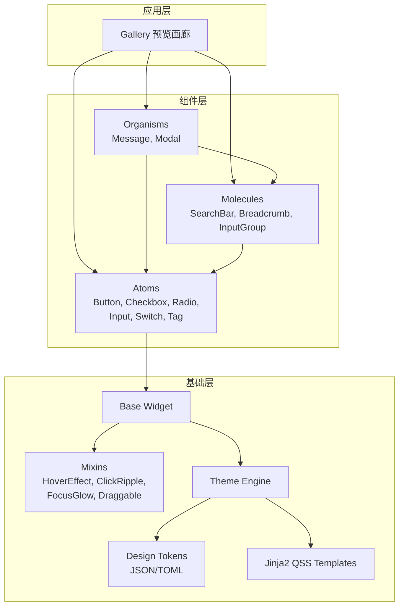
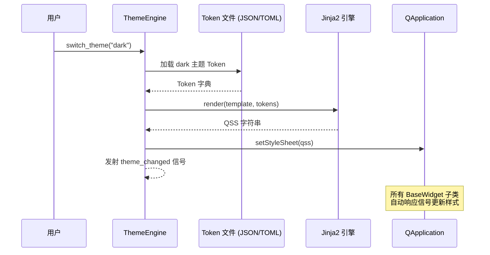
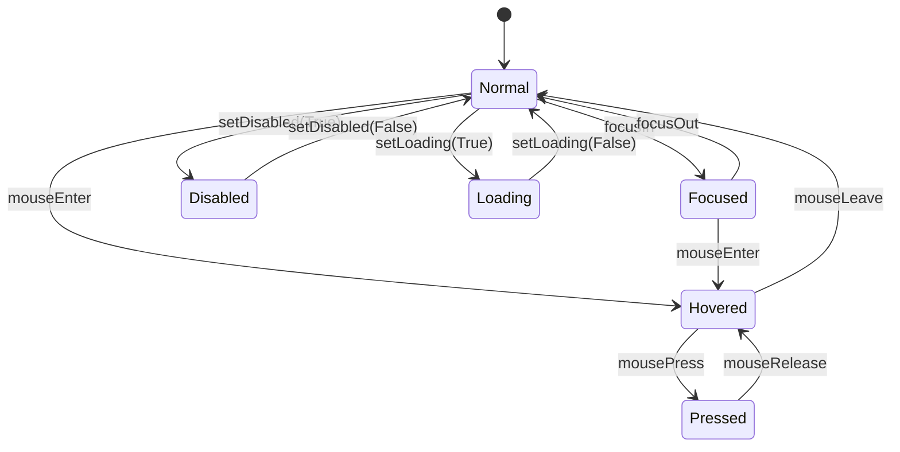

# 设计文档：Tyto UI 组件库 V1.0.0

## 概述

Tyto 是一个基于 PySide6 的现代化桌面 UI 组件库，采用原子设计方法论（Atomic Design），提供从基础控件（Atom）到复杂业务模块（Organism）的分层组件体系。样式系统基于 Design Token + Jinja2 + QSS 的动态渲染架构，支持 Light/Dark 主题实时无闪烁切换。视觉风格仿 NaiveUI。

本设计文档覆盖 V1.0.0 的全部交付内容：主题引擎、组件基类与行为混入、11 个 UI 组件、工程化配置和组件预览画廊。

## 架构

### 整体分层架构



### 主题引擎渲染流程



### 组件状态机



## 组件与接口

### 1. 核心模块 (`core/`)

#### ThemeEngine（单例）

```python
class ThemeEngine(QObject):
    """主题引擎，管理 Design Token 并动态渲染 QSS。"""

    # 信号
    theme_changed = Signal(str)  # 参数: 主题名称 ("light" | "dark")

    # 公开方法
    def load_tokens(self, path: str | Path) -> None:
        """从 JSON/TOML 文件加载 Design Token 定义。
        Raises: TokenFileError 当文件格式错误时。
        """

    def switch_theme(self, theme_name: str) -> None:
        """切换主题并重新渲染所有样式。"""

    def get_token(self, key: str) -> str:
        """获取当前主题下指定 Token 的值。"""

    def current_theme(self) -> str:
        """返回当前主题名称。"""

    def render_qss(self, template_name: str, **extra_context) -> str:
        """使用 Jinja2 渲染指定模板为 QSS 字符串。"""
```

#### DesignToken 数据结构

```python
@dataclass
class DesignTokenSet:
    """一套完整的 Design Token 定义。"""
    colors: dict[str, str]       # 如 {"primary": "#18a058", ...}
    spacing: dict[str, int]      # 如 {"small": 4, "medium": 8, ...}
    radius: dict[str, int]       # 如 {"small": 2, "medium": 4, ...}
    font_sizes: dict[str, int]   # 如 {"small": 12, "medium": 14, ...}
    shadows: dict[str, str]      # 如 {"small": "0 2px 8px ...", ...}
```

### 2. 通用模块 (`common/`)

#### BaseWidget

```python
class BaseWidget(QWidget):
    """所有 Tyto 组件的基类。"""

    def __init__(self, parent: QWidget | None = None) -> None: ...

    def apply_theme(self) -> None:
        """从 ThemeEngine 获取当前 Token 并更新自身样式。"""

    def _on_theme_changed(self, theme_name: str) -> None:
        """主题变更信号的槽函数。"""

    def cleanup(self) -> None:
        """销毁前的清理逻辑，断开信号连接。"""
```

#### Mixin 体系 (`common/traits/`)

```python
class HoverEffectMixin:
    """鼠标悬停效果混入：200ms 背景色渐变 + PointingHand 光标。"""
    def enterEvent(self, event: QEnterEvent) -> None: ...
    def leaveEvent(self, event: QEvent) -> None: ...

class ClickRippleMixin:
    """点击效果混入：背景色加深 + Scale 0.98 下陷。"""
    def mousePressEvent(self, event: QMouseEvent) -> None: ...
    def mouseReleaseEvent(self, event: QMouseEvent) -> None: ...

class FocusGlowMixin:
    """焦点光晕混入：2px 半透明主色扩散光晕。"""
    def focusInEvent(self, event: QFocusEvent) -> None: ...
    def focusOutEvent(self, event: QFocusEvent) -> None: ...

class DisabledMixin:
    """禁用状态混入：0.5 透明度 + Forbidden 光标。"""
    def set_disabled_style(self, disabled: bool) -> None: ...
```

### 3. 原子组件 (`components/atoms/`)

#### Button

```python
class TButton(BaseWidget, HoverEffectMixin, ClickRippleMixin, FocusGlowMixin):
    """按钮组件，支持 Primary/Default/Dashed/Text 四种类型。"""

    class ButtonType(str, Enum):
        PRIMARY = "primary"
        DEFAULT = "default"
        DASHED = "dashed"
        TEXT = "text"

    # 信号
    clicked = Signal()

    def __init__(
        self,
        text: str = "",
        button_type: ButtonType = ButtonType.DEFAULT,
        loading: bool = False,
        disabled: bool = False,
        parent: QWidget | None = None,
    ) -> None: ...

    def set_loading(self, loading: bool) -> None: ...
    def set_disabled(self, disabled: bool) -> None: ...
```

#### Checkbox

```python
class TCheckbox(BaseWidget, HoverEffectMixin, FocusGlowMixin):
    """复选框组件，支持三态。"""

    class CheckState(IntEnum):
        UNCHECKED = 0
        CHECKED = 1
        INDETERMINATE = 2

    # 信号
    state_changed = Signal(int)  # CheckState 值

    def __init__(
        self,
        label: str = "",
        state: CheckState = CheckState.UNCHECKED,
        parent: QWidget | None = None,
    ) -> None: ...

    def set_state(self, state: CheckState) -> None: ...
    def get_state(self) -> CheckState: ...
    def toggle(self) -> None: ...
```

#### Radio / RadioGroup

```python
class TRadio(BaseWidget, HoverEffectMixin, FocusGlowMixin):
    """单选框组件。"""
    toggled = Signal(bool)

    def __init__(
        self,
        label: str = "",
        value: Any = None,
        checked: bool = False,
        parent: QWidget | None = None,
    ) -> None: ...

    def set_checked(self, checked: bool) -> None: ...
    def is_checked(self) -> bool: ...

class TRadioGroup(BaseWidget):
    """单选框分组管理器。"""
    selection_changed = Signal(object)  # 选中项的 value

    def add_radio(self, radio: TRadio) -> None: ...
    def get_selected_value(self) -> Any: ...
```

#### Input

```python
class TInput(BaseWidget, FocusGlowMixin):
    """输入框组件，支持前后缀图标、清空、密码模式。"""

    # 信号
    text_changed = Signal(str)
    cleared = Signal()

    def __init__(
        self,
        placeholder: str = "",
        clearable: bool = False,
        password: bool = False,
        prefix_icon: QIcon | None = None,
        suffix_icon: QIcon | None = None,
        parent: QWidget | None = None,
    ) -> None: ...

    def get_text(self) -> str: ...
    def set_text(self, text: str) -> None: ...
    def clear(self) -> None: ...
    def toggle_password_visibility(self) -> None: ...
```

#### Switch

```python
class TSwitch(BaseWidget, HoverEffectMixin):
    """开关组件，仿 iOS/NaiveUI 风格。"""

    toggled = Signal(bool)

    def __init__(
        self,
        checked: bool = False,
        disabled: bool = False,
        parent: QWidget | None = None,
    ) -> None: ...

    def is_checked(self) -> bool: ...
    def set_checked(self, checked: bool) -> None: ...
    def toggle(self) -> None: ...
```

#### Tag

```python
class TTag(BaseWidget):
    """标签组件，支持多尺寸和可关闭。"""

    class TagSize(str, Enum):
        SMALL = "small"
        MEDIUM = "medium"
        LARGE = "large"

    class TagType(str, Enum):
        DEFAULT = "default"
        PRIMARY = "primary"
        SUCCESS = "success"
        WARNING = "warning"
        ERROR = "error"

    closed = Signal()

    def __init__(
        self,
        text: str = "",
        tag_type: TagType = TagType.DEFAULT,
        size: TagSize = TagSize.MEDIUM,
        closable: bool = False,
        parent: QWidget | None = None,
    ) -> None: ...
```

### 4. 分子组件 (`components/molecules/`)

#### SearchBar

```python
class TSearchBar(BaseWidget):
    """搜索栏组件，由 TInput + TButton 组合。"""

    search_changed = Signal(str)
    search_submitted = Signal(str)

    def __init__(
        self,
        placeholder: str = "搜索...",
        clearable: bool = True,
        parent: QWidget | None = None,
    ) -> None: ...

    def get_text(self) -> str: ...
    def clear(self) -> None: ...
```

#### Breadcrumb

```python
@dataclass
class BreadcrumbItem:
    label: str
    data: Any = None

class TBreadcrumb(BaseWidget):
    """面包屑导航组件。"""

    item_clicked = Signal(int, object)  # (index, data)

    def __init__(
        self,
        items: list[BreadcrumbItem] | None = None,
        separator: str = "/",
        parent: QWidget | None = None,
    ) -> None: ...

    def set_items(self, items: list[BreadcrumbItem]) -> None: ...
    def get_items(self) -> list[BreadcrumbItem]: ...
```

#### InputGroup

```python
class TInputGroup(BaseWidget):
    """输入组合组件，紧凑横向排列子组件并自动合并圆角。"""

    def __init__(self, parent: QWidget | None = None) -> None: ...

    def add_widget(self, widget: QWidget) -> None: ...
    def insert_widget(self, index: int, widget: QWidget) -> None: ...
    def remove_widget(self, widget: QWidget) -> None: ...
    def _recalculate_radius(self) -> None:
        """重新计算所有子组件的圆角合并规则。"""
```

### 5. 有机体组件 (`components/organisms/`)

#### Message

```python
class MessageType(str, Enum):
    INFO = "info"
    SUCCESS = "success"
    WARNING = "warning"
    ERROR = "error"

class TMessage(BaseWidget):
    """单条消息气泡。"""
    closed = Signal()

    def __init__(
        self,
        text: str,
        msg_type: MessageType = MessageType.INFO,
        duration: int = 3000,
        parent: QWidget | None = None,
    ) -> None: ...

    def show_message(self) -> None: ...
    def close_message(self) -> None: ...

class MessageManager(QObject):
    """全局消息管理器（单例），管理消息堆叠。"""

    @classmethod
    def info(cls, text: str, duration: int = 3000) -> None: ...
    @classmethod
    def success(cls, text: str, duration: int = 3000) -> None: ...
    @classmethod
    def warning(cls, text: str, duration: int = 3000) -> None: ...
    @classmethod
    def error(cls, text: str, duration: int = 3000) -> None: ...

    def _update_positions(self) -> None:
        """重新计算所有可见消息的堆叠位置。"""
```

#### Modal

```python
class TModal(BaseWidget):
    """模态对话框组件。"""

    closed = Signal()

    def __init__(
        self,
        title: str = "",
        closable: bool = True,
        mask_closable: bool = True,
        parent: QWidget | None = None,
    ) -> None: ...

    def set_content(self, widget: QWidget) -> None: ...
    def set_footer(self, widget: QWidget) -> None: ...
    def open(self) -> None: ...
    def close(self) -> None: ...
```

### 6. 样式模块 (`styles/`)

```
styles/
├── templates/
│   ├── base.qss.j2          # 基础样式模板
│   ├── button.qss.j2        # Button 专用模板
│   ├── checkbox.qss.j2
│   ├── radio.qss.j2
│   ├── input.qss.j2
│   ├── switch.qss.j2
│   ├── tag.qss.j2
│   ├── searchbar.qss.j2
│   ├── breadcrumb.qss.j2
│   ├── inputgroup.qss.j2
│   ├── message.qss.j2
│   └── modal.qss.j2
└── tokens/
    ├── light.json            # Light 主题 Token
    └── dark.json             # Dark 主题 Token
```

Jinja2 QSS 模板示例：

```jinja2
{# button.qss.j2 #}
TButton {
    background-color: {{ colors.bg_default }};
    color: {{ colors.text_primary }};
    border: 1px solid {{ colors.border }};
    border-radius: {{ radius.medium }}px;
    padding: {{ spacing.small }}px {{ spacing.medium }}px;
    font-size: {{ font_sizes.medium }}px;
}

TButton[buttonType="primary"] {
    background-color: {{ colors.primary }};
    color: {{ colors.white }};
    border: none;
}

TButton:hover {
    background-color: {{ colors.primary_hover }};
}

TButton:disabled {
    opacity: 0.5;
}
```

## 数据模型

### Design Token JSON 结构

```json
{
  "name": "light",
  "colors": {
    "primary": "#18a058",
    "primary_hover": "#36ad6a",
    "primary_pressed": "#0c7a43",
    "success": "#18a058",
    "warning": "#f0a020",
    "error": "#d03050",
    "info": "#2080f0",
    "bg_default": "#ffffff",
    "bg_elevated": "#f8f8fa",
    "text_primary": "#333639",
    "text_secondary": "#667085",
    "text_disabled": "#c2c2c2",
    "border": "#e0e0e6",
    "border_focus": "#18a058",
    "white": "#ffffff",
    "mask": "rgba(0, 0, 0, 0.4)"
  },
  "spacing": {
    "small": 4,
    "medium": 8,
    "large": 16,
    "xlarge": 24
  },
  "radius": {
    "small": 2,
    "medium": 4,
    "large": 8
  },
  "font_sizes": {
    "small": 12,
    "medium": 14,
    "large": 16,
    "xlarge": 20
  },
  "shadows": {
    "small": "0 2px 8px rgba(0, 0, 0, 0.08)",
    "medium": "0 4px 16px rgba(0, 0, 0, 0.12)",
    "large": "0 8px 32px rgba(0, 0, 0, 0.16)"
  }
}
```

### 组件状态枚举

```python
class WidgetState(str, Enum):
    """组件交互状态。"""
    NORMAL = "normal"
    HOVERED = "hovered"
    PRESSED = "pressed"
    FOCUSED = "focused"
    DISABLED = "disabled"
    LOADING = "loading"
```

### 消息堆叠模型

```python
@dataclass
class MessageSlot:
    """消息在堆叠中的位置信息。"""
    message: TMessage
    y_offset: int        # 距离屏幕顶部的偏移量
    created_at: float    # 创建时间戳
```

## 正确性属性

*属性（Property）是一种在系统所有有效执行中都应成立的特征或行为——本质上是关于系统应该做什么的形式化陈述。属性是人类可读规范与机器可验证正确性保证之间的桥梁。*

以下属性基于需求文档中的验收标准推导而来，每个属性都包含明确的"对于任意"全称量化声明，可直接转化为 Hypothesis 属性基测试。

### 属性 1：Token 完整性不变量

*对于任意*有效的主题配置（light 或 dark），加载后的 DesignTokenSet 应包含所有必需的 Token 类别（colors、spacing、radius、font_sizes），且每个类别中包含所有必需的键。

**验证需求：1.1**

### 属性 2：Token 序列化 Round-Trip

*对于任意*有效的 DesignTokenSet 对象，将其序列化为 JSON 后再反序列化加载，应得到与原始对象等价的 DesignTokenSet。

**验证需求：1.6**

### 属性 3：QSS 渲染包含 Token 值

*对于任意*有效的 Token 字典和 Jinja2 QSS 模板，渲染后的 QSS 字符串应包含 Token 字典中所有被模板引用的值，且不包含未解析的 Jinja2 模板变量。

**验证需求：1.4**

### 属性 4：Token 文件错误处理

*对于任意*格式错误的 Token 文件内容（缺少必需字段、类型错误、JSON 语法错误），ThemeEngine 的 load_tokens 方法应抛出 TokenFileError 异常，且异常消息包含具体的错误描述。

**验证需求：1.7**

### 属性 5：主题切换自动更新组件样式

*对于任意* BaseWidget 子类实例，当 ThemeEngine 发射 theme_changed 信号时，该组件的 apply_theme 方法应被调用。

**验证需求：2.2**

### 属性 6：HoverEffect 光标变化

*对于任意*应用了 HoverEffectMixin 的组件，模拟 enterEvent 后组件的光标应变为 PointingHandCursor，模拟 leaveEvent 后应恢复为默认光标。

**验证需求：2.4**

### 属性 7：Disabled 状态属性

*对于任意*组件，设置 disabled=True 后，组件的 windowOpacity 应为 0.5，光标应为 ForbiddenCursor，且所有交互事件应被屏蔽。

**验证需求：2.7, 3.3**

### 属性 8：多 Mixin 无冲突

*对于任意*同时应用了 HoverEffectMixin、ClickRippleMixin 和 FocusGlowMixin 的组件，依次触发 enterEvent、mousePressEvent、focusInEvent 后，各 Mixin 的效果应独立生效且不互相覆盖。

**验证需求：2.8**

### 属性 9：Button 类型正确性

*对于任意* ButtonType 枚举值，创建 TButton 时传入该类型后，Button 的 buttonType 属性应等于传入值。

**验证需求：3.1**

### 属性 10：Loading 屏蔽点击

*对于任意* TButton，设置 loading=True 后，模拟鼠标点击不应发射 clicked 信号。

**验证需求：3.2, 3.5**

### 属性 11：Button 正常点击发射信号

*对于任意*非 loading 且非 disabled 的 TButton，模拟鼠标点击后应发射恰好一次 clicked 信号。

**验证需求：3.4**

### 属性 12：Checkbox 状态 Round-Trip

*对于任意* CheckState 枚举值，对 TCheckbox 调用 set_state(state) 后，get_state() 应返回相同的 state 值，且 state_changed 信号应携带该 state 值。

**验证需求：4.1, 4.2**

### 属性 13：RadioGroup 互斥不变量

*对于任意* TRadioGroup 和其中任意数量（≥2）的 TRadio，选中其中一个 Radio 后，该组内有且仅有一个 Radio 处于选中状态。

**验证需求：5.2**

### 属性 14：RadioGroup 选择一致性

*对于任意* TRadioGroup，选中某个 TRadio 后，get_selected_value() 应返回该 Radio 的 value 值，且 selection_changed 信号应携带该 value。

**验证需求：5.3, 5.4**

### 属性 15：Input 清空 Round-Trip

*对于任意*非空文本字符串和 clearable=True 的 TInput，设置文本后调用 clear()，get_text() 应返回空字符串，且 cleared 信号应被发射。

**验证需求：6.2, 6.3**

### 属性 16：Input 密码可见性 Toggle Round-Trip

*对于任意* password=True 的 TInput，调用 toggle_password_visibility() 两次后，输入框的显示模式应回到初始的掩码模式（幂等性：f(f(x)) = x）。

**验证需求：6.5**

### 属性 17：Input text_changed 信号

*对于任意*文本字符串，对 TInput 调用 set_text(text) 后，text_changed 信号应携带该 text 值。

**验证需求：6.6**

### 属性 18：Switch Toggle Round-Trip

*对于任意* TSwitch 和初始布尔状态，调用 toggle() 后 is_checked() 应返回相反值，再次调用 toggle() 后应回到初始值。toggled 信号应携带正确的布尔值。

**验证需求：7.2, 7.3**

### 属性 19：Tag 属性正确性

*对于任意* TagSize 和 TagType 枚举值组合，创建 TTag 后其 size 和 tag_type 属性应等于传入值。

**验证需求：8.1, 8.4**

### 属性 20：Tag closed 信号

*对于任意* closable=True 的 TTag，模拟点击关闭按钮后应发射恰好一次 closed 信号。

**验证需求：8.3**

### 属性 21：SearchBar search_changed 信号

*对于任意*文本字符串，在 TSearchBar 的输入框中输入文本后，search_changed 信号应携带该文本值。

**验证需求：9.2**

### 属性 22：SearchBar search_submitted 信号

*对于任意*文本字符串，在 TSearchBar 中输入文本后触发提交（点击按钮或 Enter），search_submitted 信号应携带该文本值。

**验证需求：9.3**

### 属性 23：Breadcrumb Items Round-Trip

*对于任意* BreadcrumbItem 列表，对 TBreadcrumb 调用 set_items(items) 后，get_items() 应返回与原始列表等价的列表。

**验证需求：10.1**

### 属性 24：Breadcrumb item_clicked 信号

*对于任意*非空 BreadcrumbItem 列表和任意有效索引（非最后一项），点击该路径项后 item_clicked 信号应携带正确的索引和数据。

**验证需求：10.3**

### 属性 25：Breadcrumb 最后一项不可点击

*对于任意*非空 BreadcrumbItem 列表，最后一个路径项应处于不可点击状态（点击不发射 item_clicked 信号）。

**验证需求：10.4**

### 属性 26：InputGroup 圆角合并不变量

*对于任意*数量（≥2）的子组件序列，InputGroup 中第一个组件应仅保留左侧圆角，最后一个组件应仅保留右侧圆角，中间所有组件的圆角应为零。此不变量在添加或删除子组件后仍应成立。

**验证需求：11.2, 11.3**

### 属性 27：Message 类型正确性

*对于任意* MessageType 枚举值，创建 TMessage 后其消息类型属性应等于传入值。

**验证需求：12.1**

### 属性 28：Message 堆叠不变量

*对于任意*数量的同时可见消息，它们的 y_offset 应按创建时间严格递增，且相邻消息之间的间距应为固定值。

**验证需求：12.4, 12.5**

### 属性 29：Modal closed 信号

*对于任意* closable=True 的 TModal，点击关闭按钮或遮罩层后应发射 closed 信号。

**验证需求：13.4**

### 属性 30：Modal closable 属性控制

*对于任意* TModal，当 closable=False 时，点击遮罩层不应关闭 Modal 且不应发射 closed 信号；当 mask_closable=False 时，点击遮罩层同样不应关闭 Modal。

**验证需求：13.5**

## 错误处理

### Token 文件加载错误

| 错误场景 | 异常类型 | 处理方式 |
|---------|---------|---------|
| 文件不存在 | `FileNotFoundError` | 抛出异常，包含文件路径 |
| JSON/TOML 语法错误 | `TokenFileError` | 抛出异常，包含行号和错误描述 |
| 缺少必需 Token 键 | `TokenFileError` | 抛出异常，列出缺失的键名 |
| Token 值类型错误 | `TokenFileError` | 抛出异常，包含键名和期望类型 |

### Jinja2 模板渲染错误

| 错误场景 | 异常类型 | 处理方式 |
|---------|---------|---------|
| 模板文件不存在 | `TemplateNotFoundError` | 抛出异常，包含模板名称 |
| 模板语法错误 | `TemplateSyntaxError` | 抛出异常，包含行号 |
| 未定义的 Token 变量 | `UndefinedError` | 抛出异常，包含变量名 |

### 组件运行时错误

| 错误场景 | 处理方式 |
|---------|---------|
| 组件在 ThemeEngine 初始化前创建 | 使用默认样式，在 ThemeEngine 就绪后自动更新 |
| Mixin 事件处理异常 | 捕获异常并记录日志，不影响组件基本功能 |
| Message 定时器异常 | 强制关闭消息并释放资源 |
| Modal 遮罩层创建失败 | 回退到无遮罩模式并记录警告 |

## 测试策略

### 双轨测试方法

本项目采用单元测试与属性基测试互补的双轨策略：

- **单元测试（pytest + pytest-qt）**：验证具体示例、边界情况和错误条件
- **属性基测试（Hypothesis）**：验证跨所有输入的通用属性

### 属性基测试配置

- **测试库**：Hypothesis（Python 生态最成熟的属性基测试框架）
- **最小迭代次数**：每个属性测试至少 100 次迭代
- **标注格式**：每个测试用注释引用设计文档中的属性编号
  ```python
  # Feature: tyto-ui-lib-v1, Property 1: Token 完整性不变量
  @given(theme_name=st.sampled_from(["light", "dark"]))
  def test_token_completeness(theme_name: str) -> None:
      ...
  ```
- **每个正确性属性对应一个独立的属性基测试函数**

### Hypothesis 自定义策略

为组件测试定义以下自定义生成策略：

```python
# 生成任意 ButtonType
button_types = st.sampled_from(list(TButton.ButtonType))

# 生成任意 CheckState
check_states = st.sampled_from(list(TCheckbox.CheckState))

# 生成任意 TagSize 和 TagType 组合
tag_configs = st.tuples(
    st.sampled_from(list(TTag.TagSize)),
    st.sampled_from(list(TTag.TagType)),
)

# 生成任意非空文本
non_empty_text = st.text(min_size=1, max_size=100)

# 生成任意 BreadcrumbItem 列表
breadcrumb_items = st.lists(
    st.builds(BreadcrumbItem, label=st.text(min_size=1, max_size=50)),
    min_size=1,
    max_size=20,
)

# 生成任意有效 Token 字典
valid_token_colors = st.fixed_dictionaries({
    "primary": st.from_regex(r"#[0-9a-f]{6}", fullmatch=True),
    # ... 其他必需颜色键
})
```

### 测试目录结构

```
tests/
├── conftest.py                    # pytest-qt fixtures, QApplication 初始化
├── test_core/
│   ├── test_theme_engine.py       # 属性 1-4 的属性基测试 + 单元测试
│   └── test_design_tokens.py      # Token 加载和验证测试
├── test_common/
│   ├── test_base_widget.py        # 属性 5 的属性基测试
│   └── test_mixins.py             # 属性 6-8 的属性基测试
├── test_atoms/
│   ├── test_button.py             # 属性 9-11 的属性基测试
│   ├── test_checkbox.py           # 属性 12 的属性基测试
│   ├── test_radio.py              # 属性 13-14 的属性基测试
│   ├── test_input.py              # 属性 15-17 的属性基测试
│   ├── test_switch.py             # 属性 18 的属性基测试
│   └── test_tag.py                # 属性 19-20 的属性基测试
├── test_molecules/
│   ├── test_searchbar.py          # 属性 21-22 的属性基测试
│   ├── test_breadcrumb.py         # 属性 23-25 的属性基测试
│   └── test_inputgroup.py         # 属性 26 的属性基测试
└── test_organisms/
    ├── test_message.py            # 属性 27-28 的属性基测试
    └── test_modal.py              # 属性 29-30 的属性基测试
```

### 单元测试覆盖重点

- 各组件的边界情况（空文本、极端尺寸值）
- 错误条件（无效 Token 文件、无效参数）
- 组件间集成（SearchBar 内部的 Input + Button 协作）
- 主题切换的端到端流程
- 组件生命周期（创建、样式绑定、销毁清理）
